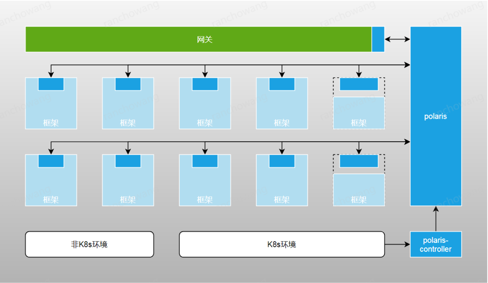
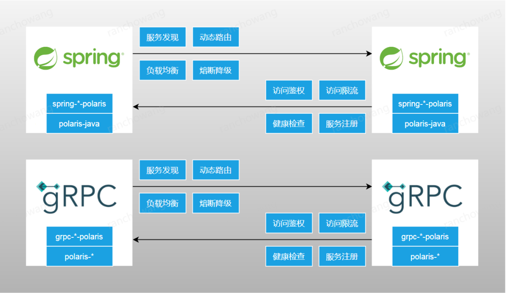

**本文转载自：infoQ**

9 月 8 日，腾讯云面向所有开发者，正式宣布开源北极星（Polaris Mesh），开放了应用在大规模生产环境中的源代码，推进以微服务为核心的开源生态建设，并希望帮助业界更好地进行分布式或者微服务架构转型。

目前很多企业在微服务实施和演化过程中，都会面临技术栈的多样性问题。整个微服务领域逐渐沉淀出了无数个相关组件，大家在选择上更加困难，也为企业的基础设施建设不断带来挑战。腾讯也曾面临这样的痛点，因此从 2019 年开始腾讯开创了统一的微服务解决方案“北极星”（Polaris Mesh），通过北极星对这些组件进行抽象和整合，打造公司标准化的服务发现和治理方案，帮助业务提升研发效率和运营质量。

经过两年的发展，北极星在腾讯内部注册服务数量超过百万，服务实例数量超过五百万，接口日调用量超过三十万亿，腾讯音乐、腾讯视频、腾讯会议、腾讯文档、企业微信、微信支付和王者荣耀等重点产品均在使用。

9 月 8 日，腾讯云面向所有开发者，正式宣布开源北极星（Polaris Mesh），开放了应用在大规模生产环境中的源代码，推进以微服务为核心的开源生态建设，并希望帮助业界更好地进行分布式或者微服务架构转型。

## PART ONE

### 从单体到微服务架构

最近十几年，业务架构经历了从单体到分布式再到微服务的演进。单体架构的所有代码都在一个应用中，适合小规模或者初创期的业务。如果应用模块和开发人员的数量很少，单体架构容易开发、测试、部署和伸缩。随着应用模块和开发人员增加，单体架构面临众多问题，例如：

任何修改都需要重新编译和部署整个系统，变更风险大，测试成本高，编译速度慢。
如果某个业务模块存在缺陷，也会影响其他业务模块，降低整个系统的可用性。
如果每个业务模块的请求量不均匀，无法针对某些热点模块进行水平扩展。
为了解决这些问题，分布式和微服务架构将业务模块拆分成为独立的服务，但是整个系统的复杂度也急剧上升，如果没有配套的技术组件，分布式和微服务架构很难落地。作为微服务方向的开发人员，我们都知道服务发现和治理是分布式和微服务架构中的关键技术，可以很好的帮助大家解决服务寻址、流量调度、故障容错、访问控制和可观测性等问题，但这个关键技术目前在业界的开源解决方案却各有利弊，并不完美。

## PART TWO

### 服务发现和治理技术

- 第一种方案以 Spring Cloud 为代表，在开发框架中集成了一系列服务发现和治理组件。虽然在虚拟机和容器环境中可以无差别地使用，但是需要在开发时引入多个零散的功能组件，缺少统一的数据面和控制面，不同的语言和框架没有无法统一管理。
- 第二种是 Kubernetes  Service，将服务注册到内置的 etcd，采用域名解析插件实现服务发现，但有个缺点是无法提供服务治理功能。
- 第三种是以 Istio 为代表的服务网格，通过劫持业务请求的方式实现服务发现和治理。这种方案对开发代码的侵入性低，具备统一的数据面和控制面，但是需要部署流量代理进程，同时还会增加运维成本，存在较大的资源和性能损耗。

我们认为上述三种方案各有优劣，不是谁取代谁的问题，而是互相融合，满足不同的业务需求。腾讯内部绝大部分核心业务使用第一种方案，也有不少业务在 Kubernetes  上使用其他两种方案，但是依然存在跨部门业务系统间数据无法打通、缺少标准化的服务治理的问题。

为了能够融合上述三种解决方案的优点，同时规避它们的缺点，我们开创了统一的解决方案——北极星，致力于打造腾讯新一代服务发现和治理中心，解决原有平台存在的问题，并且支持无缝迁移，实现公司服务的互联互通和统一治理。目前，北极星的注册服务数量超过百万，服务实例数量超过五百万，接口日调用量超过三十万亿，腾讯音乐、腾讯视频、腾讯会议、腾讯文档、企业微信、微信支付和王者荣耀等重点业务均在使用。

## PART THREE

### 北极星是什么？

北极星（Polaris Mesh）是腾讯自研的服务发现和治理中心，以服务注册中心为基础，扩展了服务治理功能以及相应的控制面，提供多语言的客户端实现，不同的开发框架可以集成使用。随着容器化和云原生的推进，北极星也支持了 Kubernetes  服务和网格 Sidecar 的自动接入，实现了它们之间互联互通和统一治理。

#### 3.1 功能特性

北极星主要有五大功能：

- **注册发现**：北极星的基础部分是一个大容量和高可用的服务注册中心，除了支持多种协议的服务注册和发现，还支持对注册的服务实例进行健康检查，避免主调方将请求发送给异常实例。在围绕服务构建的分布式应用架构中，服务注册和发现至关重要，可以提高应用的扩展能力，降低应用的迁移成本。
- **流量调度**：北极星提供动态路由和负载均衡两种类型的流量调度功能。动态路由根据请求标签、实例标签和标签匹配规则，可以实现按地域就近、单元化隔离和金丝雀发布等多种路由策略。负载均衡将请求均衡地分配给不同的被调方实例，支持权重随机、最小负载和权重一致性 Hash 等多种均衡算法。
- **熔断降级**：北极星支持实例、接口和服务三种粒度的熔断策略。如果被调方的部分实例发生熔断，将请求分配给其他实例。如果被调方的某个接口或者服务发生熔断，根据降级策略直接返回。网络抖动、机器故障和程序缺陷等因素都可能导致实例、接口或者服务出现异常，熔断降级可以提高业务的请求成功率。
- **访问控制**：北极星提供鉴权和限流两种访问控制功能。被调方可以设置鉴权规则，允许哪些主调方访问自己，不允许哪些主调方访问自己。被调方也可以设置单机或者分布式限流规则，一方面防止突发流量压垮自己，导致自己完全不可用，一方面防止部分主调方的请求量过多，消耗大量资源，影响其他主调方。
- **服务网格**：对于上述服务发现和治理功能，北极星提供统一的控制面和数据面。数据面功能采用配置化的实现方式，控制面可以下发服务数据和治理规则到数据面，动态调整数据面的执行策略。数据面支持 多语言 SDK 和 Sidecar 两种模式。

#### 3.2 系统组件

北极星系统组件分为核心和生态两个部分：

- **核心组件**：控制台、控制面和数据面
- **生态组件**：用于框架、网关和 Kubernetes  对接
北极星控制面既包含服务注册中心，也包含服务治理控制面，服务治理控制面相当于业界服务网格的控制面。数据面分为 SDK 和 Sidecar 两种模式。SDK 模式提供多语言的实现，不需要劫持业务请求，和业务请求的协议无关，适合集成在开发框架里使用。Sidecar 模式需要劫持业务请求，存在性能和资源损耗，部署和运维成本高，适合 无侵入 的开发场景。

为了降低业务的使用成本，北极星提供三种类型的生态组件。第一类用于各种开发框架和北极星数据面的无缝集成，框架用户不需要直接调用北极星数据面，减少开发的侵入性；第二类用于各种网关和北极星数据面的无缝集成，支持网关将请求直接转发到北极星服务；第三类生态组件只有 polaris-controller，支持 Kubernetes  服务和网格 Sidecar 的自动接入。

#### 3.3 最佳实践

目前，腾讯常用的框架、网关和容器平台已经集成北极星，形成了以北极星为核心的服务发现和治理体系。下面介绍北极星在腾讯的最佳实践：

第一，作为公司统一的服务发现平台，实现公司内网服务的互联互通。北极星采用计算和存储分离的架构，计算层可以随着客户端数量的增加平行扩展，轻松支持百万级客户端接入。同时服务端提供同城多中心或者跨城多中心等多种部署模式，满足不同的容灾要求。

第二，为不同的开发语言和框架提供统一的服务发现和治理功能。腾讯业务线众多，开发语言和框架也众多，北极星数据面支持多语言 SDK 和 Sidecar 两种模式。框架可以直接集成相应语言的 SDK，不需要部署 Sidecar，不会增加运维成本，没有性能和资源损耗。

第三，作为网关到内网服务的连接器。网关可以集成北极星，将请求直接转发到北极星服务，实现微服务网关的能力。

第四，现有的开源组件主要分为两个体系，一个围绕服务注册中心和开发框架打造，一个围绕 Kubernetes 服务和网格打造。两个体系各自有各自的亮点和局限，随着容器化和云原生的推进，越来越多企业同时使用两个体系。但是两个体系的实现存在割裂，给业务增加了不必要的使用成本。北极星对两个体系进行了融合，为虚拟机和容器环境、开发框架和网格提供一体化的服务发现和治理方案。

## PART FOUR

### 北极星和开源生态的关系

#### 4.1 北极星和框架

北极星客户端可以集成到各种框架中，让裸的开发框架快速升级为分布式和微服务框架，具备完整的服务发现和治理功能。

腾讯业务常用的框架均已集成北极星，其中除了自研框架，还有 gRPC、Spring 和 Gin 等开源框架。如上所述，这些集成也会作为北极星的生态组件开源，框架用户可以直接引入，逻辑代码不需要任何改动。

#### 4.2 北极星和网关

网关和框架的情况类似，北极星也可以和常见的开源网关集成使用。

#### 4.3 北极星和Kubernetes

随着容器化和云原生的推进，越来越多企业开始使用 Kubernetes 部署服务，腾讯也不例外。

在 Kubernetes 环境上，除了注册中心和框架，还有两种服务发现和治理方案：

- **Kubernetes 服务**：通过 DNS 域名解析实现服务发现，采用 iptables 或者 IPVS 实现负载均衡。这种方案简单易用，但是缺少其他服务治理能力，大规模服务存在性能瓶颈。
- **网格**：通过劫持业务请求实现服务发现和治理。这种方案功能全面，但是存在 CPU 和性能损耗，运维成本高。
在腾讯内部，绝大部分业务使用注册中心和框架的方案，也有不少业务使用 Kubernetes 服务，网格还在小范围尝试阶段。

北极星提供 polaris-controller，支持 Kubernetes 服务和网格 Sidecar 自动注入，实现三种方案的联通和统一治理。

## PART FIVE

### 北极星的开源计划
北极星是在满足腾讯业务需求的过程中，不断演进和发展起来的，积累了腾讯超大规模服务发现和治理的经验，没有一个开源组件的形态和北极星完全类似。腾讯的业务线众多，包含即时通信、音乐视频、金融科技和企业服务等，北极星面临的问题和相应的解决方案具有很强的通用性。我们相信北极星也可以帮助其他企业更好地进行分布式或者微服务架构转型，提高业务的研发效率和运营质量。

北极星开源版本直接来自腾讯的生产代码，我们已经将主体部分提交到社区。期待更多感兴趣、有能力的开发者参与共建，后续计划包括但不限于：

- 完善服务发现和治理功能
- 提供更多语言的数据面 SDK
- 优化数据面 Sidecar 的性能
- 加强北极星和相关开源组件的集成
- 完善项目文档
- 引入其他公司的开源爱好者

### 欢迎加入

截至目前，腾讯共对外开源超过 130 个优质项目，代码贡献者超过 2000 人，开源项目 star 总数超过 37 万个。北极星作为微服务领域新推出的开源项目，也非常欢迎感兴趣的小伙伴在北极星 Github 上提交 issue 与 PR 进行讨论和贡献，或加入北极星社区群参与社区讨论。

北极星 GitHub：https://github.com/polarismesh/polaris

北极星官网地址：https://polarismesh.cn/