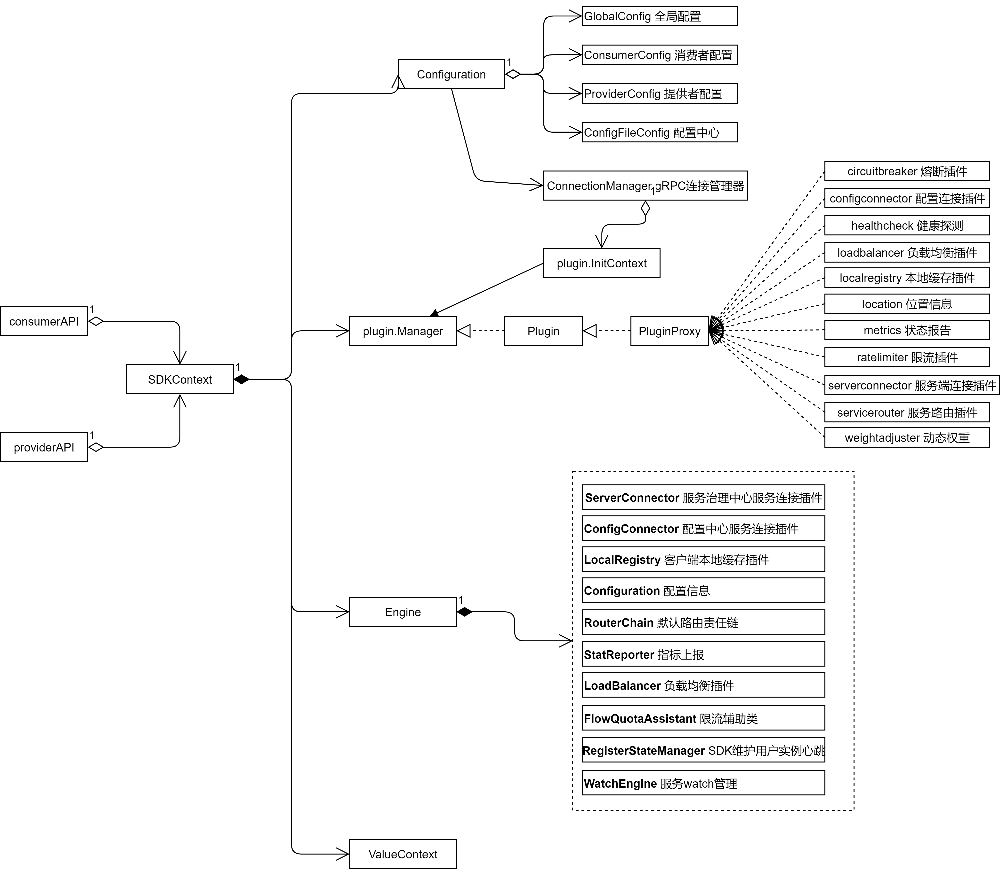
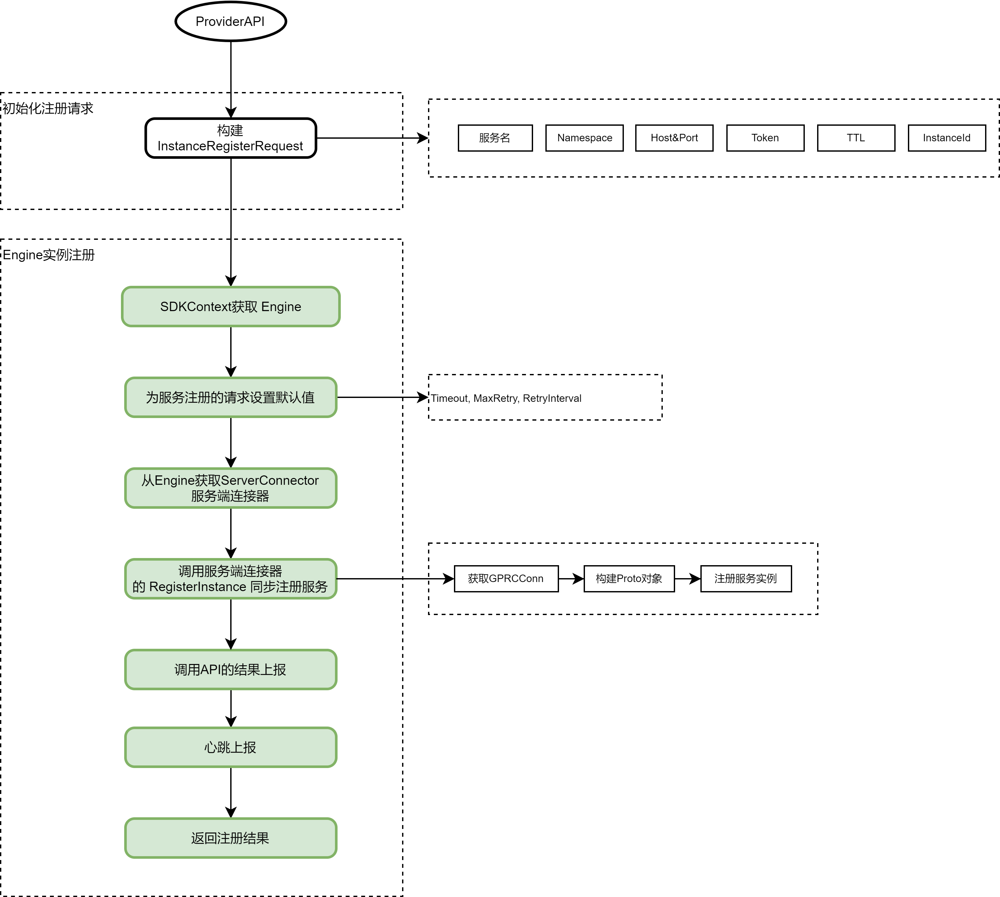
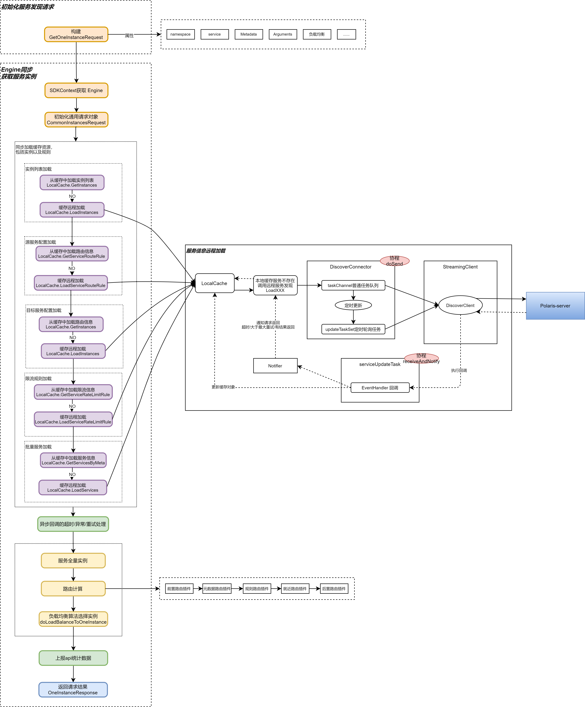

## 导语

北极星是腾讯开源的一款服务治理平台，用来解决分布式和微服务架构中的服务管理、流量管理、配置管理、故障容错和可观测性问题。 在分布式和微服务架构的治理领域，目前国内比较流行的还包括Spring Cloud，Apache Dubbo等。在Kubernetes的技术领域，也有以Istio为代表的ServiceMesh技术。 本篇Blog主要分析北极星的优势，及其服务注册发现的技术实现。


## 我是如何看待这些技术

要做好一个服务治理框架， 核心功能和要素至少包括以下几点：

- 服务注册发现
- 路由，熔断，限流
- 配置中心
- 可观测性, 日志、度量、链路追踪


从功能实现方面来看， 不管是SpringCloud，Apache Dubbo， Istio 还是北极星，基本都实现了这些功能，那它们的实现思路有什么不同呢? 


### SpringCloud

SpringCloud 是完全架构在SpringBoot基础上的， 是SpringBoot开发框架很自然的延申，因此继承了SpringBoot框架所有的优点，可以非常灵活的集成各类服务注册发现、服务治理、可观测组件。 例如SpringCloud 框架自身开发了 Spring-Cloud-Config和 Spring-Cloud-Sleuth 组件，分别提供了配置和部分可观测性的能力；在其他能力方面，早期版本主要由Netflix提供的 Eureka, Ribbon, Hystrix等组件提供了服务注册发现，服务治理的能力;  随着Netflix很多组件生命周期结束， SpringCloud又通过自定义的Abstract LoadBalance/Route接口及实现， 以及集成的Resilience4J/Sentinel 等熔断限流组件，继续为用户提供统一的服务注册发现，服务治理等方面的能力。

SpringCloud 在实际使用过程中, 可能会给人一种没有一个统一的服务治理模型的错觉, 这是因为SpringCloud保持了自身的胶水框架的特性和思路, 可以集成和融合各类治理组件，例如熔断限流就提供了Hystrix、Resilience4J、Sentinel 等方式。这样的框架特性，优势是灵活，可以融合各类框架， 劣势是抽象统一的治理模型比较困难， 因此SpringCloud并没有提供一个统一的服务治理控制面，即使是Spring-Cloud-Admin的扩展，也更多是基于SpringBoot Actuator提供可观测的管理，并没有提供服务治理的控制面能力。


### ServiceMesh

ServiceMesh 解耦了业务逻辑和服务治理逻辑， 它将服务治理能力下沉到基础设施，在服务的消费者和提供者两侧以独立进程的方式部署。这种方式提升了整体架构的灵活性，减少对业务的侵入性并很好的解决了多语言支持的复杂性。劣势是一方面服务通过sidecar的调用多了一道 iptables/ipvs 的转发，降低了一些性能，sidecar也增加了少量的资源使用； 另一方面是中小团队很难对框架灵活扩展，虽然envoy提供了 WASM机制，其自身也能通过C++扩展Filter，但是不管那种方式，都需要团队有一定经验的人员来完成，中小团队很难提供这样的人员保障。 

另外，Istio 虽然也能提供基于虚拟机/物理机的部署， 但是本身还是基于Kubernetes 设计的，也对Kubernetes部署最友好，对于未使用Kubernetes的团队有一定的挑战。


### PolarisMesh

PolarisMesh 从个人的角度看，是融合和兼容了很多技术的解决方案。 

一方面，它可以看作是 SpringCloud服务治理实践的一种自顶向下的正向思考过程， SpringCloud是自底向上的一种构建思路，它提供了各类服务发现、服务治理、可观测组件的集成和融合，但是并没有提供统一的顶层治理模型(或者仅提供了一部分)； 而 Polaris是先基于 下一代架构基金会所制定的[服务治理标准](https://github.com/nextarch/SIG-Microservice)，  制定和扩展了服务治理的模型， 然后基于该模型，分别构建了服务治理的控制面和数据面(各类语言的SDK、开发框架、JavaAgent、Kubernetes Controller)。  当然，基于该模型，也能很好的对接到ServiceMesh的治理方式, 这样就给未来的发展也留足了空间。

另一方面，PolarisMesh 也通过[插件机制](https://polarismesh.cn/docs/%E5%8F%82%E8%80%83%E6%96%87%E6%A1%A3/%E5%BC%80%E5%8F%91%E8%80%85%E6%96%87%E6%A1%A3/%E6%8F%92%E4%BB%B6%E5%BC%80%E5%8F%91/%E5%BC%80%E5%8F%91%E8%A7%84%E8%8C%83/)， 为框架扩展预留了空间，如果当前的开源Polaris不满足你的需求，可以较灵活的进行扩展。


## polaris-go SDK服务注册发现技术分析&源码阅读

本篇Blog重点对polaris-go SDK的服务的注册和发现做下技术分析, 以及源码阅读。 主要是服务注册和发现是各类服务治理框架最基础和核心的功能，因此先从它开始吧~


### 公共部分 SDKContext

在客户端SDK， 不论是 服务注册的API, 还是服务发现的SDK，其内部都是封装了 SDKContext 的上下文， SDKContext 内部构成如下图所示：





- ConfigurationImpl: 主要是 客户端 `polaris.yaml` 配置文件的映射， 分为4个部分，分别是 GlobalConfig， ConsumerConfig， ProviderConfig和 ConfigFileConfig 。

- ConnectionManager:  grpc 连接的连接池管理接口。

- plugin.Manager: 插件管理接口，SDK内部实现的各类功能- 熔断，限流，配置，健康检查，路由，负载均衡等都是按照插件的方式实现， 插件需要实现Plugin 接口，通过PluginProxy 包装后交给 plugin.Manager 管理。

- Engine： SDK 执行的各类动作，都交由Engine处理， 例如 服务的注册发现， 限流，路由，熔断等， 都是调用Engine内的API实现。 也就是SDK能执行的功能，都是由Engine API统一实现。


### 服务注册流程

服务注册的粗略流程如下图所示 :




> go客户端SDK的整体服务注册流程比较线性, 没有涉及特别复杂的逻辑, 相关gRPC service如下: 

```
service PolarisGRPC {
  // 客户端上报
  rpc ReportClient(Client) returns (Response) {}
  // 被调方注册服务实例
  rpc RegisterInstance(Instance) returns (Response) {}
  // 被调方反注册服务实例
  rpc DeregisterInstance(Instance) returns (Response) {}
  // 统一发现接口
  rpc Discover(stream DiscoverRequest) returns (stream DiscoverResponse) {}
  // 被调方上报心跳
  rpc Heartbeat(Instance) returns (Response) {}
  // 上报服务契约
  rpc ReportServiceContract(ServiceContract) returns (Response) {}
}
```


### 服务发现流程


服务发现流程相对于服务注册流程要复杂很多, 主要原因是 北极星的服务发现 会涉及到本地Cache与远程server端信息的懒加载同步，同时加载的服务信息也比较复杂，包括实例信息，服务信息，路由信息，限流信息等内容。


服务发现的粗略流程如下图所示 :





可以看到，服务发现中的关键点包括:

- SDK内部实现了 LocalCache缓存机制， 同时LocalCache缓存具备以懒加载方式同步远程server中服务信息的能力。
- SDK与远程服务信息的同步，是由插件**serverconnector** 实现， SDK客户端通过专门的routine和channel队列， 在服务信息第一次远程懒加载完成后， 定时拉取远程server中的服务信息，并更新本地缓存和插件数据。
- 获取到服务信息后，通过 路由和负载均衡机制，选取出可用实例， 参考 [官网-流量管理](https://polarismesh.cn/docs/%E5%8C%97%E6%9E%81%E6%98%9F%E6%98%AF%E4%BB%80%E4%B9%88/%E5%8A%9F%E8%83%BD%E7%89%B9%E6%80%A7/%E6%B5%81%E9%87%8F%E7%AE%A1%E7%90%86/) 
- 其他细节包括: 与服务端通信后的异步回调更新机制，超时计算，重试 ，缓存实现，插件加载机制等 。


> go SDK 服务发现的 gRPC 接口如下:  

```
// DiscoverClient 服务发现客户端接口
type DiscoverClient interface {
	// Send 发送服务发现请求
	Send(*apiservice.DiscoverRequest) error
	// Recv 接收服务发现应答
	Recv() (*apiservice.DiscoverResponse, error)
	// CloseSend 发送EOF
	CloseSend() error
}
```


## 结语

上面的技术分析因为时间有限，难免有错误和遗漏，欢迎大家指正。 北极星通过对[服务治理标准](https://github.com/nextarch/SIG-Microservice)的实现，提供了完善的服务发现和治理方案。 同时, SDK客户端与server服务端的数据同步与交互，也有设计良好的服务治理模型和健壮的通信机制提供了可靠的保障。 此外，通过插件机制，SDK框架也提供了灵活扩展的能力 。

