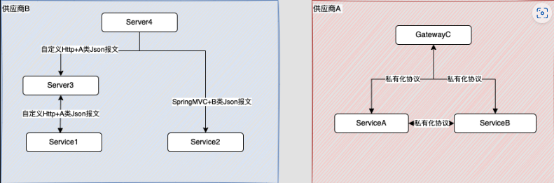

## 背景介绍

富融银⾏是⼀家⽴⾜于⾹港，⾯向全球业务的虚拟银⾏，创立以来先后斩获 2021年-杰出虚拟银行服务大奖、2022年-[领航9+2粤港澳大湾区奖项]粤港澳大湾区最佳银行 等荣誉。

富融银⾏以⼤数据、云计算等技术为驱动，为用户提供存款、贷款、转账、理财、营销等⼀站式的⾦融服务。

富融银行的核⼼系统是处理银⾏业务存款、贷款和中间件业务等最基本业务的IT系统。为了⽀持银⾏业务的⾼速发展，核⼼系统涵盖了外购、⾃研2⼤类系统，其中外购系统不具备⼆次开发能⼒，需要供应商⽀持。

为了保障业务的持续发展，需要改进核⼼系统服务治理⽔平，来应对业务挑战和⾦融监管，因此核⼼业务需要引入服务治理组件，能够平滑顺利地解决容灾、系统集成、流控、服务发现、服务治理、故障容错等问题。接下来，我们来看看富融银行是如何应对挑战，实现业务系统升级的。

## 挑战重重，迎难而上

随着业务不断扩展，自研系统+外购系统带来了一定的挑战：通讯协议上的多样性，报文格式的差异，云上的安全机制，混合云的容灾机制等，北极星的到来，帮助核心研发团队低成本高效率应对上述各种挑战。

### 挑战一：异构系统，集成难度高

上面提到过，为了⽀撑银⾏业务发展，核心系统涵盖了外购、⾃研2⼤类系统，外购系统不具备⼆次开发能⼒，需要供应商⽀持。

核⼼服务供应商A适配各种银⾏的集成需求，提供私有化RPC协议解决模块之间的调⽤，提供服务⽹关解决外部系统的调⽤问题。核⼼服务供应商B，基于Spring体系，提基于Http+Json的通讯协议，并基于Netty定制Http组件，便于配置。

但不同供应商系统再加上⾃建系统，增加系统集成难度：

- 通讯协议：为了⽀持多种协议接⼊，需要引⼊各种组件库，⾯临依赖冲突，版本冲突等问题。
- 报⽂格式：不同⼚商使⽤的报文格式有差异，给验签、加密带来额外的复杂度。

#### 解决方案：集成北极星，提高效能

##### 接入方式和版本选择

北极星社区提供多种数据面，能够很好地兼容现在主流的技术栈，目前富融银行核心系统使用的是 Spring Cloud Tencent、Spring Boot Polaris 和 Polaris Java SDK。

- Spring Cloud Tencent

基于 Spring Boot 体系开发的服务全部使⽤ Spring Cloud Tencent，其中，Spring Boot 选用 2.4.5 版本，Spring Cloud Tecent 选用 2020.5 版本。统⼀版本，可维护性⾼。

- Polaris Java SDK

没有使用 Spring Boot 体系的服务，需要在开发框架中集成 Polaris Java SDK。我们参考 Spring Boot Polaris 实现了服务和 Polaris Java SDK 的集成插件，必须通过插件进行服务发现和路由，选择性进行服务注册，低成本地接⼊北极星体系。⽆法使⽤ SDK 进行服务注册的服务，可以在北极星控制台上注册。

##### 北极星集成

使⽤统⼀的polaris.yml，统⼀北极星服务接⼊、就近路由、降级措施和主动探测机制。

引⼊统⼀的pom依赖，管理⾃定义组件和北极星版本。

##### 系统集成

- 传输协议强制使⽤https，⼀来保证云上数据安全，⼆来在⽆论⽹络策略多复杂，https是主流协议，不受影响。
- 使⽤OpenFegin组件统⼀接⼝外调、⽇志打印、脱敏和签名。
- 引入网关收拢流量。
- 封装api⼯程，包含DTO定义和FeignClient定义。⼀次定义，多处复⽤。通过DTO约束，有效解决json弱类型的问题。

改造结果如下：

### 挑战二：容灾机制依赖内部负载服务，手段单⼀

⾹港银⾏同业结算有限公司(HKICL)要求所有接⼊转数快(FPS)的⾦融机构实现MQ队列的⾃动容灾。在主队列出现异常时，能在5分钟之内切换到备⽤队列。

早期设计思路是⽆法做到⾃动切换队列的场景。

- 依赖业务系统的端⼝探测进⾏切换，只能应对运维发布场景。
- 接⼊服务不感知队列是否正常，⽆法将调⽤结果上报到负载均衡服务(L5)，只能让运维通过告警发现。

#### 解决方案：前置接入服务改造

- 利⽤上报机制，能根据调⽤结果，及时熔断不可⽤服务。
- 通过探测机制，扩展MQ探测插件，在流量不⾜的情况下，及时熔断异常队列。
- 基于路由功能，根据权重将流量分配到不同的队列上。
- 通过运维控制台，主动切换流量。在不影响客户的情况下，进⾏系统加固、容灾演习和专线升级。

新服务的架构变为：

默认情况下同机房80%流量、跨机房20%流量。保证在队列异常、专线异常、转发服务异常时，服务不中断。

## 玩法探索

北极星丰富的服务和流量管理能⼒，给了我们更多的选择。

#### ⽹关增强：SpringCloudGateway+北极星

⾦融业务上公有云，需要考虑后云上安全，需要加密传输、数字签名等机制，直接修改外购系统不现实。折中⽅案是将这些系统，放在严格管理的区域，然后开放有限⼊⼝对外提供服务。⽹关可以作为服务⼊⼝承担此任务。北极星提供spring-cloud-tencent-gateway-plugin插件打通SpringCloudGateway(简称SCG)和北极星，将北极星的服务治理能力与⽹关集成在⼀起。⼀旦服务能注册到北极星上，SCG就可路由到对应服务。如果外购系统不⽀持⾃动注册到北极星，可使⽤⼿动注册+北极星主动探测的机制，及时熔断异常服务。

北极星维护服务对应的IP列表，可以借此做授权管理。通过 服务名->[⽩名单URL]、服务名->[⿊名单URL]，可有效控制流量。IP地址的变更与服务注册完美绑定在⼀起，⽆需再⽹关⼿动维护。

#### 公⽹服务治理：Http代理+HttpClient+SCT+北极星

默认情况下，北极星服务中的IpPort就是被调⽅地址。

在特定业务中，需要与公⽹服务进行通讯。服务方或者提供IpPort或者URL。如果IpPort，可直接使⽤北极星负载均衡。但如果是URL则需要引⼊Http代理服务器。

内网的主调⽅通过代理服务访问被调⽅。容灾可在主调⽅处理，也可以通过http代理服务应对。考虑到运维统⼀性，选择通过北极星进⾏管理。默认情况下北极星路由地址是http代理地址，因此需要重写访问地址。利⽤ApacheHttpClient提供的DefaultRoutePlanner，可解决此问题。通过重写DefaultRoutePlanner的 determineProxy接⼝，达到 返回实际代理(proxyHost)并重写⽬标地址(targetHost)。

此外利⽤北极星SDK⾃带的探活机制，定期检查链路，在链路(Http代理->专线->被调⽅) 出现任何异常时，都可切换到可⽤链路。

## 总结

北极星是腾讯新⼀代服务治理的核⼼组件，它的到来极⼤改善了富融银⾏核⼼业务的服务治理⽔平。促使富融银行逐步摆脱了私有化的⼚商RPC协议，以统⼀的Https/Http+Json+Fegin模式降低系统间的集成难度，北极星灵活可靠的路由规则，低成本的⽀持银⾏容灾演练，上报与探测功能，也保证了服务的可⽤性。

借由这个机会，向北极星开源团队表示感谢。当我们摸索北极星，开源团队积极耐⼼回答我们的疑惑。我们提出的建议，也能得到团队回应。

从2021年到现在，⻅证了开源北极星的诸多变化，基础功能不断优化，⽂档质量逐步提升，企业级功能逐步完善，对运维⼈员也越来越友好，开源的道路上，愿它乘⻛破浪。