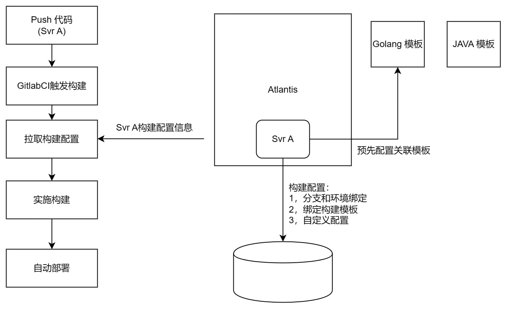
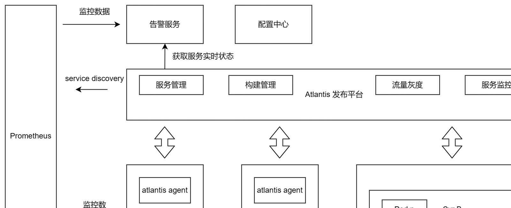
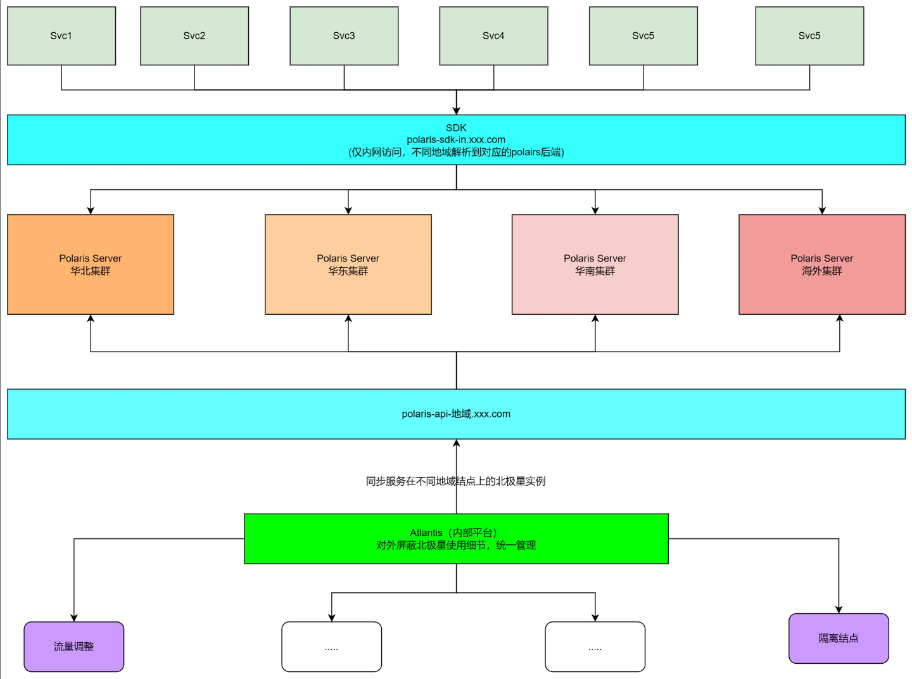
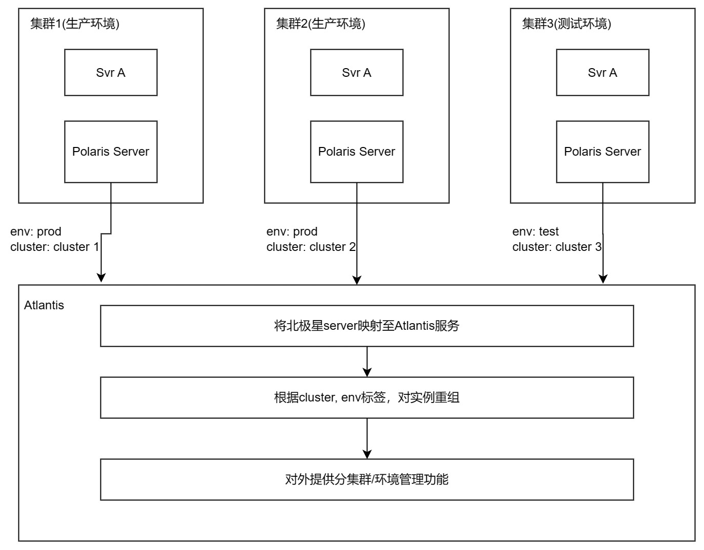
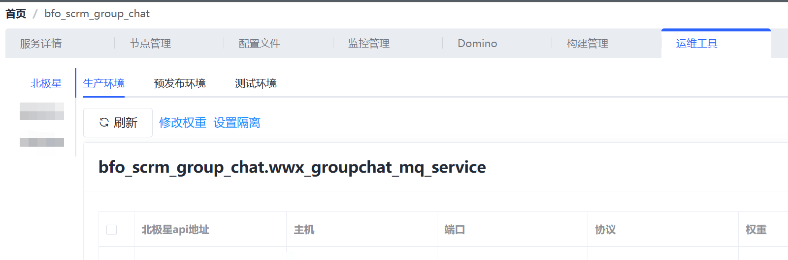
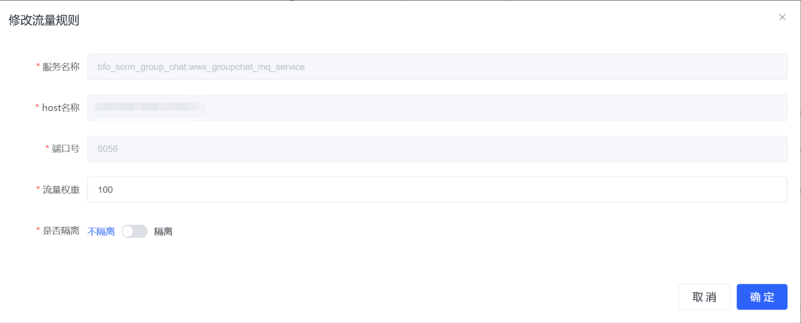
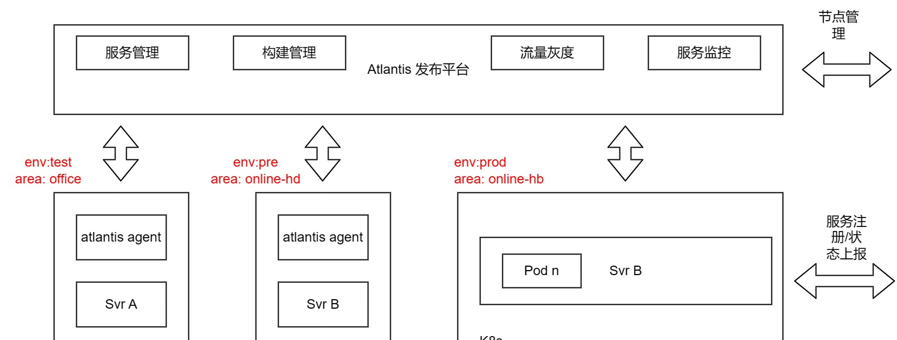
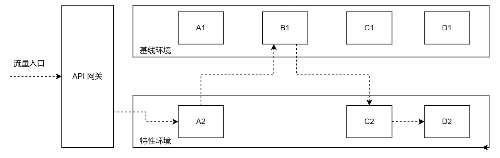
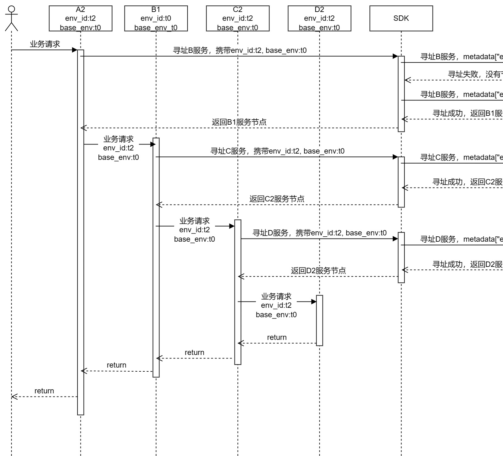

## 背景介绍

蓝色光标是一家营销领域的科技公司，其业务涵盖数字广告投放平台，SaaS服务，以及基于营销科技的智慧经营服务等，2022年公司营业收入超过了366亿人民币，服务了约3,000个国内外品牌客户。由于营销领域的客户需求多种多样，这也决定了公司的产品形态并非大一统，不同的业务战线具有非常显著的个体差异性，同时也对技术架构提出了不同的要求，其中典型的场景如下：

- 广告投放类业务：日均百亿+的广告流量，且为了最大程度保障业务可用性和降低运维成本，通常是分地域混合云部署。
- SaaS业务：除了标准产品外，还需要支持对大客户的私有化部署。
- 创新业务：快速搭建新业务，要求中台功能足够全。

不同的业务场景，对技术架构的要求也不同，而各个团队的选择也往往是先快速支持业务，因此随着时间推移，难免会出现技术栈不统一，各自造轮子的情况。在实施服务治理前，我们遇到的一些问题如下：
1. 对于投放类业务，由于流量频繁波动，对动态扩缩容有较强的需求，是最先迁移到k8s平台的业务。而其它业务由于刚需不强，仍以虚拟机部署的方式为主。在业务往新架构迁移的过程中，新旧服务需要做到互通互调，并且架构迁移需要平滑。
2. 服务发现的方式五花八门，只能做到业务内兼容：对于使用k8s的业务，采用的是k8s原生的service方式。其它的业务有些用开源的ServiceDiscovery框架，有些通过Zookeeper自研，也有直接IP:PORT直连的方式。当有跨业务访问的需求时，往往通过nginx负载均衡+人工维护的方式解决。增大人工维护和出错的成本。
3. 没有统一的测试环境管理方案，主要还是以人工约定测试环境的使用为主。
通过对业界主流的服务治理框架的调研，我们认为北极星对不同架构的兼容能力能够符合我们的业务实际情况，因此最终选择北极星作为服务往云原生架构迁移过程中的服务治理平台。

## 服务治理实践

北极星虽然提供了完善的服务治理能力，但是也并不是立即就可以在我们业务落地，也需要看业务是否已经准备好了。在实施服务治理前，我们需要首先解决以下前置问题：

- 服务部署信息和北极星需要互通，例如，当服务部署到某个节点时，需要能够获取环境/地域信息，并且在服务注册的同时传入给北极星。而现实情况是，不同业务之间的服务发布方式并不一致，使用k8s的业务，是直接使用云厂商的原生k8s平台；而沿用VM部署的业务，则使用公司内部的发布平台。在现有架构下，需要针对每个业务制定不同的方案，当业务架构变化时，往往也需要重新适配。
- 整合现有服务发现机制，在使用北极星之前，我们的部分业务也做了一些服务发现的尝试，例如，zookeeper, Nacos等，本次架构迁移也将原有的服务发现方式统一迁移到了北极星。

综上所述，我们首先对现有的服务构建和发布流程做了一次全面的重构，并通过重新设计的发布平台整合了VM/K8s部署的全流程。在此基础上，利用北极星实现了内部的服务治理能力。

## 基于发布平台实现标准化

由于各个业务的异构性，对于单个业务的具体痛点的改造往往收效不大，且不具备普适性。因此，我们在整个架构变革的初期，选定了以发布平台作为全流程的切入点，原因如下：

- 由于VM/K8s + 混合云部署的特征，我们需要一个能对接各种云服务商的发布平台，降低运维成本。
- 发布平台是所有模块的上线的必经之路，往前能串联模块的CI/CD流程，往后能对接服务治理/监控等能力；是一个很好的抓手。
- 架构演进也是一系列标准化的过程，发布平台需要兼容所有类型的模块，前后端，不同的服务框架。适配的过程能够主导推进业务模块的标准化；比如标准化的构建，上线流程，配置管理，监控等。

蓝色光标内部的统一服务发布平台取名是Atlantis，后续我们将用atlantis来代替发布平台，我们在atlantis上实现了以下核心能力:
- 屏蔽底层基础设施: Atlantis同时支持虚拟机+k8s部署，支持对接各类云厂商的ecs和k8s集群。服务的所有操作收归到一个入口。并且可以通过atlantis获取服务的所有部署信息，不论该服务部署在哪个集群上。
- 环境管理：Atlantis统一管理测试，预发布，生产等多套环境的发布；并且将测试环境治理的功能也集成到发布平台，天然打通了从线下测试到上线的全流程。
- 服务治理：Atlantis底层对接了北极星，实现服务发现和治理的能力。并且通过暴露服务发现接口给prometheus，实现了服务发布后的自动监控能力。

## 统一CI/CD流程

通常在技术团队内，都会定义一套完整的持续发布流程，通过全自动的构建,测试,发布流程，提升研发效能。这套流程实施的方法论不属于本文的探讨重点，本节主要描述这套持续集成流程与发布系统的是如何整合的。
首先，先简要描述下我们对构建流程的几个目标：

1. 通用流程模板化，且可实时更新；例如，Golang的服务共用一套构建模板，模板的更新可以快速对所有服务生效；
2. 自定义功能统一配置入口，避免在工程内部硬编码。自定义功能点包括：是否自动发布，分支和测试环境的绑定，依赖的接口库，需要发布的集群，镜像仓库地址等。
 
为了达到以上目标，我们在发布系统里增加了"构建管理"的功能，管理服务的所有构建相关配置。



通过将构建和服务部署信息整合到一个系统，并且在构建时实时下发模板，我们就可以轻松的实现类似以下的功能：

1. 业务无感，快速的执行更新构建镜像版本，新增构建步骤，调整包上传地址等操作；
2. 根据服务所配置的需要部署的架构，自动构建相应的交付件。例如，服务A需要部署在三个位置，分别是某国内云厂商K8s集群，某海外云厂商K8s集群，以及某客户的私有化平台（非K8s部署）。这样当服务构建时，会自动打包成docker镜像并分别上传至两个k8s集群，同时会构建一个虚拟机安装包，上传至私有化部署平台。

当部署环境有变化时，只需要调整发布平台上的配置，无需修改构建脚本，能够自动同步到构建流程中。

## 部署架构兼容虚拟机/K8s

业务在往K8s迁移的过程是一个持续的过程，通常伴随着新老系统并存的问题，因此我们重点解决了以下几个问题：

- 屏蔽因为底层架构差异带来的不一致体验，统一一个服务管理入口。
  - 针对虚拟机部署的服务，通过部署在每台机器上的agent接收发布指令，并完成相应的发布动作；
  - 通过对接k8s集群api，在atlantis上实现对多集群的统一管理；
  - 通过部署prometheus联邦集群，我们将不同集群下的监控数据进行汇总，数据统一呈现，统一监控。

架构图如下所示：



- 通过北极星，实现VM/K8s集群之间的服务发现，这个在下一节中将重点介绍。


## 基于北极星实现服务治理

如上文所描述，北极星对异构系统的兼容能够很好的匹配蓝色光标的业务形态。我们将北极星作为服务治理的底座，通过和atlantis的结合，快速构建起了同时支持测试和生产环境的服务治理平台。

### 部署架构

由于我们的业务是跨地域，多集群部署，且不同地域之间的网络通常是不互通(针对需要跨地域互调的场景，单独走专线)，因此，我们在每个地域(或者说，每个局域网内部)都部署了一套北极星组件，用于集群内部的服务发现。

无论是部署在哪个集群，北极星server对外暴露的api地址都为同一个，通过DNS配置，实现每个集群的server只访问本集群的北极星server。这样可以简化业务服务的配置，无需根据部署地域，配置不同的北极星地址；实际部署架构图如下所示：



### 管理后台统一

分布式部署北极星能提高集群内的服务发现稳定性和效率，但是如果服务存在跨多集群部署的情况，由于每个集群的北极星server都有一个管理console，如果让用户通过直接访问console进行流量的管理，会需要登录多个console，成本高且容易出错。并且我们也希望能基于服务的视角，统一管理生产,预发布,测试环境的流量。对这个问题的解决方案是这样的：

我们将发布平台atlantis对接所有已部署的北极星（这些北极星都部署在不同的地域，集群里），将常用的流量管理功能嵌入atlantis，以服务的视角，支持跨集群管理流量，如下图所示：



具体流程如下：

1. Atlantis内部维护了服务部署信息和北极星api地址的映射，
2. 用户进入atlantis的北极星管理页面时，atlantis根据获取的北极星api地址列表，拉取实例实时信息；
3. 根据拉回的实例标签env字段，基于环境分类。
4. 用户可以基于环境,集群等维度，对北极星实例的流量进行管理。

如下图所示，同一个服务即使部署在多集群，多环境，也能够通过atlantis统一管理流量：




### 服务接入北极星

北极星提供了多种语言的sdk，且对服务框架没有严格限制，可以让业务服务快速接入。为了更好的适配现有业务，我们将自身的服务定义和北极星服务定义进行了融合，并在北极星sdk基础上做了一层封装。

#### 服务定义

实际业务场景里，一个服务有可能会监听多个端口，每个端口提供不同的服务。例如，一个passport_server在8080端口提供了业务服务rpc_service，同时在8081端口提供了管理控制功能control_service。对于这种情况，我们在北极星会注册两个服务，名称分别为: passport_server.rpc_service, passport_server.control_service。主调需要通过完整的servername进行服务寻址，即类似passport_server.rpc_service这样的格式。

#### 注入标签信息

为了实现环境隔离，标签选址等功能，服务在往北极星注册，以及查询被调服务地址时，通常需要带上自己的部署信息，例如环境类型，集群名称等。关于这一点，我们是通过atlantis发布平台来实现。如下图所示，atlantis在服务发布时，根据所发布的环境，注入不同的环境变量。服务在调用北极星api时，自动携带所注入的环境变量，从而实现环境隔离，标签路由等功能。



#### 流量定向请求

在我们使用北极星作为服务发现平台后，通常情况下，对被调服务的寻址和路由都是动态的，即根据被调实例的可用性和权重进行自动的选择，这些选择往往基于预先设定的路由规则，主调一般不会hard code被调的地址。但是在一些特殊场景下，我们有可能需要override北极星的功能，直接指定被调的地址。例如，服务开发中，我们希望直接指定某个下游服务的地址进行请求，或者我们希望单独测试某个被调节点的性能时。

为了实现此需求，我们对业务服务框架进行了扩展，使之同时支持自定义寻址和北极星两种方式，并且自定义寻址的优先级要高于北极星寻址，服务的配置如下所示：

```conf
[polaris]
token_server_addr=bfo_scrm_token_server.token_thrift_service
material_server_Addr=bfo_scrm_material_server.material_thrift_service@10.0.0.215:8080;10.0.0.214:8000
```

我们通过占位符"@"标明是否使用自定义配置，配置格式为：IP:PORT;IP:PORT当存在自定义配置时，将根据配置文件中明确定义的地址进行请求，如果配置了多个，则进行负载均衡。通过这样的设计，使得业务代码本身不需要做任何修改就可以快速响应流量定向请求的需求。
流量定向请求的功能主要应用场景还是在各类联调和测试中，线上稳定运行的服务通常不会开启。

#### SDK接入

为了更好适配我们对北极星的使用姿势，减少业务重复代码，我们在北极星sdk基础上做了一层封装，主要增加了以下功能：

- 被调服务：
  - 服务启动时，获取atlantis所注入的环境变量，将env，deploy_type, cluster_name等环境变量随着服务注册，以标签形式上报到北极星；
  - 由于注册的地址正确性是一个非常关键的功能，当被调服务通过环境变量获取到POD_IP后，会随机启动一个http服务，监听POD_IP:PORT，并对该端口可达性做验证。
- 主调服务:
  - 获取被调服务实例列表时，将env，deploy_type, cluster_name等环境变量以标签形式发送到北极星；
  - 基于从北极星获取的地址列表，扩展实现了连接池，失败重试，熔断等功能。

## 测试环境管理

测试环境的管理是一个老生常谈的问题，简言之，测试环境治理的核心目标是：减少测试环境维护成本，环境之间按需隔离/互通，使用门槛足够低。当我们把测试环境治理的需求抽象成一个最小集，即可得到如下的示意图：



对以上场景的描述为：

- 测试环境可分为基线环境，特性环境两类。基线环境为稳定的环境，通常和生产环境保持一致。特性环境为开发新feature环境，按需创建/销毁。
- 基线环境涵盖的服务往往最全，而特性环境一般只包含本次需求开发的服务
- 流量通过网关转发进入到特性环境后，基于以下三个转发规则：
  - 被调服务在特性环境存在，则调用同环境的被调服务；
  - 被调服务在特性环境不存在，则访问基线环境；
  - 流量需要能够从基线环境重新回到特性环境。

我们基于北极星的测试环境管理基于以下5个点：

- 引入env_id和base_env的概念。
- 服务在启动时，注入预先分配好的env_id和base_env。
- 流量会从入口服务携带env_id和base_env，并且向下游透传（通过context，或者header）。
- 主调服务在通过北极星寻找下游服务时，通过metadata传入env_id进行路由匹配，如果匹配不到结果，使用base_env的值作为env_id进行匹配。
- 流量中携带的env_id和base_env优先级比服务本地注入的优先级高。

整体调用流程示例如下：

1. 流量在经过入口时随入口服务携带上env_id=t2, base_env=t0的标签，此后所有的流量都以这两个值为基准经由SDK向北极星进行寻址。
2. SDK根据第一次metadata["env_id"]=t2的寻址结果决定是否需要二次寻址跳往基线测试环境。
3. 流量转入基线环境之后，因为优先使用流量中携带的env_id=t2，通过SDK寻址北极星，从而再次跳转回特性环境t2。



## 总结

以上是蓝色光标基于北极星的服务治理实践，截止目前，我们主要利用的是北极星服务发现和标签路由的功能。通过使用北极星，很好的解决了我们业务跨多集群, 混合架构部署的问题，使得我们可以加快将业务服务从虚拟机往K8s迁移的过程。当然，我们目前只是迈出了第一步，后续我们计划和北极星做更深入的整合，将灰度发布，全链路追踪等能力也集成到现有平台。

