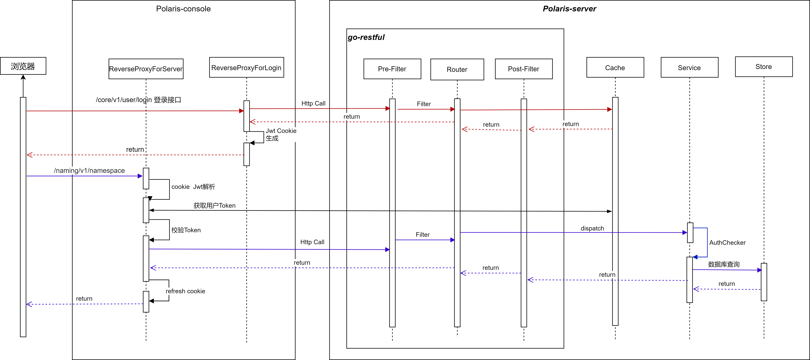
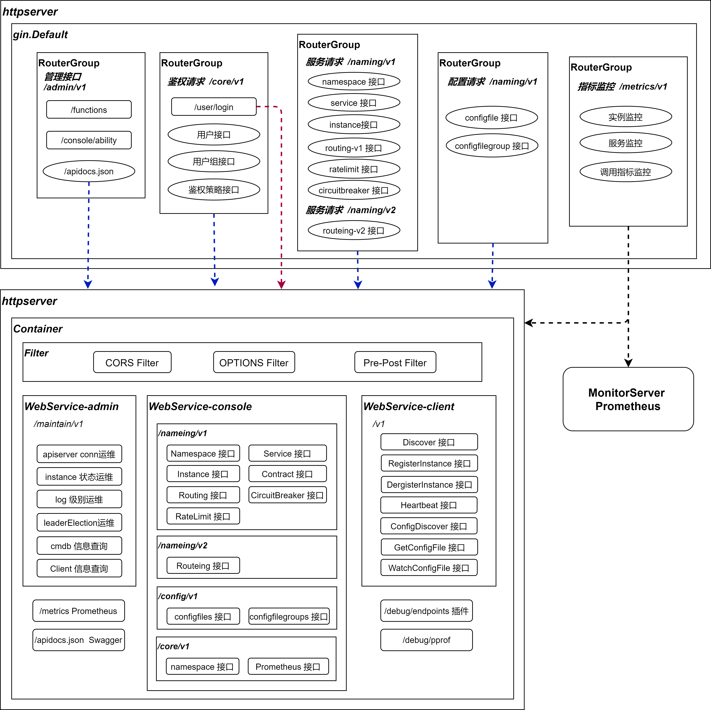

## 前言

在北极星开源服务治理平台中，用户可以通过前端WEB界面来进行服务管理、流量管理、配置管理、故障容错和可观测性查看，本篇Blog主要从源码分析的角度，来看polaris的前端功能如何与后端进行交互和调用。


在 polaris 部署中，主要包括下面4个组件：
- polaris-console：可视化控制台，提供服务治理管控页面。
- polaris-server：控制面，提供数据面组件及控制台所需的后台接口。
- polaris-limiter: 分布式限流服务端，提供全局配额统计的功能。
- prometheus：服务治理监控所需的指标汇聚统计组件。


本篇Blog，重点分析 polaris-console组件与 polaris-server 组件的交互和调用， 整体交互流程图如下：



## polaris-console 组件源码分析

polaris-console 中主要包括2部分源码内容：

- 基于 React的WEB前端代码。
- 基于 Gin 框架的 RESTful反向代理代码。


### Gin 反向代理介绍

在 polaris-console工程中， 并没有使用传统的 React前端 + Nginx反向代理 这样的方案， 而是通过 Gin + Golang的 httputil ReverseProxy实现了一个简单的反向代理， 这样带来的好处是能够通过golang编码的方式，来实现很多权限校验，请求重定向, 请求/响应校验 等功能。

在polaris-console中，主要实现了4中类型的反向代理:


类型一 `ReverseProxyForLogin`: 主要 为登录接口提供反向代理，登录成功后，会将反参中的 `UserID `, `Token` 作为 claims生成Jwt Token， 并将这个Jwt Token作为Cookie 写入Http Response中。

```
func ReverseProxyForLogin(polarisServer *bootstrap.PolarisServer, conf *bootstrap.Config) gin.HandlerFunc {
	return func(c *gin.Context) {
		c.Request.Header.Add("Polaris-Token", polarisServer.PolarisToken)
		c.Request.Header.Del("Cookie")

		director := func(req *http.Request) {
			// 请求入参处理
		}
		modifyResp := func(resp *http.Response) error {
			// 响应反参处理 与 Cookie刷新
		}
		proxy := &httputil.ReverseProxy{Director: director, ModifyResponse: modifyResp}
		proxy.ServeHTTP(c.Writer, c.Request)
	}
}

```

类型二 `ReverseProxyForServer`: 主要 为大部分需要鉴权的接口提供反向代理功能，一般是登录成功后做其他操作时，走该反向代理。 该反向代理 首先从 Cookie中解析出 Jwt Claims, 从Claims中得到 `UserID `与`Token` 属性， 然后通过调用 polaris-server的 `/user/token` 接口，比对接口返回的 `AuthToken` 是否与Jwt中的一致 ，如果一致， 则校验通过， 反向代理将请求代理到 polaris-server的接口， 并且刷新 Cookie 中Jwt的 Expire时间。

```
func ReverseProxyForServer(polarisServer *bootstrap.PolarisServer, conf *bootstrap.Config) gin.HandlerFunc {
	return func(c *gin.Context) {
		if !verifyAccessPermission(c, conf) {  // 权限校验方法
			return
		}

		c.Request.Header.Add("Polaris-Token", polarisServer.PolarisToken)
		c.Request.Header.Del("Cookie")

		director := func(req *http.Request) {
			req.URL.Scheme = "http"
			req.URL.Host = polarisServer.Address
			req.Host = polarisServer.Address
		}
		proxy := &httputil.ReverseProxy{Director: director}
		proxy.ServeHTTP(c.Writer, c.Request)
	}
}

```


类型三 `ReverseProxyNoAuthForServer`: 不需要鉴权的反向代理， 主要提供给 `/apidocs.json` Swagger描述使用。

```
func ReverseProxyNoAuthForServer(polarisServer *bootstrap.PolarisServer, conf *bootstrap.Config) gin.HandlerFunc {
	return func(c *gin.Context) {
		c.Request.Header.Add("Polaris-Token", polarisServer.PolarisToken)
		c.Request.Header.Del("Cookie")

		director := func(req *http.Request) {
			req.URL.Scheme = "http"
			req.URL.Host = polarisServer.Address
			req.Host = polarisServer.Address
		}
		proxy := &httputil.ReverseProxy{Director: director}
		proxy.ServeHTTP(c.Writer, c.Request)
	}
}
```


类型四 `ReverseProxyForMonitorServer`: 代理到 Prometheus的地址。

```
func ReverseProxyForMonitorServer(monitorServer *bootstrap.MonitorServer) gin.HandlerFunc {
	return func(c *gin.Context) {

		director := func(req *http.Request) {
			req.URL.Scheme = "http"
			req.URL.Host = monitorServer.Address   // Prometheus地址
			req.Host = monitorServer.Address
		}
		proxy := &httputil.ReverseProxy{Director: director}
		proxy.ServeHTTP(c.Writer, c.Request)
	}
}
```


## polaris-server 组件源码分析

polaris-server 在启动时， 会启动一个 `httpserver`, 其内部使用 `go-restful` 框架来处理前端的 Restful 请求 。


### Restful 拦截器介绍

`httpserver` 在 go-restful 的Container 级别增加了全局 Filter， 包括 preFilter 与 postFilter 。

- preFilter: 用来对 Restful 请求进行预处理, 包括日志打印， 访问白名单过滤 和 限流。
- postFilter: 主要对请求后的接口调用情况进行度量统计处理。

***此处需要说明***， 在  go-restful 的preFilter中，并没有对权限进行校验。 真正的权限校验放在了服务层。


### Restful 请求处理

polaris-server 收到 Restful 请求后， 主要由如下几部分组件处理：

- Cache ： 缓存组件，后台协程会定时同步数据到缓存中(例如工号信息)， 通过Cache 提升系统响应速度。
- Service: polaris-server 的各功能的逻辑处理部分， 包括 `auth`, `config`, `namespace`, `service` 等逻辑处理接口及实现。 
- Store： polaris-server 可插拔的存储组件，用来处理数据CURD逻辑， 默认支持 Mysql与boltdb存储。


## 前后端Restful接口整体功能架构





主要包括：

- 管理接口Group: 提供一些 apidocs， 函数导出，当前系统健康状态 的接口。
- 鉴权接口Group: 提供用户，用户组，鉴权策略的接口。
- 服务请求接口Group: 提供 `namespace`, `service`, `instance`, `routing`, `ratelimit`， `circuitbreaker` 等主要的功能接口。
- 配置接口Group： 提供 `configfile` 配置文件管理接口。
- 指标监控Group: 提供指标监控接口。


## 结语

通过上面的分析， 梳理了`polaris-console`前端组件通过 Restful 调用后台 `polaris-server`组件的逻辑，可以帮助大家更好的理解 polaris 的前后端模块的交互过程。

