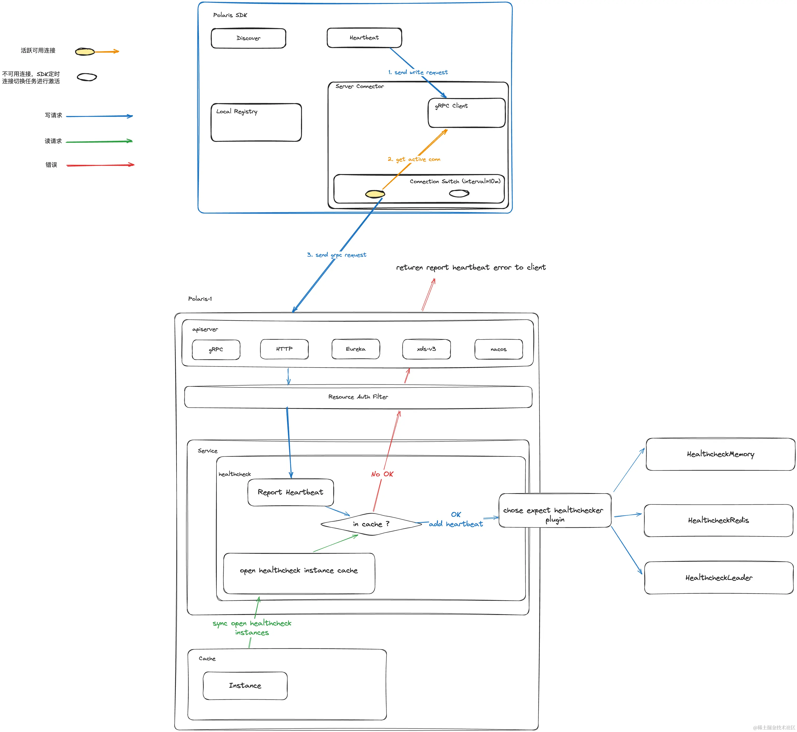
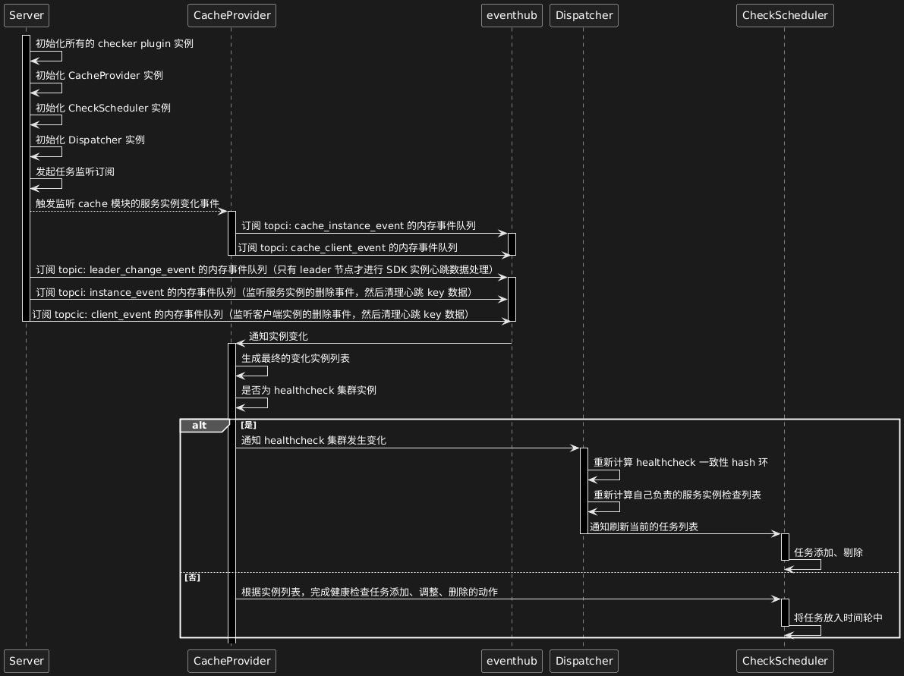

-- [转载自掘金](https://juejin.cn/post/7389560835636510758)

## 前话

PolarisMesh 官网：[PolarisMesh](https://polarismesh.cn/#/)

PolarisMesh Github：[polarismesh/polaris](https://github.com/polarismesh/polaris)

**polaris-server** 作为PolarisMesh的控制面，该进程主要负责服务数据、配置数据、治理规则的管理以及下发至北极星SDK以及实现了xDS的客户端。

**polaris-server** 是如何处理客户端的服务实例的心跳请求的呢？心跳数据是怎么存储的呢？带着这个疑问，我们来探究看下**polaris-server**的健康检查模块，看看北极星是实现的。


## 前期准备

- golang 环境，需要1.20.x +
- 准备 vscode 或者 goland
- 从github中clone一份 polaris-server 的源码，这里推荐从release-vx.y.z分支中选择一个分支进行学习，以下文章将基于[main](https://github.com/polarismesh/polaris/tree/main)分支进行研究
- 从github中clone一份 polaris-java 的源码，这里推荐从 release-vx.y.z 分支中选择一个分支进行学习，以下文章将基于[main](https://github.com/polarismesh/polaris-java/tree/main)分支进行研究
  
## 正题

从上一篇文章我们看到，客户端在注册实例之后，会维护实例的心跳上报任务

```java
public InstanceRegisterResponse registerInstance(InstanceRegisterRequest request, RegisterFunction registerFunction,
        HeartbeatFunction heartbeatFunction) {
    // 将注册请求发送至北极星服务端
    InstanceRegisterResponse instanceRegisterResponse = registerFunction.doRegister(request,
            createRegisterV2Header());
    // 当前实例的注册管理状态进行本地保存
    RegisterState registerState = RegisterStateManager.putRegisterState(sdkContext, request);
    if (registerState != null) {
        // 首次存入实例的注册状态时，为该实例注册创建定期心跳上报动作任务
        registerState.setTaskFuture(asyncRegisterExecutor.scheduleWithFixedDelay(
                () -> doRunHeartbeat(registerState, registerFunction, heartbeatFunction), request.getTtl(),
                request.getTtl(), TimeUnit.SECONDS));
    }
    return instanceRegisterResponse;
}
```

客户端会按照用户实际设置的 TTL 间隔进行心跳定期上报，而客户端和服务端的心跳上报通信协议基于 gRPC，具体的定义信息如下：

```protobuf
service PolarisGRPC {
  ...
  // 被调方上报心跳
  rpc Heartbeat(Instance) returns (Response) {}
}
```

那么当服务端收到心跳后，是如何处理心跳数据，以及如何根据 TTL 进行实例的健康状态检查的呢？这里我们先通过一个简单的数据图来对北极星服务端对于服务实例心跳包的处理有一个大致的理解后，我们在逐步针对每个细节进行分析。

### 服务端处理实例心跳



从流程图可知，客户端发起服务实例心跳包到北极星服务端后，先后经过 apiserver -> resource auth filter -> service -> healthcheck -> checker plugin。这里来分析下每个部份它们的职能：

- apiserver: 负责处理不同网络协议的适配，将各种协议下的心跳数据请求转为北极星的心跳数据请求模型，然后将请求传递到 resource auth filter 层
- resource auth filter: 负责北极星的资源鉴权操作，比如验证客户端的实例注册请求，是否有权限注册到目标服务下
- service: 注册发现和服务治理的控制面，负责处理客户端的注册发现、实例健康状态的检查、治理规则获取以及控制台针对治理规则以及服务数据的 CURD 操作
- healthcheck: 负责服务实例心跳请求的处理、检验心跳包是否合法、是否接收该心跳包的上报以及定期检查每个服务实例的健康状态。
- checker plugin: 负责服务实例心跳包的 CURD 操作，以及根据 healthcheck 发送的健康判断请求，进行检查对应的服务实例的心跳请求是否正常发送，如果在 3TTL 内未查到有效的心跳包，则告诉 healthcheck，该实例健康状态变为异常

如果细心察看流程图的读者会发现，healthcheck 内部还有一层缓存，这层缓存的数据来源于北极星的 cache 模块，并且该缓存只会保存开启了健康检查的实例信息，为什么需要这一层缓存呢？由于北极星的服务实例健康检查开关可根据用户实际需要选择开启或关闭，只有开启了健康检查的引擎实例才能上报心跳数据，如果没有开启健康检查的实例，上报心跳数据是一个无效数据，如果对这类的数据不加以拦截，那么会导致 checker plugin 内部保存了无效的心跳包数据，同时也会在有限的服务端资源内，和正常的心跳数据请求争抢服务端资源。因此这里做了一个心跳请求的判断处理。

### 服务端检查实例心跳

当服务端将客户端的实例心跳数据请求处理之后，接下来就是如何检查服务实例的健康状态是否处于正常状态、心跳包是否在 3TTL 内正常上报，北极星集群间各节点如何协同工作，一起完成服务实例的健康状态检查。这些都在 service 下的 healthcheck 模块完成。

这里先来看看 healthcheck 在 polaris-server.yaml 中的相关配置

```yaml
healthcheck:
  # 是否开启该北极星节点的健康检查组件
  open: true
  # 北极星健康检查集群的服务名
  service: polaris.checker
  # 设置时间轮参数
  slotNum: 30
  # 设置最小的实例健康检查周期
  minCheckInterval: 1s
  # 设置最大的实例健康检查周期
  maxCheckInterval: 30s
  # 由于一个北极星 SDK 实例会将当前 SDK 实例的相关信息上报到北极星服务段，因此这里也需要做一个额外检查
  clientReportInterval: 120s
  batch:
    # 心跳数据批量修改的控制器
    heartbeat:
      open: true
      queueSize: 10240
      waitTime: 32ms
      maxBatchCount: 32
      concurrency: 64
  # 健康检查的类型插件
  checkers:
    # 单机场景，基于 map 的心跳检查插件
    - name: heartbeatMemory
    # 集群场景，基于 DB 选主的分布式心跳检查插件
    - name: heartbeatLeader
```

这里来分析下 healthcheck 中每个部份的职能

- **defaultChecker** 
    - 北极星默认的健康检查插件（基于心跳的健康检查）
- **checkers** 
    - 北极星当前支持的健康检查插件列表，不同类型的健康检查都有一个对应的插件
- **cacheProvider** 
    - 从 cache 模块同步开启了健康检查的服务实例数据，将其保存到自己的缓存中
- **timeAdjuster** 
    - 北极星集群各节点的心跳时钟对其组件，根据存储层获取的统一时间，各个节点根据存储层时间，调整自己收到服务实例的心跳包数据的实际接受时间，避免由于时钟不对其导致的服务实例心跳数据检查混乱
- **dispatcher**
    - 根据 **healthcheck.service** 中配置的北极星健康检查集群服务名，从而感知当前节点所在的健康检查集群内其他北极星的 IP 信息，随后将这些 IP 构建出一个一致性 hash 环，所有开启了健康检查的实例，根据该一致性 hash 环计算出，当前北极星服务端节点是否为负责该服务实例健康状态检查的责任节点，如果是，则将该实例保存在自己的负责服务实例 map 中，同时通知给 checkScheduler 组件
- **checkScheduler**
    - 负责接受来自 dispatcher 发过来的开启了健康检查任务的服务实例数据，完成对应的 Add、Update 以及 Delete 操作
    - 内部存在时间轮，通过时间轮针对开启了健康检查的服务实例，根据其设置的 TTL 信息发起延迟任务，即检查服务实例的心跳包是否在 3TTL 内正常发送，当实例状态出现变更时，通过 batch.Controller 针对一批实例发起健康状态字段的变更存储层操作
- localHost: 记录 healchecker 当前节点的自己本机 IP


接着再通过一个时序图来看看 healthcheck 是如何完成上述相关任务的





通过 Dispatcher 组件的一致性 hash 环对所有开启了健康检查服务实例进行责任节点分发，使得北极星的健康检查可以进行很好的水平扩展，同时将具体的健康检查执行判断以及健康检查数据CURD操作独立成插件
