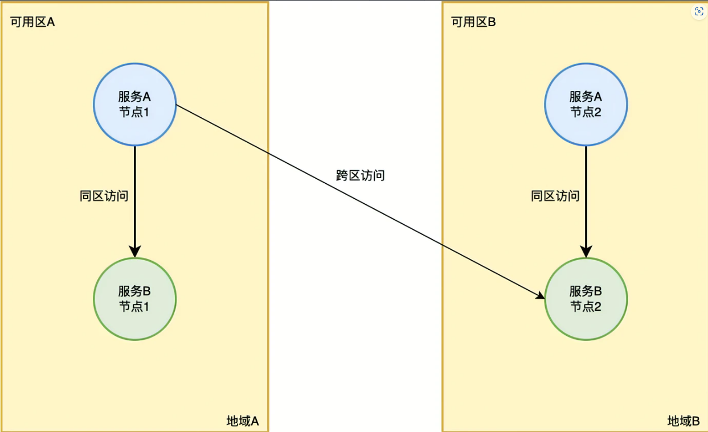
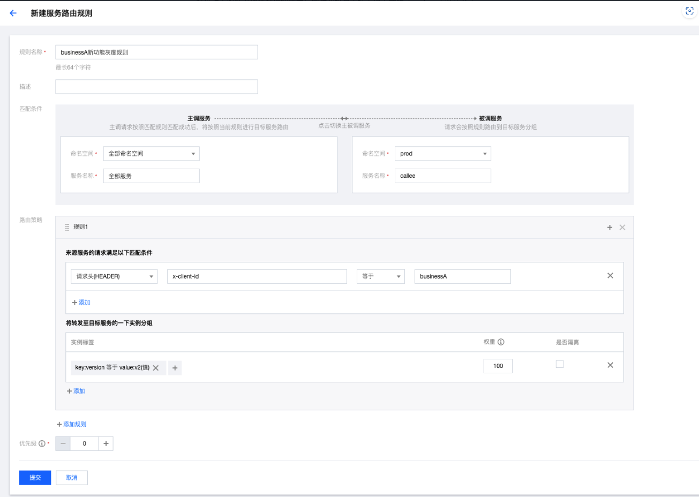
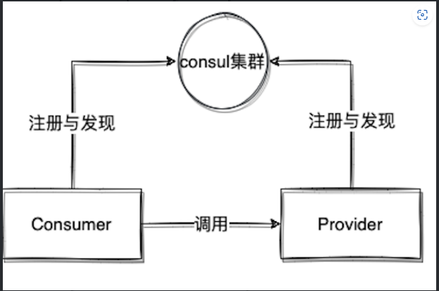
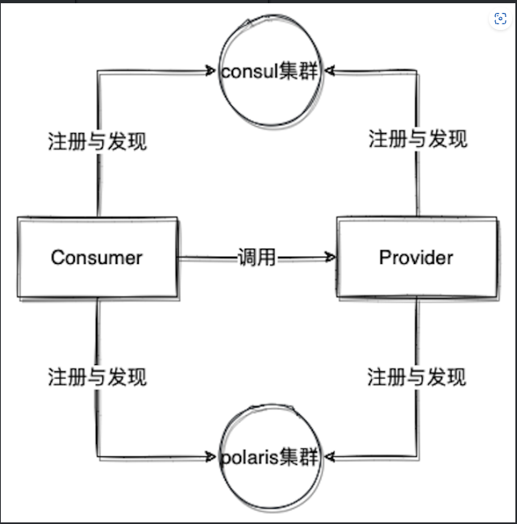

## 背景

某部门早在2020年便积极响应公司自研上云的号召，借用云原生的思想，对老系统进行了重构，使用 Spring Cloud 框架将原来的单体服务拆分为一个个业务微服务，并对这些微服务进行容器化多实例部署，使得整个系统的弹性伸缩能力、容错能力得到了增强，能够面对更加复杂多样化的业务场景。现如今，该部门拆分的微服务数量已高达200多个，这些微服务各司其职，共同为部门的业务保驾护航。

## 新场景，新挑战

在系统重构之初，部门的业务场景还比较简单。对于服务治理的要求，仅仅只需要微服务能够自动注册并互相发现即可，对于流量管理、故障容错等没有太大的要求，因此，选择了当时较为成熟稳定的 Consul 作为微服务的服务注册中心。但是后来随着业务规模的不断扩大，服务间的调用关系也越来越复杂，接入的用户数量越来越多，对系统的稳定性要求也越来越高。Consul 作为服务注册中心已经不能够满足实际的运营要求，给开发运维工作带来了巨大的挑战。

#### 挑战一：服务治理规则不统一

由于 Consul 不支持流量管理、故障容错等功能，因此当需要进行服务治理时，会引入相关的 Spring Cloud 治理组件，比如 Resilience4j、Ribbion 等等，相关组件的治理规则会配置在本地 Application.yml 文件中，但是可能各个服务引入的治理组件不一样，配置的规则也不一样，那么在 Application.yml 展示的内容就各不相同；如果服务负责研发同学调整，就有可能需要重新理解相关的服务治理规则配置，增加维护的理解成本。

#### 挑战二：新功能上线，如何进行流量灰度？

该部门系统的主要职责是进行服务器的管理，包括某些非常关键操作。所以，一旦发生代码变更，除了需要在测试环境进行充分验证外，还需要进行现网灰度。现网灰度如果只按照实例节点灰度的话，意味着现网所有业务的流量均可流到这个变更的代码上，一旦变更的代码有点小 Bug，很可能会对业务的服务器误操作，从而造成生产事故，因此，该部门此前都是通过增加额外的代码逻辑来实现按业务灰度流量的，但这样的操作不但费时还耗人力。

#### 挑战三：多区部署，如何让请求就近访问？

为了保障现网服务的稳定性，该部门正在考虑对一些关键服务进行多区部署。多区部署虽然能够避免因为一个可用区故障而导致整个服务宕机情况的发生，但同时也带来一些问题，多区部署的服务，在进行服务间调用时，很容易因为两个服务不在同一个可用区而导致调用时间增加从而影响整个链路的性能，严重情况下，可能会导致请求超时。另外，也会增加跨区访问的网络成本。因此，在多区部署的情况下，流量的就近路由就很有必要。

## 如何破解挑战？

Consul 仅提供服务注册发现的能力，缺乏针对业务流量的治理，因此我们希望可以引入服务治理中心组件，并且可以针对不同语言、不同微服务开发框架都能够有一样的服务治理体验；同时希望引入服务治理组件后不会增加太多的运维成本。经过对业内流行的几款开源组件调研后，我们最终选择了北极星（Polaris Mesh）。选择北极星（Polaris Mesh）主要看中其一站式的服务治理中心设计：包括服务管理、流量管理、故障容错、配置管理、可观测性；仅需一个组件就可以获得微服务场景下所需的全部服务治理能力，减少对于服务治理规则理解成本；同时北极星支持无侵入式的 JavaAgent 以及 Sidecar，也便于我们后续进行 Mesh 化的改造。

#### 第一：切换到 Spring Cloud Tencent，统一微服务治理框架

结合团队原本的微服务开发框架选型，Spring Cloud Tencent 成为了我们的首要选择，并且 Spring Cloud Tencent 将北极星的服务治理能力，和 Spring Cloud 的扩展点进行了很好的整合，我们只需要引入对应的服务治理能力 Starter，就可以启用对应的服务治理能力。

#### 第二：巧用路由规则，功能灰度上线

为了实现系统新上线的功能能够按照不同业务进行灰度，可以在北极星控制台中配置服务路由规则，让不同的业务请求能够路由到指定的实例节点上。比如 Callee 服务有新功能上线，则需配置如下图所示的路由规则。

该路由规则表示，对于所有访问 Callee 的服务请求，只要请求头中带有 x-client-id=businessA 的请求会优先路由到带有标签 Verison=v2 的 Callee 服务的实例中。

该路由规则表示，对于所有访问 Callee 的服务请求，只要请求头中没有带 x-client-id=businessA 的请求会优先路由到带有标签 Verison=v1 的 Callee 服务的实例中。

配置好了上述路由规则后，通过北极星 SDK 提供的服务打标功能，给新版本的 Callee 服务打上 Version=v2 的标签。这样，在灰度 Callee 服务节点时，灰度的服务节点会带上 Version=v2 的标签，而没有灰度的节点则还是之前的老标签 Version=v1。至此，按不同业务进行流量灰度的功能便得以实现。

#### 第三：结合云上部署信息，完成就近路由

为了解决服务就近路由的问题，北极星 SDK 通过提供环境变量、接口重写等方式让服务实例能够轻松地上报自身的地域信息到北极星服务端，方便其它服务实例能够获取。在进行服务间调用时，主调服务会获取被调服务所有的健康实例，然后根据健康实例的地域信息与自身的地域信息进行匹配，相同地域信息的被调服务实例会优先访问，从而实现就近路由功能。

## 如何平滑迁移注册中心？

注册中心作为微服务架构中最为核心的组件，更换注册中心并非易事，只有当所有服务同一时刻同时更换注册中心时，才能保证服务间的访问不受影响。很显然，这种要求是无法做到的。庆幸的是，北极星注册中心提供了双注册中心的机制，可以让服务同时注册在北极星注册中心及其它类型的注册中心上，这样一来，业务便可利用这种双注册的机制帮助业务平滑地从其它类型的注册中心迁移到北极星注册中心来。

利用双注册机制实现注册中心迁移可分为二步三阶段：

- 原始阶段：即使用 Consul 作为服务注册中心的阶段，该阶段不需要做任何事情。

- 过渡阶段：即使用 Consul 和北极星同时作为服务注册中心的的阶段，该阶段需要逐步引导所有服务通过升级 SDK 的方式实现服务的双注册。

- 最终阶段：即使用北极星作为服务注册中心的阶段，该阶段需要待所有服务都完成双注册后，再又逐步引导所有服务通过修改配置的方式实现北极星的单注册。

## 总结

经过系统重构和北极星的加持后，让部门的系统焕然一新，服务治理能力得到了有力的提升，能够承载越来越多的业务以及越来越复杂的业务场景。现如今，部门200多个微服务依托于北极星丰富的服务治理能力为业务提供持续稳定的服务，将后来，随着业务规模的继续扩大，北极星的服务治理能力也将进一步得到体现。

