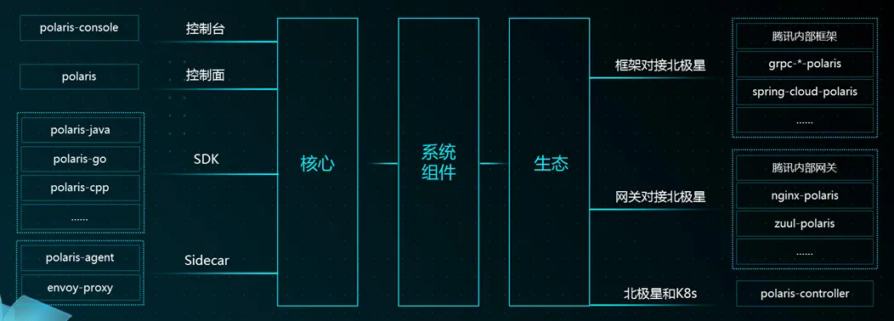

## 导语

PolarisMesh 是腾讯开源的百万级服务发现和治理中心，积累了腾讯从虚拟机到容器时代的分布式服务治理经验。作为分布式和微服务架构中的核心组件，PolarisMesh 提供服务寻址、流量调度、故障容错和访问控制等一系列能力，在 K8s 和虚拟机环境中可以无差别使用，支持主流的开发模式，兼容 grpc、spring cloud 和 servicemesh 等开源生态，帮助用户快速构建扩展性强、可用性高的业务架构，实现从传统架构到云原生架构的转型。

## 作者简介

### 单家骏

腾讯云高级研发工程师

腾讯北极星（PolarisMesh）开源项目、弹性微服务引擎 TSE 核心研发，10 + 年从业经验，从事云计算及中间件 7 年有余。热爱开源、崇尚技术，希望能够使用技术使软件的应用变得简单、高效和美好。

## 全面拥抱 Go 社区

PolarisMesh 以服务注册中心为基础，提供了服务注册发现，健康检查等能力；同时扩展了服务治理控制面，支持了流量调度（动态路由、负载均衡）、熔断降级、访问控制（限流）等功能。


在客户端接入上，PolarisMesh 提供了多语言 Proxyless（Go，Java，C++）以及 Sidecar（envoy，Java agent）的接入方式，供不同形态的应用进行接入。同时，PolarisMesh 也提供了生态组件，以提升已使用了生态框架的应用的接入效率，下文主要介绍的是 Go 语言相关的生态组件（gRPC-Go）的使用及实现。



## 什么是 gRPC-Go

在 Go 语言社区，发展最成熟，使用最广泛的 RPC 框架就是 gRPC-Go（https://github.com/grpc/grpc-go）。

gRPC 是一个高性能的二进制 RPC 框架，通过统一定义的 RPC 服务描述，配合多语言的 SDK，可以轻松实现跨语言的 RPC 调用。


gRPC-Go 是 gRPC 框架的 Go 语言的实现，核心层提供在 RPC 调用过程中的寻址，消息编解码，网络收发、连接管理，故障重试等功能，并且可以通过插件的方式，扩展服务发现、负载均衡、鉴权以及链路跟踪等服务治理的高级能力：


然而，假如将 gRPC 作为一个服务框架使用的话，以当前的能力，部分服务治理相关的场景还是满足不了。比如：

- **就近路由场景** ：用户希望应用可以进行就近访问，以降低链路时延，同时在区域故障的时候，可以进行跨区的容灾切换

- **故障熔断场景** ： 在节点出现 down 机时，能对故障节点进行及时剔除以避免雪崩效应

- **优雅下线场景** ： 为了保服务调用成功率不受节点裁撤影响，节点在裁撤前，需要先进行流量的剔除，再进行裁撤下线

- **流量限制场景** ： 在应用进行营销活动时，为了保障活动的进场流量在预估范围之内，需要将异常流量通过全局方式进行限制。

为解决上述这些服务治理相关的场景诉求，需要将 PolarisMesh 的能力与 gRPC 进行整合，是的 gRPC 能真正成为一个全功能的服务框架。

## PolarisMesh 对接 gRPC-Go

### 1. 实现方式

PolarisMesh 通过插件扩展的方式，将 go 语言客户端（polaris-go）与 gRPC-Go 进行整合，整合后的整体架构如下图所示：


- 通过扩展 resolver 插件，提供基于 PolarisMesh 进行服务发现的能力
- 通过扩展 balancer 插件，提供动态路由和故障熔断的能力
- 通过扩展 serverInterceptor 插件，在被调方提供服务注册、健康检查、优雅下线的能力。

扩展后 gRPC-Go 服务调用和核心流程如下：

- 主调方，蓝色为 gRPC 核心流程，绿色为 PolarisMesh 扩展的流程。


- 被调方，蓝色为 gRPC 核心流程，绿色为 PolarisMesh 扩展的流程。


### 2. 如何使用

#### (1) 主调方使用方式

需要指定 "polaris://EchoServerGRPC/" 以明确使用 PolarisMesh 进行服务发现

```golang
import (
  "google.golang.org/grpc"
  polaris "github.com/polarismesh/grpc-go-polaris"
)

ctx, cancel := context.WithCancel(context.Background())
defer cancel()
conn, err := grpc.DialContext(ctx, "polaris://EchoServerGRPC/", grpc.WithInsecure(),
  grpc.WithDefaultServiceConfig(polaris.LoadBalanceConfig))
if err != nil {
  log.Fatal(err)
}
defer conn.Close()

//使用conn正常进行gRPC客户端方法调用
echoClient := pb.NewEchoServerClient(conn)
echoClient.Echo(ctx, &pb.EchoRequest{Value: value})
```

#### (2) 被调方使用方式

需要使用 polaris.NewServer 以明确使用 PolarisMesh 作为服务注册中心

```golang
import (
  "google.golang.org/grpc"
  polaris "github.com/polarismesh/grpc-go-polaris"
)
srv := grpc.NewServer()
pb.RegisterEchoServerServer(srv, &EchoService{})
address := fmt.Sprintf("0.0.0.0:%d", listenPort)
listen, err := net.Listen("tcp", address)
if err != nil {
  log.Fatalf("Failed to addr %s: %v", address, err)
}
// 执行北极星的注册命令
pSrv, err := polaris.Register(srv, listen, polaris.WithServerApplication("EchoServerGRPC"))
if nil != err {
  log.Fatal(err)
}
go func() {
  c := make(chan os.Signal)
  signal.Notify(c)
  s := <-c
  log.Printf("receive quit signal: %v", s)
  // 执行北极星的反注册命令
  pSrv.Deregister()
  srv.GracefulStop()
}()
err = srv.Serve(listen)
if nil != err {
  log.Printf("listen err: %v", err)
}
```

#### (3) 使用样例

快速入门样例请参考：https://github.com/polarismesh/grpc-go-polaris/tree/main/examples/quickstart

## PolarisMesh 对接其他开源框架

除了 gRPC-Go 以外，PolarisMesh 还对接了其他的开源框架，助力这些框架能获取到全功能的服务治理能力，以下为已完成对接的框架以及示例：

- grpc-go：https://github.com/polarismesh/grpc-go-polaris

- dubbo-go：https://github.com/apache/dubbo-go/tree/master/registry/polaris

- go-zero：https://github.com/zeromicro/zero-contrib/tree/main/zrpc/registry/polaris

- GoFrame：https://github.com/gogf/polaris

- grpc-java-polaris：https://github.com/polarismesh/grpc-java-polaris

- spring-cloud-tencent：https://github.com/Tencent/spring-cloud-tencent
