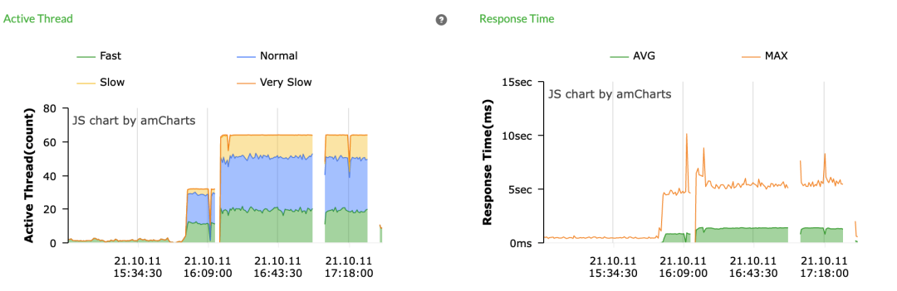
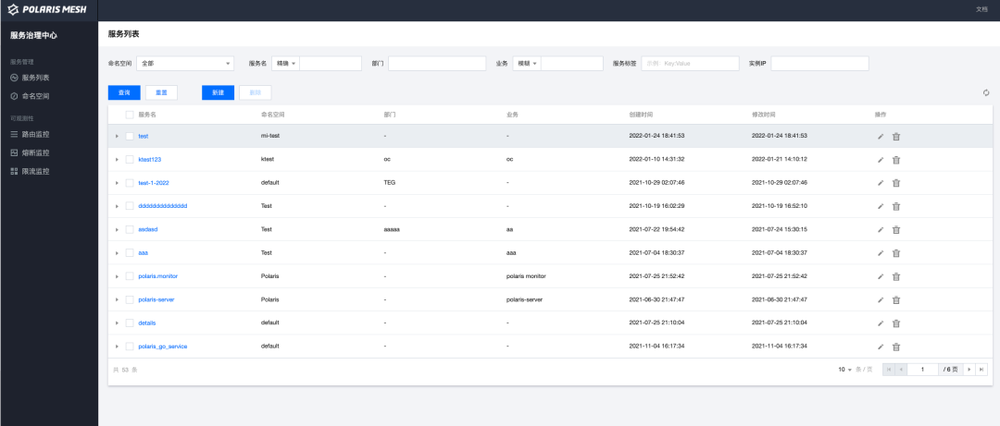

## 导语

PolarisMesh 是腾讯开源的百万级服务发现和治理中心，积累了腾讯从虚拟机到容器时代的分布式服务治理经验。作为分布式和微服务架构中的核心组件，PolarisMesh 提供服务寻址、流量调度、故障容错和访问控制等一系列能力，在K8s 和虚拟机环境中可以无差别使用，支持主流的开发模式，兼容grpc、spring cloud和servicemesh等开源生态，帮助用户快速构建扩展性强、可用性高的业务架构，实现从传统架构到云原生架构的转型。

## Eureka是什么

Eureka是Netflix开源的一款基于Java语言的服务发现框架，2014年发布了第一个版本，现在业界广泛使用的是与Spring Cloud结合的Spring Cloud Neflix的版本。

Eureka主要功能是为应用之间跨进程的RPC调用提供服务注册发现，以及故障实例剔除的功能，其工作原理如下图所示：

- Eureka Server：提供基于最终一致性的服务数据管理，服务发现，异常节点剔除等能力。
- Provider：服务被调方，启动时候将自身注册到Eureka server，运行过程中定时发送心跳续约请求进行保活，在进程结束时将自身从Eureka server反注册。
- Consumer：服务主调方，基于Eureka服务发现接口，从eureka拉取服务列表，并根据一定负载均衡算法，选出一个IP地址与被调方进行远程调用。

Eureka Server本身支持集群化部署，通过推拉结合的方式进行数据的同步，达成最终一致性。

- **推模式**：单个Eureka Server收到写请求时，会通过异步方式将写请求复制给集群中其他Eureka server。
- **拉模式**：Eureka Server本身也是作为Eureka客户端，会往集群里面的其他Eureka server注册及反注册自身，定时续约并拉取服务列表更新缓存数据。

Eureka支持多语言客户端SDK，官方提供了Java版本的SDK（spring-cloud-netflix-eureka-client），社区提供了其他语言的SDK（Go，Python等），应用可以按照各自的开发语言集成客户端从而使用Eureka的功能。



相关链接：
spring-cloud-netflix-eureka-client：
https://github.com/spring-cloud/spring-cloud-netflix/tree/main/spring-cloud-netflix-eureka-client



## Eureka存在的问题

大部分开发者在使用Eureka时都会遇到这样或那样的问题，我们通过收集社区以及用户的反馈，归纳总结为以下3类常见的问题：

### 1. 性能问题

从上文的描述可知，Eureka各个server之间是通过异步请求的方式进行写请求的同步，写请求包括注册/反注册/心跳续约的请求，同步失败会进行重试。这种异步同步模式，在客户端集群规模较大、或者网络情况不好触发了重试风暴的情况下，容易因为处理过多的同步续约请求，导致server端高负载。

下面是当时某个客户的一个现网场景，4个Eureka server，跨区进行高可用部署，客户端数有2000+，其中一个区的Eureka server出现网络异常，导致续约的同步请求都重试到其他区的服务端，导致服务端高负载，出现大量请求超时，超时情况下会继续重试，从而导致高负载问题蔓延到其他区。

下图是当时的一个监控截图，在1小时内，服务端平均负载飙升到80%，续约请求的时延也出现10s的峰值，导致大量服务健康状态出现异常，严重影响了现网的服务运营质量。

### 2. 运维复杂度高

下图是Eureka的运维控制台，大部分用户反馈该控制台在实际使用过程中存在以下问题，从而影响了运维效率：

- 不支持根据实例或者服务的某些信息数据进行搜索。
- 服务实际上是与部分、业务相关的，而Eureka这里并不支持在控制台这些数据的录入或修改，使得对服务数据的运维管理不太友好。
- Eureka Server本身支持通过接口的方式对实例进行手动隔离（OUT_OF_SERVICE），但是Eureka控制台没法进行操作。

### 3. Eureka 2.x版本社区停止更新

在2018年，Eureka社区发了通告，停止对Eureka 2.0的开源更新工作，对于使用Eureka的现网业务来说，增加了运维风险和成本。

## 北极星兼容Eureka

### 1. 无缝迁移

北极星是腾讯开源的服务发现和治理组件，在服务注册发现基础上，提供了流量调度，故障剔除等治理能力，其功能可完整覆盖Eureka的使用场景。同时北极星提供了存算分离的架构，以及全功能的服务治理控制台。在性能和可运维性上相比Eureka都有不少的提升。

相当一部分使用Eureka的用户，希望可以接入北极星，以解决他们在使用eureka过程中出现的问题。但是，他们接入过程中，遇到以下几个阻碍：

- 用户程序变更问题：用户当前程序已经集成了Eureka的客户端，如果切换成北极星客户端的话，需要做代码变更，成本较高。
- 数据迁移问题：用户现网已经注册到Eureka上的存量数据，如何平滑迁移到北极星上，过程中不能出现业务的中断。

**针对问题一**：北极星在新版本1.5.0实现了Eureka Server API的全兼容，做到支持各个语言、不同版本的Eureka Client进行直接接入。

北极星服务端基于一套开放的服务治理模型来实现各个治理功能，在API层，提供了插件化的机制来进行其他服务模型的对接转换。为满足Eureka的兼容性需求，只需要在API层实现一个对接插件即可完成：

**针对问题二**：北极星在服务端通过服务数据单向同步，以及关联查询的方式，实现了新老服务的互访，用户可以按自己的节奏将服务从Eureka注册中心迁移到北极星。

### 2. 迁移后效果

用户将服务数据迁移到北极星后，可以解决上文描述的使用的Eureka Server所碰到的3个问题：

#### (1) 性能数据

通过监控曲线可以看到，北极星（Eureka）的整体CPU使用情况稳定在2.29核，并且整体的CPU利用率稳定在57%左右（5W注册实例，并发进行全量数据拉取及实时心跳续约）

并且，当实例规模从1w到5w中，CPU的利用率都是稳定速率增加的，没有出现说CPU利用率陡然增加，整体的内存利用了也没有出现大幅度的变动。

在注册规模进一步提升时，由于北极星设计之初就是存算彻底分离的架构设计，因此当北极星出现高负载时，可以快速的对北极星进行水平扩容。

#### (2) 可运维性

从控制台的易用性来看，北极星控制台经过腾讯内部的多次打磨，在易用性上对用户更容易上手，且可支持多种的查询条件方便进行各种服务信息的检索。同时北极星本身带有全功能的服务治理能力，可以服务设置服务治理规则，实现包含Eureka客户端在内的多种框架的统一服务治理。

#### (3) 社区活跃度

北极星开源社区当前由腾讯主导维护，正常每月发布1个迭代版本，每双周会进行开发者例会的技术分享，BUG问题在社区提问后，不超过1周时间会得到回复及修复。详情可了解：https://github.com/polarismesh

