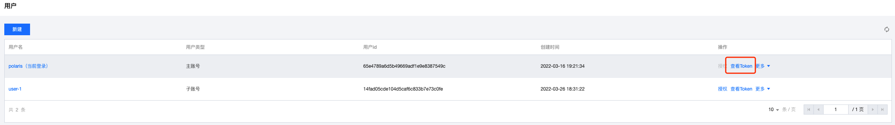

## 获取访问token

### 查看用户的token

- 在用户列表页面

  

- 在用户详细页面

  

### 查看用户组的token

- 在用户组列表页面

   

- 在用户组详细页面

   

## 注册服务实例使用鉴权能力

- Java语言

```java
InstanceRegisterRequest registerRequest = new InstanceRegisterRequest();
registerRequest.setNamespace("Test");
registerRequest.setService("FooService");
registerRequest.setHost("127.0.0.1");
registerRequest.setToken( ${user_token | group_token} );
registerRequest.setPort(8888);
InstanceRegisterResponse registerResp = provider.register(registerRequest);
```

详细使用逻辑可以参考[polaris-java快速入门](https://github.com/polarismesh/polaris-java/tree/main/polaris-examples/quickstart-example)

- Go语言

```go
registerRequest := &api.InstanceRegisterRequest{}
registerRequest.Service = "FooService"
registerRequest.Namespace = "Test"
registerRequest.Host = "127.0.0.1"
registerRequest.ServiceToken = ${user_token | group_token}
registerRequest.Port = 8888
resp, err := provider.Register(registerRequest)
```

详细使用逻辑可以参考[polaris-go快速入门](https://github.com/polarismesh/polaris-go/tree/main/examples/quickstart)

- C++语言

```cpp
polaris::InstanceRegisterRequest register_req("Test", "FooService", ${user_token | group_token}, "127.0.0.1", 8888);
std::string instance_id;
ret = provider->Register(register_req, instance_id);
```