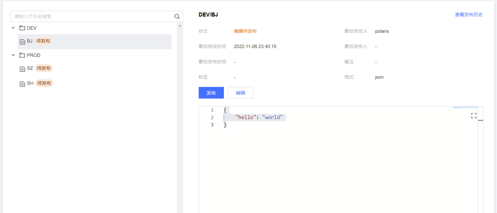

## 配置分组

配置分组是配置文件集的所属分组，是配置组织的维度之一，每个配置文件都属于某个一个命名空间以及配置分组，相同命名空间和配置分组下的配置文件具有唯一的名称。

推荐使用一个有意义的字符串来分组配置集，用于标识该分组下的配置集合，比如和微服务名称对应--UserConfig，代表用户服务下的配置集合。

## 配置文件

配置文件指的是业务具体的配置，配置文件名可采用树形结构的层级进行标识，采用/符号来区分层次，比如cluster1/dev/config。

不同层级可用于体现服务的配置在不同环境、集群、set的差异。例如：第一级按环境分为DEV（开发）、TEST（测试环境）、PROD（生产环境），PROD下第二级按城市分为SH、SZ。

