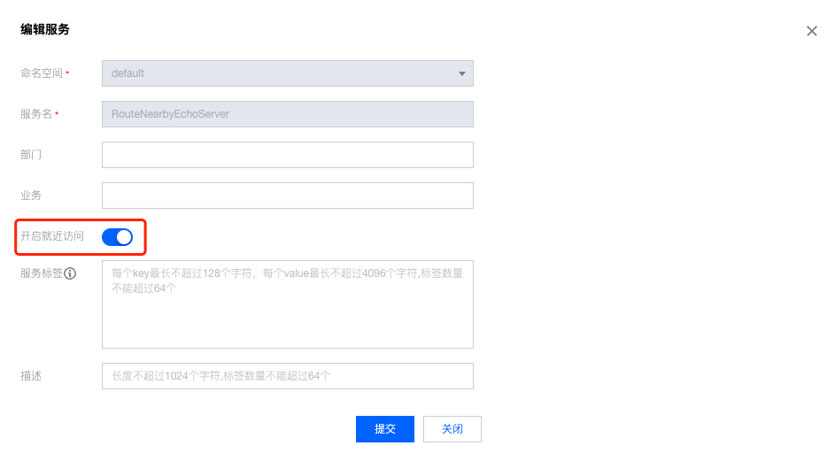

# 就近路由

## 功能描述

北极星提供基于 **地域(region) - 城市(zone) - 园区(campus)** 这3元组组成的地域信息进行就近路由的能力，能够根据主调的地域信息，结合被调实例的地域信息，进行匹配。实例本身的地域信息来源于有以下几个途径

### polaris服务端的 CMDB 插件

- 提供 CMDB 对接的插件，用户可以根据 **polaris服务端** 中 CMDB 的插件定义，对接自己的 CMDB 系统。当
  polaris 客户端通过**ReportClient**接口上报信息至**polaris服务端**，然后由服务端的 CMDB 插件填充当前客户端所在地理位置信息并通知给客户端
### polaris客户端的 CMDB 插件

- 提供 CMDB 插件，用户可以根据 **polaris客户端** 中对于 CMDB 插件的定义，根据客户端所在环境的特性来实现不同的本地地址位置信息获取插件
  - **env**: 将地理位置信息注入至客户端所在机器的环境中，客户端就可以基于系统环境变量自动获取地理位置信息
  - **qcloud**: 可以根据用户所部署的云环境，根据该云厂商提供的环境信息获取接口，自动获取地址位置信息，当前已实现基于
    **Tencent Cloud**的客户端地址插件

## 配置设计

 
### SDK配置

SDK配置属于客户端全局配置，基于该SDK实例所发起的服务发现，都遵循该就近路由策略。
由于就近路由能力通过SDK服务路由模块的插件进行提供，因此就近路由相关配置，也作为插件的特有配置来进行提供。

```yaml
global:
  location:
    # 设置 polaris-go 进程地理信息的提供插件
    # 设置为 env 时，可以在 linux 中注入以下环境变量
    # POLARIS_INSTANCE_REGION: 设置 region 信息, 例如 china
    # POLARIS_INSTANCE_ZONE: 设置 zone 信息, 例如 ap-guangzhou
    # POLARIS_INSTANCE_CAMPUS: 设置 IDC 信息, 例如 ap-guangzhou-3
    provider: env
consumer:
  serviceRouter:
    # 服务路由链
    chain:
      - nearbyBasedRouter
    # 插件特定配置
    plugin:
     nearbyBasedRouter:
        # 默认就近区域：默认城市
        matchLevel: zone
        # 最大就近区域，默认为空（全匹配）
        maxMatchLevel: zone
        # 假如开启了严格就近，插件的初始化会等待地域信息获取成功才返回，假如获取失败（server获取失败或者IP地域信息缺失），则会初始化失败
        strictNearby: false
        # 是否启用按服务不健康实例比例进行降级
        enableDegradeByUnhealthyPercent: true
        # 需要进行降级的实例比例，不健康实例达到百分之多少才进行降级。值(0, 100]。
        # 默认100，即全部不健康才进行切换。
		unhealthyPercentToDegrade: 100
```

### 服务配置

- 在控制台上通过可视化的方式操作开关就近路由。
  - 
  - **polaris服务端**下发服务数据时，在服务元数据中加入**internal-enable-nearby=true|false**的元数据，SDK通过服务元数据解析出服务是否开启就近路由。


## 就近流程


 
### 初始化

- 用户调用**NewConsumerAPI**或者**NewProviderAPI**后
- SDK 会使用客户端节点的 IP，往 Polaris 服务端查询该 IP 对应的 CMDB 信息，查询后的结果后返回给客户端
- 如果查询的结果中，没有携带地址信息，则客户端会走自己本地的 CMDB 插件查询客户端的地理位置信息
- 客户端按照查询结果以及配置项 **strictNearby** 的策略决定初始化结果是成功还是失败

### 地域匹配

服务调用过程中，使用拉取的客户端地域信息，进行全词匹配。匹配规则如下：

- 优先按照 **matchLevel** 进行匹配，匹配不成功（实例不存在或者可用实例比例少于阈值），则进行降级
- 就近降级按照 **degrade** 所配置的策略进行降级，会进行逐级的降级匹配，直到 **lowestMatchLevel**

## 就近场景

按照不同的场景，就近路由对被调服务的过滤策略如下表所示：

### 降级策略：

|                                                                | 降级策略：服务实例不可用                                              | 降级策略：服务实例不存在                                                             |
| -------------------------------------------------------------- | --------------------------------------------------------------------- | ------------------------------------------------------------------------------------ |
| matchLevel区域不存在实例                                       | 逐级降级直到maxMatchLevel。若实例全部不存在，返回LocationMismatch错误 | 逐级降级直到maxMatchLevel，若都不存在，返回LocationMismatch错误                      |
| matchLevel区域存在实例，区域中不可用实例百分比大于等于降级比例 | 返回matchLevel区域实例                                                | 逐级降级直到maxMatchLevel，若都不满足健康实例返回条件，返回实例数大于0的最小区域实例 |
		

### 被调信息异常策略

|                            | maxMatchLevel != "" | maxMatchLevel == “”                                    |
| -------------------------- | ------------------- | ------------------------------------------------------ |
| 被调实例对应的CMDB字段缺失 | 忽略该实例          | 当降级到最高匹配级别（全匹配）时，会返回这部分服务实例 |
		
		

### 主调信息异常策略


|                        | strictNearby == true | strictNearby == false |
| ---------------------- | -------------------- | --------------------- |
| 主调对应的CMDB字段缺失 | 启动失败             | 启动成功              |
		
		
 
### 跨机房容灾场景

#### 背景

服务端有广州云、深圳、南京云设备。客户端在深圳。 那么深圳客户端访问这个服务端时，返回实例列表由深圳、广州、南京实例组成，同时设置优先级，让深圳客户端优先访问深圳；然后是广州(同可用区)；最后是南京。当深圳的机器，被踢达到50%，则需要访问广州

#### 解决方案

假设存在服务A，服务A下面节点存在分别属于深圳、广州、南京的实例，CMDB信息如下：

- 华南-(ap-guangzhou)-(ap-guangzhou-3)
- 华南-(ap-shenzhen)-(ap-shenzhen-2)
- 华东-(ap-nanjing)-(ap-nanjing-4)

> 客户端配置：

```yaml
consumer:
  serviceRouter:
    plugin:
      nearbyBasedRouter:
        # 默认按zone进行就近
        matchLevel: zone
        # 被踢超过50%，则开始降级访问上一级区域节点
        unhealthyPrecentToDegrade: 50
```

> 就近逻辑

客户端配置**matchLevel: zone**，默认只访问同**zone(深圳)**的实例，当可用区实例被剔除达到50%时后，降级访问**region(华南)**的实例（可访问广州的实例），当华南地区实例也达到降级条件后，降级访问全部**region(包含华东-南京)**的实例

### 严格就近场景

#### 背景

用户是国际业务，部署到多伦多、新加坡。两地数据是隔离的，因此多伦多只能调多伦多的服务器，新加坡只能调新加坡的机器，而业务逻辑都是一致的，因此需要进行严格的就近路由。

#### 解决方案：

> 客户端配置：

```yaml
consumer:
  serviceRouter:
    plugin:
      nearbyBasedRouter:
        # 默认按zone进行就近
        matchLevel: zone
		# 最低匹配区域也设置为zone，代表永远只在zone区域进行匹配
        maxMatchLevel: zone
        # 开启强制就近，客户端必须能够拉取到地域信息
        strictNearby: true
```

> 就近逻辑

- 客户端初始化时，会往北极星服务端发消息获取本机的CMDB地域信息，假如获取失败（server返回错误或者客户端IP的CMDB信息缺失），则会在通过客户端的CMDB插件再进行一次地址信息获取，如果还是获取失败，由于开启了严格就近开关，因此客户端初始化失败，启动不成功
- 在服务访问过程中， 默认只返回同**Zone**的实例，假如同**Zone**实例全熔断了，则只针对同**Zone**进行全死全活。假如同**Zone**实例不存在，则返回**LocationMismatch**错误

