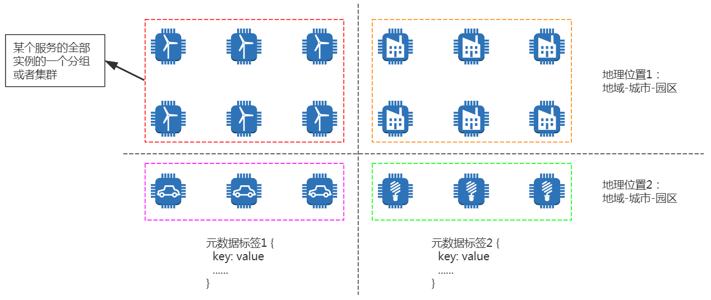

# 概述

## 动态路由功能定义

通常一个服务包含多个实例。在简单场景下，每个实例是对等的，通过负载均衡组件访问任意一个即可。

但是，在绝大部分场景下，每个实例具有逻辑属性和物理属性：

- 逻辑属性：版本、协议、业务Set、特性环境等。北极星允许用户为每个实例设置自定义标签
- 物理属性：地理位置。北极星从公司CMDB获取每个实例的地域-城市-园区信息

对于某个服务的全部实例，可以根据逻辑和物理属性将其划分成为多个分组或者集群，如下图所示：

服务主调方/消费者发送请求，**动态路由组件**根据请求和主调方节点属性，将不同节点的不同请求路由到不同实例分组或者集群。

## 串联式路由插件

北极星动态路由组件采用插件化、可配置的方式实现。默认提供以下路由插件：

- 前置路由插件：去除隔离和权重为0的实例
- 规则路由插件：根据自定义规则筛选实例分组或者集群
- 就近路由插件：根据自定义规则实现地域-城市-园区三级就近路由
- 后置路由插件：去除健康状态异常和故障熔断的实例。如果被剔除的节点数超过一定比例，返回前一个插件的结果，防止因网络分区原因导致的误剔除。

当调用GetOneInstance接口时，默认集成前置路由、规则路由、就近路由和后置路由插件，执行流程如下图所示：

前置路由和后置路由属于必选插件，规则路由和就近路由属于可选插件，建议不要去除规则路由和就近路由插件：

- 如果没有配置规则路由或者开启就近路由，规则路由和就近路由插件的逻辑不会执行，因此不会影响业务调用性能
- 后续使用规则路由或者就近路由功能，只需要在控制台上配置路由规则，不需要修改代码和重新部署
  

