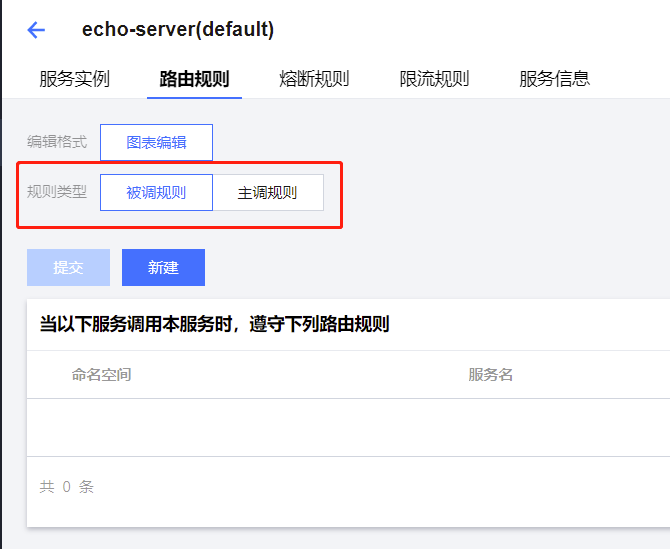
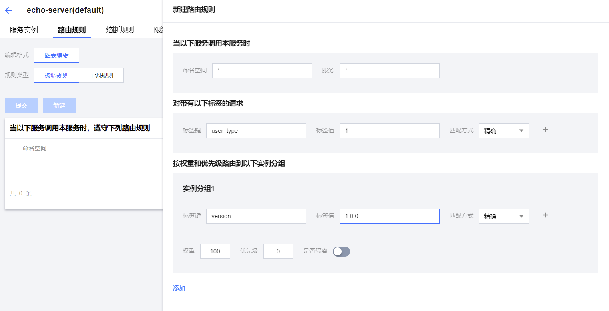
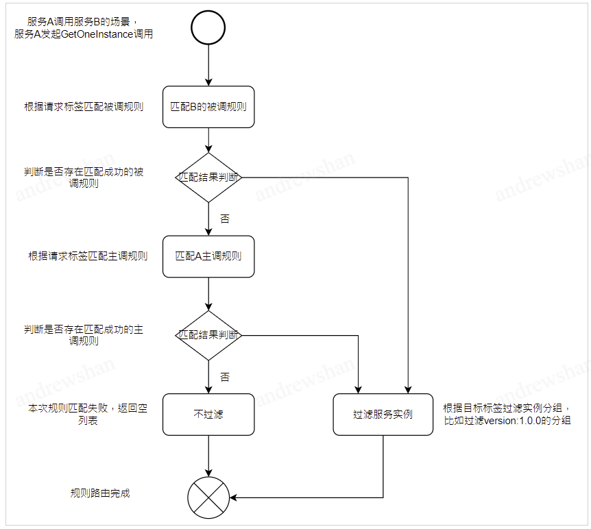
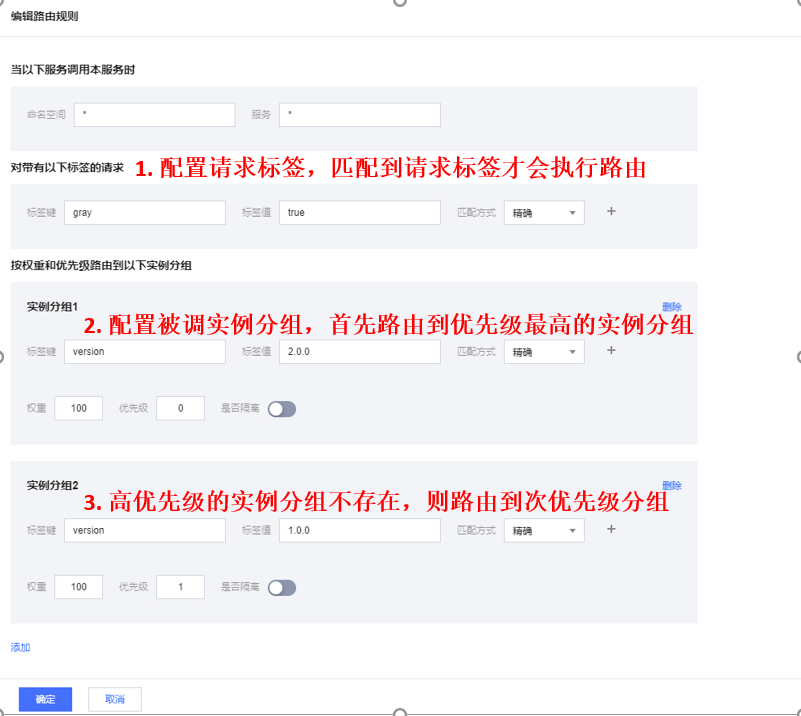
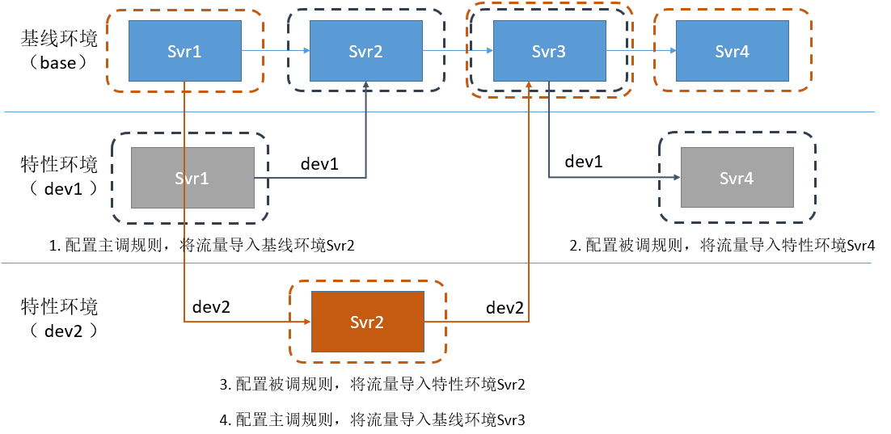
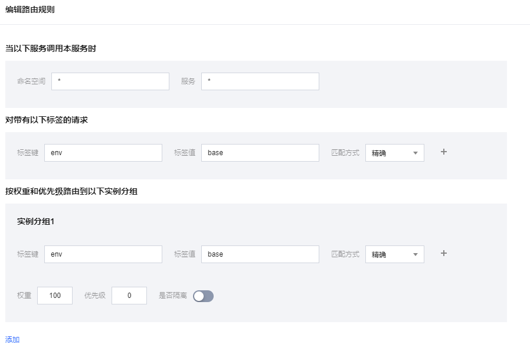
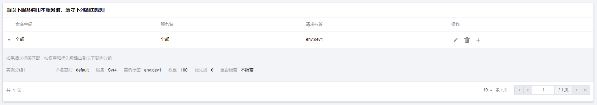
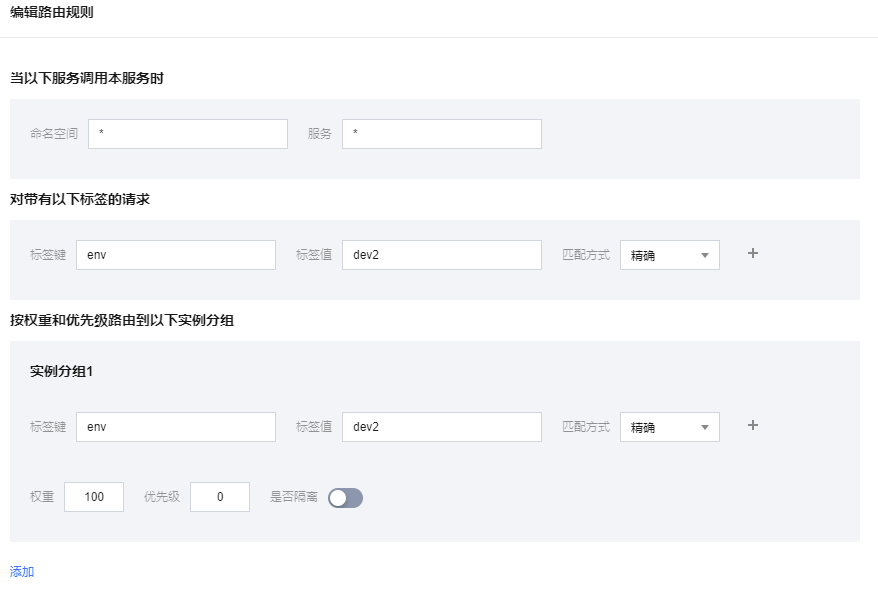

# 规则路由

## 什么是规则路由

北极星提供规则路由的能力，本质上就是通过规则来动态控制消息的分配转发。

通过该功能，用户基于北极星可以轻松实现多测试环境隔离、全链路灰度、金丝雀测试、A/B测试等功能。

## 规则路由原理解读

### 路由规则分类

规则路由是一种根据一段DSL（路由规则）来控制消息分流的机制。

路由规则分为被调规则和主调规则2部分：

- 被调规则代表的是当服务作为被调方时，控制所有主调方进行流量转发的规则。

- 主调规则代表的是当服务作为主调方时，控制所有被调方进行流量转发的规则。

服务上可以配置主调规则和被调规则，如下图所示：

### 配置被调规则

被调规则在服务作为被调方时候生效，配置界面如下：

图上的规则的含义是：当echo-server（服务名）作为被调方时，对于所有主调方过来的，带有user-type:1的标签的请求，都路由给自身服务版本号为1.0.0的实例分组。

### 配置主调规则

主调规则在服务作为主调方时候生效，配置界面如下：

图上的规则的含义是：当echo-server（服务名）作为主调方时，对于发出去的请求，带有user-type:1的标签的请求，都路由给目标服务版本号为1.0.0的实例分组。

### 路由规则的匹配流程

#### 边界条件

- 通过请求标签进行匹配，没有匹配到一个路由规则，则本次请求路由失败，返回空实例列表。
- 通过请求标签进行匹配，匹配到了路由规则，但是路由规则所对应的destination不存在服务实例，则本次请求获取到的服务实例为空。
- 通过请求标签进行匹配，匹配到了路由规则，路由规则对应的2个同优先级的destination，请求会在这2个destination中按照权重比例随机路由，假如其中一个destination不存在服务实例，则路由到该destination的请求获取到的服务实例为空。

## 规则路由实践

### 按版本号灰度实践

#### 场景描述

请求通过网关接入，路由到后端服务。后端服务上线了新版本，新版本只对打了标签的用户请求开放，未打标签的请求继续路由到老版本。

#### 使用方式

- 配置路由规则

  由于新版本上线的行为发生在被调方，主调方并不感知被调是否上线了新版本服务，因此路由规则需要配置在被调方。配置一个被调规则，指定只有gray=true的请求，才流入版本号为2.0.0的实例分组，其他请求则流入版本号为1.0.0的实例分组。

  (1) 配置兜底规则：将请求导入到1.0.0版本的分组。

 

  (2) 配置灰度规则：将gray=true的请求导入到2.0.0版本的分组，不存在2.0.0分组时，请求导入到1.0.0的分组。

  

  

  (3) 规则列表：将按顺序进行匹配执行规则。

  

  

- 执行服务路由

  可以执行各个语言SDK的版本号路由样例进行服务路由功能的执行，执行完可以通过调用结果可以看到灰度的请求都流向了版本号2.0.0的分组。
  
  

### 多环境隔离实践

#### 场景描述

使用微服务架构时，一个业务数据流通常需要跨多个微服务才能完成。而在业务开发过程中，通常会有以下诉求：
- 为了提升开发效率，不同特性开发人员，需要使用特性环境进行并发开发测试联调，特性环境之间需要进行隔离；
- 同时为了降低部署成本，开发测试时，只需要部署特性变更所涉及的服务，链路其他未更改的服务，统一使用基线环境的服务。

#### 使用方式

- 配置路由规则

本次场景，存在2个特性并行开发，特性（dev1）涉及修改的微服务为Svr1和Srv4，特性（dev2）涉及修改的微服务为Svr2。其他不涉及修改的微服务，在开发联调过程中，统一使用基线环境的服务。
为了防止混乱，每个特性开发人员只允许针对自己涉及修改的微服务添加针对当前特性的规则，不涉及修改的微服务不允许添加规则。

（1）所有的服务默认配置一个兜底规则，将请求导入到基线环境。

（2）Srv1服务添加一个主调规则，将来源dev1请求路由到dev1的Srv2。

（3）Srv4服务添加一个被调规则，将来源dev1请求路由到dev1的Srv4。

（4）Srv2服务添加一个被调规则，将来源dev2请求路由到dev2的Srv2。

- 执行服务路由

  可以执行各个语言SDK的多环境路由样例进行服务路由功能的执行，执行完可以通过调用结果可以看到不同特性环境的请求都流向了对应特性环境的分组。

