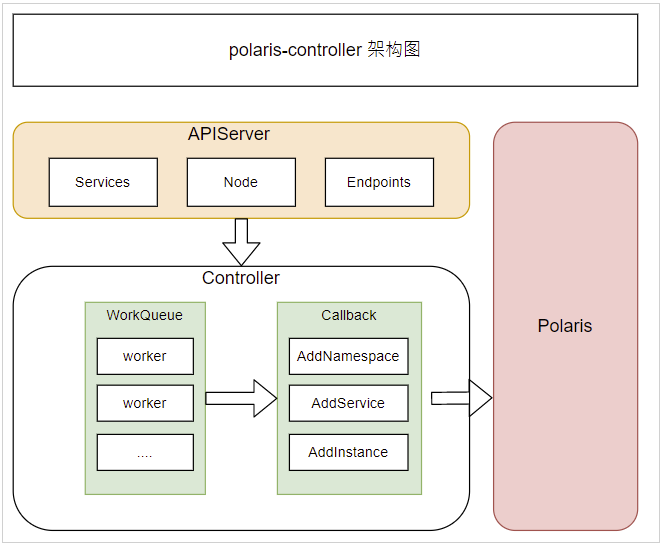

# 使用k8s服务同步

## 原理说明

PolarisMesh提供polaris-controller，基于kubernetes的controller机制，监听service&pod事件，同步集群内的POD实例信息到PolarisMesh注册中心，相关架构图如下：

## 准备Polaris服务端

需要预先安装好Polaris服务端，安装方式可参考：[单机版安装](https://polarismesh.cn/zh/doc/快速入门/安装服务端/安装单机版.html#单机版安装)或者[集群版安装](https://polarismesh.cn/zh/doc/快速入门/安装服务端/安装集群版.html#集群版安装)

## 安装polaris-controller

您需要在应用所在的 Kubernetes 集群部署 Polaris Controller ，如果您有多个 Kubernetes 集群需要接入 Polaris ，需要在每个集群安装一次。详细安装步骤可参考[PolarisController文档](https://github.com/PolarisMesh/polaris-controller)

安装并启动后，polaris-controller会自动同步kubernetes上面的命名空间，服务以及实例数据。