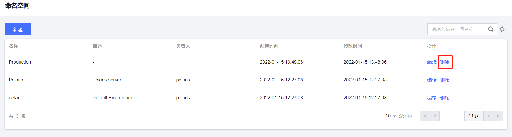
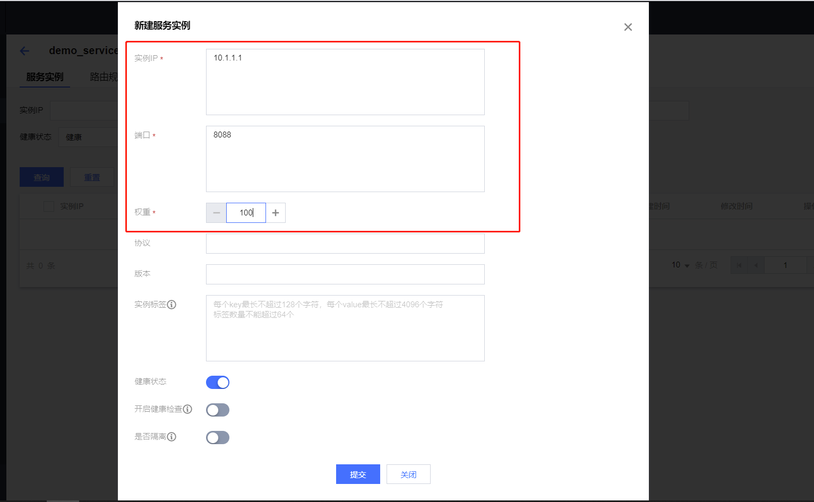

# 使用控制台注册

## 准备Polaris服务端

需要预先安装好Polaris服务端，安装方式可参考：[单机版安装](polarismesh.cn/zh/doc/快速入门/安装服务端/安装单机版.html#单机版安装)或者[集群版安装](polarismesh.cn/zh/doc/快速入门/安装服务端/安装集群版.html#集群版安装)

## 注册命名空间

1. 通过浏览器输入```http://127.0.0.1:8080（127.0.0.1可换成服务端实际安装的IP地址）```，打开Polaris控制台。


2. 在侧边栏点击```命名空间```，进入命名空间列表页。


3. 点击```新建```按钮，在弹出对话框中填入命名空间全局唯一名称，即可完成命名空间的创建。


## 反注册命名空间

1. 通过浏览器输入```http://127.0.0.1:8080（127.0.0.1可换成服务端实际安装的IP地址）```，打开Polaris控制台。


2. 在侧边栏点击```命名空间```，进入命名空间列表页。


3. 选择需要反注册的命名空间（该命名空间下不能有任何资源），点击```删除```按钮，即可进行删除。


## 注册服务

1. 通过浏览器输入```http://127.0.0.1:8080（127.0.0.1可换成服务端实际安装的IP地址）```，打开Polaris控制台。


2. 在侧边栏点击```服务列表```，进入服务列表页。


3. 点击```新建```按钮，在弹出来的对话框填入命名空间和服务名（同一命名空间下需唯一）等必填信息，即可完成服务的创建。


## 反注册服务

1. 通过浏览器输入```http://127.0.0.1:8080（127.0.0.1可换成服务端实际安装的IP地址）```，打开Polaris控制台。


2. 在侧边栏点击```服务列表```，进入服务列表页。


3. 选择需要反注册的服务（该服务下不能有任何实例），点击```删除```按钮，即可进行删除。


## 注册服务实例

1. 通过浏览器输入```http://127.0.0.1:8080（127.0.0.1可换成服务端实际安装的IP地址）```，打开Polaris控制台。


2. 在侧边栏点击```服务列表```，进入服务列表页，并选择所需注册实例的目标服务。


3. 点击服务名，进入服务实例列表页。


4. 点击```新建```按钮，在弹出来的对话框填入实例IP和端口（同一服务下IP和端口组合需唯一）以及权重等必填信息，即可完成服务实例的创建。


## 反注册服务实例

1. 通过浏览器输入```http://127.0.0.1:8080（127.0.0.1可换成服务端实际安装的IP地址）```，打开Polaris控制台。


2. 在侧边栏点击```服务列表```，进入服务列表页，并选择所需注册实例的目标服务。


3. 点击服务名，进入服务实例列表页，同时选择需要反注册的实例，点击```删除```按钮，即可进行删除。

