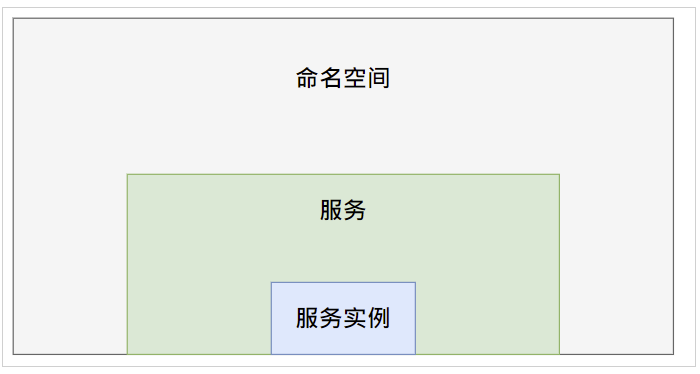

# 概述

## 服务注册

服务注册指定是服务提供者把服务数据添加到服务注册中心，以供服务消费者进行发现和消费。

## 服务模型

服务提供者需要按照指定的服务模型来组装服务数据，以便成功添加到服务注册中心。北极星服务模型主要包括```命名空间```，```服务```，```服务实例```这3部分，其包含关系如下：


### 命名空间

命名空间提供了一种在相同注册中心下资源的逻辑隔离的机制，同一命名空间下的资源命名必须唯一，但是跨命名空间允许存在同名的资源。命名空间常用于多个团队或者项目之间的资源的区分隔离。

PolarisMesh默认存在2个命名空间：

- Polaris：Polaris命名空间存放的是PolarisMesh的系统服务，PolarisMesh自身的集群发现及管理需要依赖Polaris命名空间下的服务。
- default：默认命名空间，用户如果没有多命名空间的需求，可以直接使用default命名空间。

### 服务

服务是一种资源对外暴露的抽象方式，资源本身通过端口监听的方式提供网络访问，并通过提供一系列预定义的服务接口，给主调端进行调用。

### 服务实例

服务实例对应的是可提供服务接口网络调用的节点，通过IP:PORT的方式进行唯一标识。

## 服务注册方式

PolarisMesh提供了以下服务注册方式：

- [使用控制台](使用控制台.md)
- [使用REST接口](使用REST接口.md)
- [使用SDK](使用SDK.md)
- [使用kubernetes服务同步](使用k8s服务同步.md)