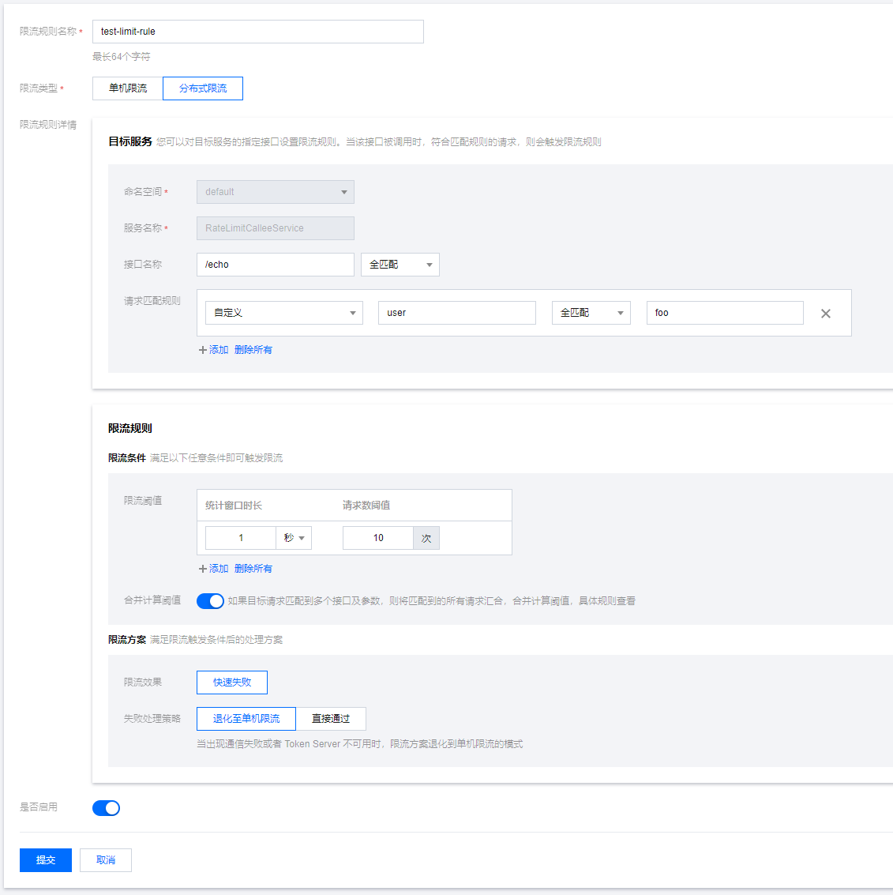

# 分布式限流

## 什么是分布式限流

分布式限流是一种通过统计全局QPS指标，当达到规则指定阈值时对流量进行限制，保障服务实例不被瞬时流量给冲垮。

## 限流规则说明

北极星支持在界面配置分布式限流规则，通过以下路径可以打开限流规则的编辑页面：控制台->服务列表->具体服务->限流规则->新建，打开后，规则各配置项说明如下：


### 接口名称

可选，指定限流规则的接口过滤参数，接口名可对应方法名、http url等信息，不填代表不过滤。

- 接口：规则生效所对应的接口名，用于匹配客户端传入的method参数，默认为```空(全部)```
- 匹配方式：接口字段的匹配方式，支持全匹配、不等于、包含、不包含、正则表达式四种匹配模式

### 请求匹配规则

可选，指定限流规则的请求参数匹配条件，不填代表不过滤，支持以下四种参数类型：

- 自定义参数：自定义KEY和VALUE，具体的请求参数值可通过SDK进行传入。
- 请求头（HEADER）：针对协议消息头（http header/grpc  header）进行过滤。
- 请求参数（QUERY）：针对协议请求参数（http query）进行过滤。
- 方法（METHOD)：针对协议的METHOD（http method/grpc method）进行过滤。
- 主调服务：针对微服务调用场景下，主调方的服务名进行过滤。
- 主调IP：针对主调方机器的IP地址进行过滤。

### 限流阈值

指定统计周期内的统计阈值，达到阈值则进行限流。可以配置多个限流阈值，多个限流阈值可同时生效，任意触发了一个就进行限流。

- 统计时长：限流阈值的统计时长，单位秒，默认为1秒
- 请求数：达到限流条件的请求数阈值。默认为1

### 限流效果

限流阈值被触发后，如何进行对流量进行限制，目前支持2种模式（默认为直接拒绝）：

- 直接拒绝：当统计时长内请求数达到阈值，后续新的请求会被拒绝，直到下个统计周期到来才恢复。

### 失败退化策略

分布式限流需要依赖token server，如果出现token server不可访问，则客户端可以根据配置的规则进行降级，保证用户请求最大限度不受影响。

- 退化成单机限流：默认策略。直接退化成单机计算配额的方式进行限流，单机配额=(全局配额/节点数)。
- 直接通过：不执行限流，所有请求都直接放通。

## 如何使用

### 部署TokenServer

北极星的TokenServer的命名为polaris-limiter，可以从[release](https://github.com/polarismesh/polaris-limiter/releases)中下载最新的polaris-limiter部署包。

下面以polaris-limiter-release_v1.0.0.linux.amd64.zip为例，下载后，执行以下命令进行解压：

```
unzip polaris-limiter-release_v1.0.0.linux.amd64.zip
cd polaris-limiter-release_v1.0.0.linux.amd64
```

编辑```polaris-limiter.yaml```，填入polaris服务端地址。

```
registry:
  enable: true
  # 填入polaris服务端地址
  polaris-server-address: 127.0.0.1:8091
  name: polaris.limiter
  namespace: Polaris
  health-check-enable: true
```

执行启动脚本

```
cd tool
bash start.sh
```

### 客户端接入

#### 针对服务进行限流

1. 配置限流规则

在RateLimitServiceJava服务下新建限流规则，指定QPS为10，限流效果选择直接拒绝。


2. 使用北极星Java SDK执行限流API

关键代码：

```
//构造请求，获取限流配额
QuotaRequest quotaRequest = new QuotaRequest();
quotaRequest.setNamespace(NAMESPACE_DEFAULT);
quotaRequest.setService(ECHO_SERVICE_NAME);
quotaRequest.setCount(1);
QuotaResponse quotaResponse = limitAPI.getQuota(quotaRequest);
if (quotaResponse.getCode() == QuotaResultCode.QuotaResultOk) {
   // 配额允许，本次请求通过
} else {
   // 配额已经用完，本次请求拒绝
}
```

#### 针对接口+标签进行细粒度限流

1. 配置限流规则

在RateLimitServiceJava服务下新建限流规则，指定QPS为10，方法名为/echo，标签键为user，值为foo，限流效果选择直接拒绝。



2. 使用北极星Java SDK执行限流API

关键代码：

```
QuotaRequest quotaRequest = new QuotaRequest();
quotaRequest.setNamespace(NAMESPACE_DEFAULT);
quotaRequest.setService(ECHO_SERVICE_NAME);
quotaRequest.setMethod("/echo");
quotaRequest.setLabels(parameters);
quotaRequest.setCount(1);
QuotaResponse quotaResponse = limitAPI.getQuota(quotaRequest);
if (quotaResponse.getCode() == QuotaResultCode.QuotaResultOk) {
   // 配额允许，本次请求通过
} else {
   // 配额已经用完，本次请求拒绝
}
```

## 其他SDK及框架接入参考

- Nginx接入：https://github.com/polarismesh/nginx-gateway
- Spring Cloud/Spring Boot接入：https://github.com/Tencent/spring-cloud-tencent/wiki/Spring-Cloud-Tencent-Rate-Limit-%E4%BD%BF%E7%94%A8%E6%96%87%E6%A1%A3
- Java SDK接入：https://github.com/polarismesh/polaris-java/tree/main/polaris-examples/ratelimit-example/global-limiter-example
- Go SDK接入：https://github.com/polarismesh/polaris-go/tree/main/examples/ratelimit
- C++ SDK接入：https://github.com/polarismesh/polaris-cpp/tree/main/examples/rate_limit
