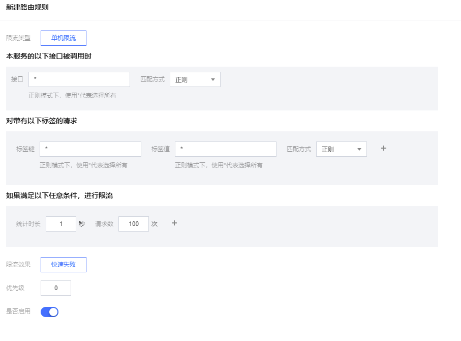

# 单机限流

## 单机限流类型

北极星支持以下3个维度的限流类型：

- 服务级限流：针对当前实例的所有流量设置限流阈值，对实例的所有请求流量都生效。
- 接口级限流：针对访问该实例的特定接口设置限流阈值，对接口生效。
- 标签级限流：针对带有特定标签的请求设置限流阈值，常见场景包括：UIN限流，应用APP限流。

## 如何使用单机限流

### 配置限流规则

### 执行单机限流

可以执行各个语言SDK的限流样例进行服务限流功能的执行，执行完可以通过调用结果。