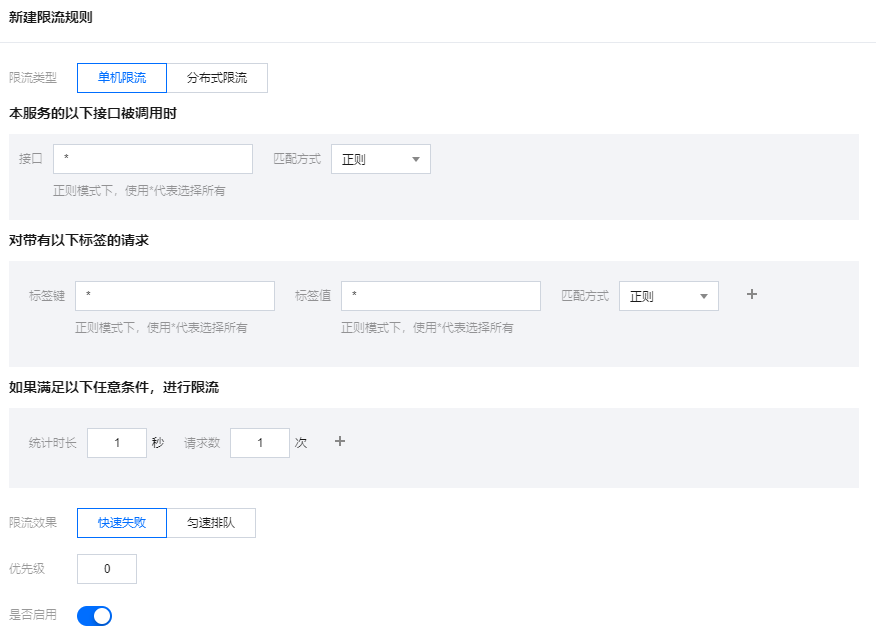
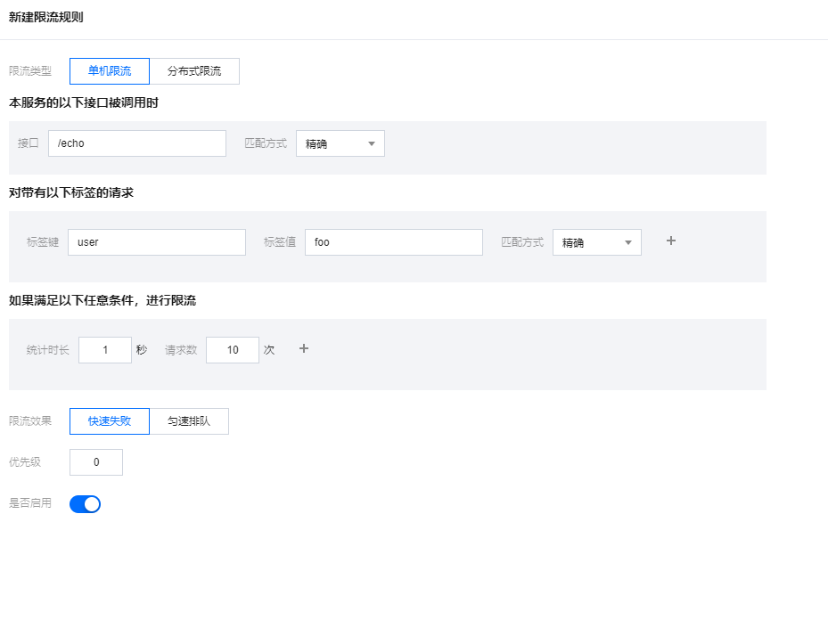
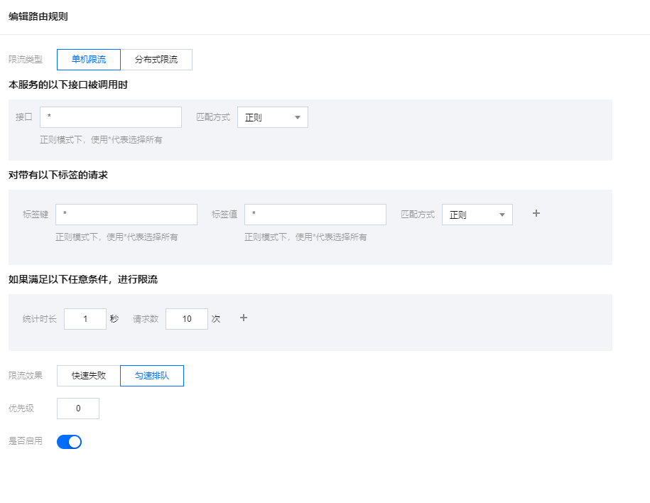

# 单机限流

## 什么是单机限流

单机限流是一种通过统计单机QPS指标，当达到规则指定阈值时对流量进行限制，保障服务实例不被瞬时流量给冲垮。

## 限流规则说明

北极星支持在界面配置单机限流规则，通过以下路径可以打开限流规则的编辑页面：控制台->服务列表->具体服务->限流规则->新建，打开后，规则各配置项说明如下：



### 接口定义

指定限流规则的接口过滤参数，接口名可对应方法名、http url等信息，填```*```代表不过滤。

- 接口：规则生效所对应的接口名，用于匹配客户端传入的method参数，默认为```*(全部)```
- 匹配方式：接口字段的匹配方式，只支持精准匹配和正则表达式匹配

### 标签定义

指定限流规则的标签过滤参数，标签为通用的KV字段，可对应方法入参，http请求的headers以及query parameters等信息，填```*```代表不过滤。

- 标签键：标签的key，用于匹配客户端传入的labels key参数，默认为```*(全部)```
- 标签值：标签的value，用于匹配客户端传入的labels value参数，默认为```*(全部)```
- 匹配方式：标签值的匹配方式，只支持精准匹配和正则表达式匹配

### 限流阈值

指定统计周期内的统计阈值，达到阈值则进行限流。可以配置多个限流阈值，多个限流阈值可同时生效，任意触发了一个就进行限流。

- 统计时长：限流阈值的统计时长，单位秒，默认为1秒
- 请求数：达到限流条件的请求数阈值。默认为1

### 限流效果

限流阈值被触发后，如何进行对流量进行限制，目前支持2种模式（默认为直接拒绝）：

- 直接拒绝：当统计时长内请求数达到阈值，后续新的请求会被拒绝，直到下个统计周期到来才恢复。
- 匀速排队：基于漏桶算法，将请求数平均分配到统计时长内（细分的最小度量单位为1ms），从而控制请求以均匀的速度通过。在这种模式下，限流阈值必须满足：```请求数<=统计时长*1000```

### 优先级

控制多条限流规则的生效顺序，比如应用同时配置了接口级的规则，以及服务级规则，则可以通过优先级控制生效顺序。优先级的值越小，优先级越高。默认0。

## 如何使用

北极星限流支持多语言SDK、以及集成了SDK的生态框架（如Spring Cloud， gRPC等）接入，下面以Java SDK为例进行演示具体使用过程。

演示场景中， 被调服务名叫RateLimitServiceJava，命名空间为default，用户真正使用时，可以按照自己的需要使用其他服务名。

具体代码的样例可以参考：[单机限流demo](https://github.com/polarismesh/polaris-java/tree/main/polaris-examples/ratelimit-example/local-limiter-example)

### 针对服务进行限流

1. 配置限流规则

在RateLimitServiceJava服务下新建限流规则，指定QPS为10，限流效果选择直接拒绝。


2. 使用北极星Java SDK执行限流API

关键代码：

```
//构造请求，获取限流配额
QuotaRequest quotaRequest = new QuotaRequest();
quotaRequest.setNamespace(NAMESPACE_DEFAULT);
quotaRequest.setService(ECHO_SERVICE_NAME);
quotaRequest.setCount(1);
QuotaResponse quotaResponse = limitAPI.getQuota(quotaRequest);
if (quotaResponse.getCode() == QuotaResultCode.QuotaResultOk) {
   // 配额允许，本次请求通过
} else {
   // 配额已经用完，本次请求拒绝
}
```

### 针对接口+标签进行细粒度限流

1. 配置限流规则

在RateLimitServiceJava服务下新建限流规则，指定QPS为10，方法名为/echo，标签键为user，值为foo，限流效果选择直接拒绝。



2. 使用北极星Java SDK执行限流API

关键代码：

```
QuotaRequest quotaRequest = new QuotaRequest();
quotaRequest.setNamespace(NAMESPACE_DEFAULT);
quotaRequest.setService(ECHO_SERVICE_NAME);
quotaRequest.setMethod("/echo");
quotaRequest.setLabels(parameters);
quotaRequest.setCount(1);
QuotaResponse quotaResponse = limitAPI.getQuota(quotaRequest);
if (quotaResponse.getCode() == QuotaResultCode.QuotaResultOk) {
   // 配额允许，本次请求通过
} else {
   // 配额已经用完，本次请求拒绝
}
```

### 使用匀速排队

1. 配置限流规则

在RateLimitServiceJava服务下新建限流规则，指定QPS为10，限流效果选择匀速排队。



2. 使用北极星Java SDK执行限流API

关键代码：

```
QuotaRequest quotaRequest = new QuotaRequest();
quotaRequest.setNamespace(NAMESPACE_DEFAULT);
quotaRequest.setService(ECHO_SERVICE_NAME);
quotaRequest.setCount(1);
QuotaResponse quotaResponse = limitAPI.getQuota(quotaRequest);
if (quotaResponse.getCode() == QuotaResultCode.QuotaResultOk) {
      // 匀速排队等待
      if (quotaResponse.getWaitMs() > 0) {
          try {
              Thread.sleep(quotaResponse.getWaitMs());
          } catch (InterruptedException e) {
                 e.printStackTrace();
          }
      }
}  else {
   // 已经超过最大等待时长，本次请求拒绝
}
```

## 其他SDK及框架接入参考

- Spring Cloud/Spring Boot接入：https://github.com/Tencent/spring-cloud-tencent/wiki/Spring-Cloud-Tencent-Rate-Limit-%E4%BD%BF%E7%94%A8%E6%96%87%E6%A1%A3

- Go SDK接入：https://github.com/polarismesh/polaris-go/tree/main/examples/ratelimit

- C++ SDK接入：https://github.com/polarismesh/polaris-cpp/tree/main/examples/rate_limit


