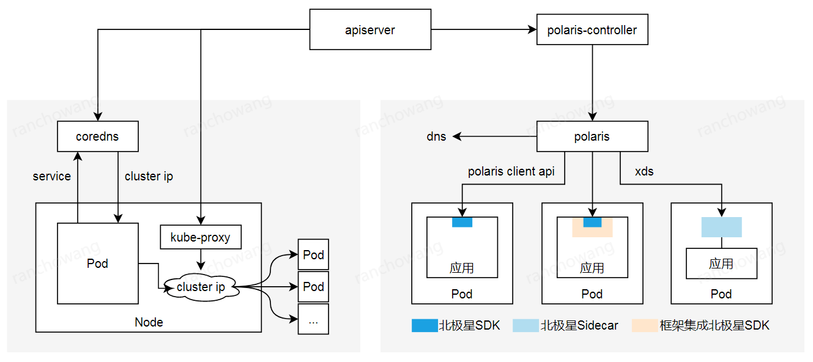

# 简介

北极星致力于解决分布式或者微服务架构中的服务可见性、故障容错、流量控制和安全性问题。虽然已经有一些组件在解决这些问题，但是缺少一个标准的、多语言的、框架无关的实现

腾讯由于业务线和技术栈的多样性，沉淀了大量解决相关问题的组件。从2018年开始，我们对这些组件进行整合，打造公司级服务发现和治理组件-北极星，极大地提升了开发效率和运营质量

|问题类型|问题示例|依赖组件|
| - | - | - |
|服务可见性|主调方如何知道被调方的服务地址|注册发现|
|故障容错|当被调方的实例、接口或者服务异常时，如何屏蔽异常实例、接口或者服务，屏蔽之后如何恢复|熔断降级|
||当某些主调方的请求量过多时，如何限制这些主调方的请求，避免影响其他主调方的请求|限流|
|流量控制|被调方具有多个实例，主调方如何确定请求发送到哪个实例，如何保证负载均衡|负载均衡|
||如果被调方实例部署在多个地域，主调方如何就近访问|路由|
|安全性|被调方如何判断允不允许某个主调方访问|访问鉴权|

为了解决这些问题，提供服务注册中心以及路由、熔断、降级、限流、鉴权组件，支持高性能和无侵入两种使用方式

## 从系统组件看

北极星控制面只有两个组件，采用Go实现，部署简单
* polaris-console: 控制台
* polaris：集服务注册中心和服务治理控制面于一体

北极星数据面支持SDK和Sidecar两种模式
* SDK：提供Java、Go和C++等多语言SDK，实现语义相同的服务治理功能，每种功能可以单独使用
* Sidecar：控制面兼容xds协议，支持envoy自动注入。SDK和Sidecar模式互通

北极星已经打通常用框架、网关和kubernetes，也很容易和其他组件集成使用
* 提供不同框架和北极星SDK的集成，帮助框架补齐服务治理功能，框架用户不需要直接使用北极星SDK
* 提供不同网关和北极星SDK的集成，支持网关将请求转发到北极星服务，帮助网关补齐服务治理功能
* 提供polaris-controller，支持k8s service自动注册到北极星，帮助k8s补齐服务治理功能

## 从功能特性看

## 从应用场景看

### 服务注册和发现

在分布式和微服务架构中，首先要解决的问题是主调方如何知道被调方的服务地址。

### 提高服务调用的容错能力

### 防止服务被突发流量压垮

* 某个
* 某个业务
* 某个

### k8s和服务网格

k8s通过service提供服务发现和负载均衡功能：
* 用户创建service，service通过标签绑定相应的pod，每个service关联一个cluster ip
* k8s先依赖kubedns、coredns或者其他dns插件，将service解析成cluster ip
* 再通过iptables或者IPVS，将cluster ip的请求转发给相应的pod

k8s service当前的实现存在不足之处：
* 当service超过一定数量时，iptables和IPVS存在性能问题，不适合大体量的业务
* iptables和IPVS支持的负载均衡算法有限，在内核里实现，无法在应用层扩展
* 不提供动态路由、熔断降级、访问限流、访问鉴权等常用的服务治理功能
* 不兼容spring cloud等微服务框架的服务注册和发现方式，无法打通

北极星提供更加完善的服务发现和治理功能：
* 既支持k8s service自动注册，也支持使用SDK和框架进行注册，两者统一管理
* 除了k8s原有的DNS访问方式，还支持高性能和无侵入两种服务网格方案
* 高性能服务网格提供多语言SDK，以及常用框架和北极星SDK的集成
* 无侵入服务网格提供Sidecar，业务不需要依赖SDK或者框架
