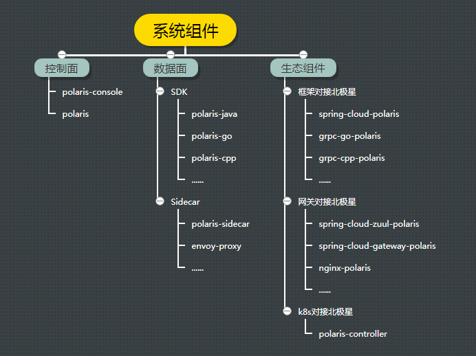
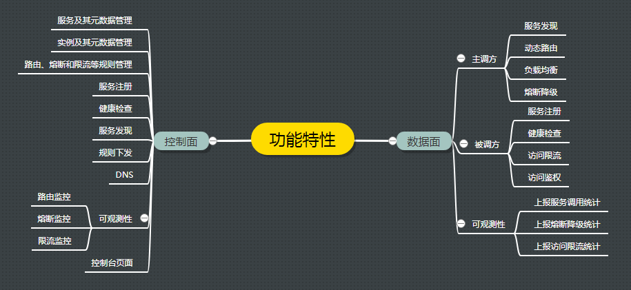
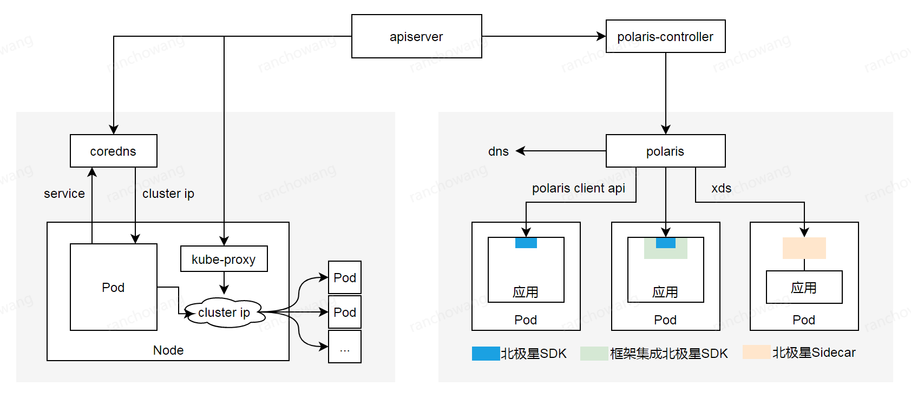

# 简介

## 从系统组件看

北极星控制面只有两个组件，采用Go实现，部署简单
* polaris-console: 控制台
* polaris：集服务注册中心和服务治理控制面于一体

北极星数据面支持SDK和Sidecar两种模式
* SDK：提供Java、Go和C++等多语言SDK，实现语义相同的服务治理功能，每种功能可以单独使用
* Sidecar：控制面兼容xds协议，支持envoy自动注入。SDK和Sidecar模式互通

北极星已经打通常用框架、网关和kubernetes，也很容易和其他组件集成使用
* 提供不同框架和北极星SDK的集成，帮助框架补齐服务治理功能，框架用户不需要直接使用北极星SDK
* 提供不同网关和北极星SDK的集成，支持网关将请求转发到北极星服务，帮助网关补齐服务治理功能
* 提供polaris-controller，支持k8s service自动注册到北极星，帮助k8s补齐服务治理功能

## 从功能特性看

## 从应用场景看

北极星

### 服务注册和发现

在分布式和微服务架构中，首先要解决的问题是主调方如何知道被调方的服务地址。

### DNS

北极星控制面兼容DNS协议，如果应用程序采用HTTP访问，不希望引入北极星SDK，可以通过域名解析的方式进行服务发现

北极星DNS相比于内网DNS的优势：
* 通常内网DNS作为内网办完的域名解析，不作为业务应用的域名解析，可用性和性能得不到保证
* 通常内网DNS

### 提高服务调用的容错能力

### 防止服务被突发流量压垮

### 对现网请求进行动态调度

### k8s和服务网格

k8s通过service提供服务发现和负载均衡功能：
* 用户创建service，service通过标签绑定相应的pod，每个service关联一个cluster ip
* k8s先依赖kubedns、coredns或者其他dns插件，将service解析成cluster ip
* 再通过iptables或者IPVS，将cluster ip的请求转发给相应的pod

k8s service当前的实现存在不足之处：
* 当service超过一定数量时，iptables和IPVS存在性能问题，不适合大体量的业务
* iptables和IPVS支持的负载均衡算法有限，在内核里实现，无法在应用层扩展
* 不提供动态路由、熔断降级、访问限流、访问鉴权等常用的服务治理功能
* 不兼容spring cloud等微服务框架的服务注册和发现方式，无法打通

北极星提供更加完善的服务发现和治理功能：
* 既支持k8s service自动注册到北极星，也支持使用SDK或者框架注册，两者实现统一管理
* 除了k8s原有的DNS访问方式，还支持高性能和无侵入两种服务网格方案
* 高性能服务网格提供多语言SDK，以及常用框架和北极星SDK的集成
* 无侵入服务网格提供Sidecar，业务不需要依赖SDK或者框架
