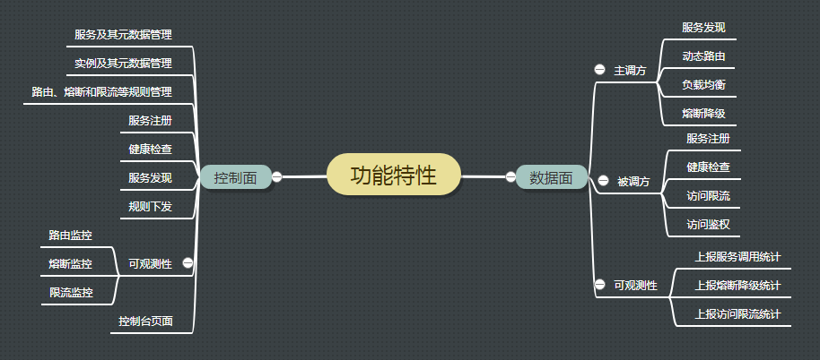
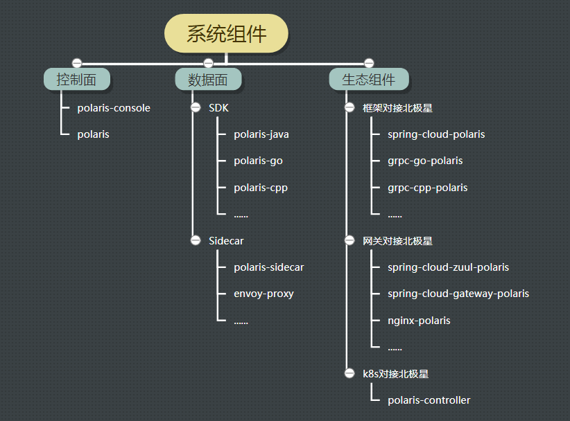

# 简介

北极星是腾讯开源的服务发现和治理中心，致力于解决分布式或者微服务架构中的服务可见性、故障容错、流量控制和安全性问题。虽然业界也有一些组件解决这些问题，但是缺少一个标准的、多语言的、框架无关的实现。

|问题类型|问题示例|功能定义|
| - | - | - |
|服务可见性|主调方如何知道被调方的服务地址|注册发现|
|故障容错|当被调方的实例、接口或者服务异常时，如何屏蔽异常实例、接口或者服务，屏蔽之后如何恢复|熔断降级|
||当某些主调方的请求量过多时，如何限制这些主调方的请求，避免影响其他主调方的请求|限流|
|流量控制|被调方具有多个实例，主调方如何确定请求发送到哪个实例，如何保证负载均衡|负载均衡|
||如果被调方实例部署在多个地域，主调方如何就近访问|路由|
|安全性|被调方如何判断允不允许某个主调方访问|访问鉴权|

腾讯具有海量的分布式服务，加上业务线和技术栈的多样性，沉淀了大大小小数十个相关组件。从2019年开始，我们通过北极星将这些组件整合起来，打造公司统一的服务发现和治理方案，帮助业务提升研发效率和运营质量。目前，北极星在腾讯内部的服务数量超过百万，日接口调用量超过十万亿。下面从功能特性、系统组件和应用场景三个方面介绍北极星是什么。

## 从功能特性看

北极星控制面主要提供三大部分功能：
* 服务注册、健康检查和服务发现
* 支持以DNS的方式进行服务发现
* 服务治理规则的管理和下发

北极星数据面采用插件化的方式实现，每个功能可以选择使用：
* 基础功能：服务发现、服务注册、健康检查
* 故障容错：熔断降级、访问限流
* 流量控制：动态路由、负载均衡
* 安全：访问鉴权

## 从系统组件看

### 控制台

### 控制面

采用Go实现，部署简单

### 数据面

支持高性能SDK和无侵入Sidecar两种模式
* SDK：以插件化的方式实现服务注册和发现、路由和负载均衡、熔断降级和限流，可以选择使用
* Sidecar：控制面兼容xds协议，支持envoy自动注入。SDK和Sidecar模式可以互相调用

### 生态组件

用于打通常用框架、网关和kubernetes
* 提供不同框架和北极星SDK的集成，帮助框架补齐服务治理功能，框架用户不需要直接使用北极星SDK
* 提供不同网关和北极星SDK的集成，支持网关将请求转发到北极星服务
* polaris-controller：支持k8s service自动注册到北极星

## 从应用场景看

### 服务注册和发现

### 提高服务调用的容错能力

### 防止服务被突发流量压垮

### k8s和服务网格

k8s通过service提供服务发现和负载均衡功能：
* 用户创建service，service通过标签绑定相应的pod，每个service关联一个cluster ip
* k8s先依赖kubedns、coredns或者其他dns插件，将service解析成cluster ip
* 再通过iptables或者IPVS，将cluster ip的请求转发给相应的pod

k8s service当前的实现存在不足之处：
* 当service超过一定数量时，iptables和IPVS存在性能问题，不适合大体量的业务
* iptables和IPVS支持的负载均衡算法有限，在内核里实现，无法在应用层扩展
* 不提供动态路由、熔断降级、访问限流、访问鉴权等常用的服务治理功能
* 不兼容spring cloud等微服务框架的服务注册和发现方式，无法打通

北极星提供更加完善的服务发现和治理功能：
* 既支持k8s service自动注册，也支持使用SDK和框架进行注册，两者统一管理
* 除了k8s原有的DNS访问方式，还支持高性能和无侵入两种服务网格方案
* 高性能服务网格提供多语言SDK，以及常用框架和北极星SDK的集成
* 无侵入服务网格提供Sidecar，业务不需要依赖SDK或者框架
