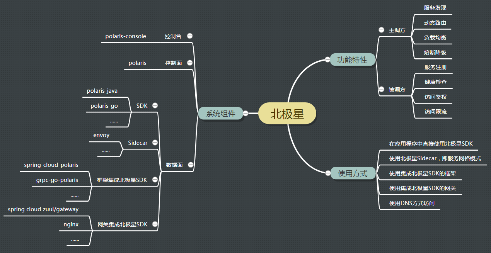

# 简介

在分布式和微服务架构中，一次远程调用面临以下几个问题：
* 服务发现：主调方需要知道被调方的服务地址
* 动态路由：可能根据版本等信息将一个服务的实例分为不同分组，如何将请求路由到指定的实例分组
* 负载均衡：通常一个服务或者实例分组包含多个实例，需要将请求均衡地发给各个实例
* 熔断降级：如果实例或者实例分组出现异常，主调方
* 服务注册：
* 健康检查：
* 访问限流：
* 访问鉴权：

虽然，业界一些组件，但是没有一个组件，

北极星致力于

## 从系统组件看

### 控制面

### 数据面

### 生态组件

## 从功能特性看

## 从使用方式看

## 功能特性

## 系统组件

北极星组件分为控制面和数据面两个部分

### 控制面

北极星：
北极星控制台：
北极星SDK：
北极星Sidecar：
框架

## 3.应用场景

服务注册和发现

DNS

熔断/降级/限流

路由和负载均衡

服务网格

k8s服务治理
