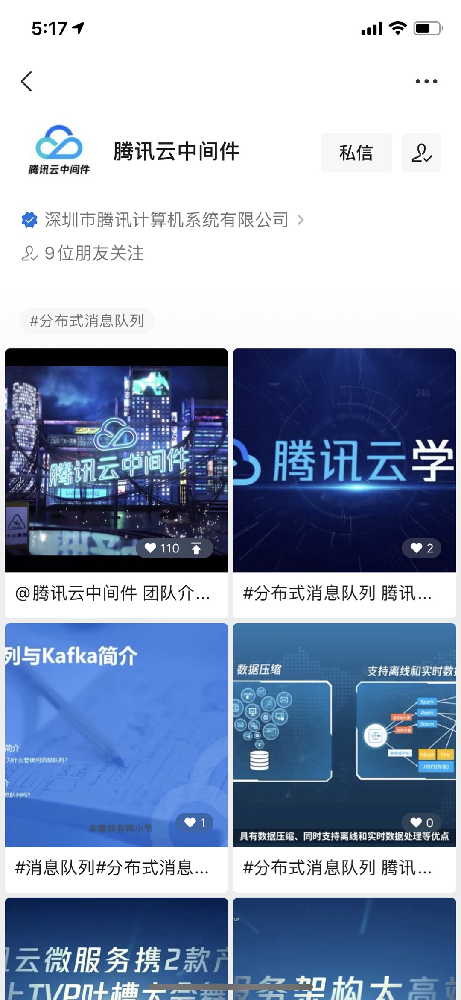

# 如何获取学习资料

## 代码库

所有的疑问，都可以通过阅读代码来解答，北极星社区的各个项目的代码库主要在这里：
https://polarismesh.cn/project

## 文档库

北极星文档库可以参考：[文档库](https://polarismesh.cn/zh/doc/简介/北极星是什么.html#北极星是什么)

## 新手教程

北极星每周会发布新手教程，新手教程会同步到各个视频及文档社区。

### B站

北极星训练营系列课程：<https://space.bilibili.com/591730945/channel/seriesdetail?sid=2158864>

### 知乎

北极星训练营专栏地址：<https://www.zhihu.com/column/c_1489885790524665856>

### 微信公众号

### 微信视频号

用户在视频号中搜索“腾讯云中间件”查看PolarisMesh的视频专栏。

