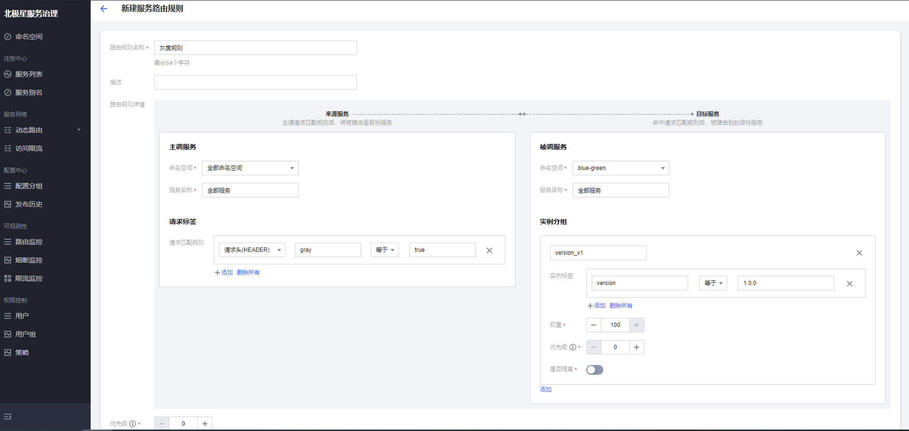
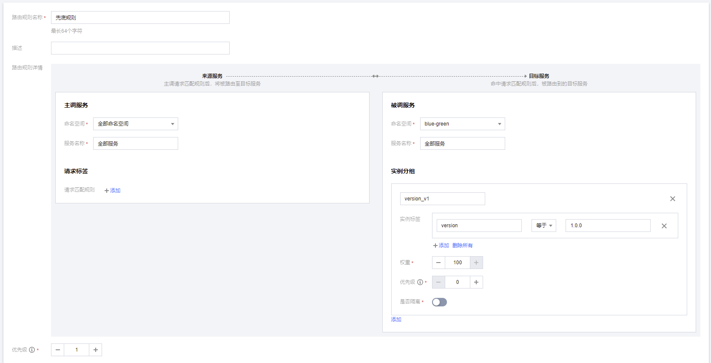

# 全链路灰度

## 什么是全链路灰度

## 前置条件

### 部署polaris

如果已经部署好了polaris，可忽略这一步。

polaris支持在kubernetes环境中进行部署，注意必须保证暴露HTTP端口为8090，gRPC端口为8091。具体部署方案请参考：

- [单机版部署指南](https://polarismesh.cn/zh/doc/%E5%BF%AB%E9%80%9F%E5%85%A5%E9%97%A8/%E5%AE%89%E8%A3%85%E6%9C%8D%E5%8A%A1%E7%AB%AF/%E5%AE%89%E8%A3%85%E5%8D%95%E6%9C%BA%E7%89%88.html#kubernetes-%E5%AE%89%E8%A3%85)
- [集群版部署指南](https://polarismesh.cn/zh/doc/%E5%BF%AB%E9%80%9F%E5%85%A5%E9%97%A8/%E5%AE%89%E8%A3%85%E6%9C%8D%E5%8A%A1%E7%AB%AF/%E5%AE%89%E8%A3%85%E9%9B%86%E7%BE%A4%E7%89%88.html#%E9%83%A8%E7%BD%B2%E5%9C%A8kubernetes)

## 阶段一：实例打标

### Spring Cloud Tencent 接入

##### 打标实例版本号

Spring Cloud Tencent支持通过以下2种方式进行实例的版本号打标：

- 方式一：配置文件

在服务实例的配置文件中添加配置，如在 `bootstrap.yml` 添加如下所示即可：

```yml
spring:
  cloud:
    tencent:
      metadata:
        content:
          version: 2.0.0
```

- 方式二：环境变量

在服务实例所在的操作系统中添加环境变量也可进行打标，例如：`SCT_METADATA_CONTENT_version=2.0.0` 。

#### 打标灰度标签透传

由于Spring Cloud默认不会对所有的请求标签进行透传，因此需要增加Spring Cloud透传标识，可以通过添加环境变量```SCT_PROTOCOL_CONTENT_TRANSITIVE_HEADER=gray```的方式，进行灰度标识```gray:true```的透传。

### Envoy Proxy 接入

应用需要基于K8S进行部署，才可以使用Envoy Proxy的接入模式。

实例的版本标签需要通过POD标签的方式打入，然后在部署过程中，北极星的controller会自动把POD标签同步到北极星。

可以在K8S的部署配置中，在template配置中，添加labels的方式完成版本打标。可参考这里的部署配置：[微服务部署配置](https://github.com/polarismesh/examples/blob/main/servicemesh/gray-releasing/blue-green-releasing/k8s/05-microservices.yaml)

```
spec:
  template:
    metadata:
      labels:
        app: user
        version: 2.0.0
```

## 阶段二：部署应用

### Spring Cloud Tencent 接入

支持虚拟机、Docker Composer、K8S等多种部署模式，注意需要保证业务进程与北极星服务的网络连通性。

### Envoy Proxy 接入

只支持K8S的部署模式，同时，为了实现POD标签的自动同步，以及Envoy Proxy的自动注入，需要预先部署北极星的Controller组件（polaris-controller）。具体部署方案请参考：

- [polaris-controller部署指南](https://polarismesh.cn/zh/doc/%E5%BF%AB%E9%80%9F%E5%85%A5%E9%97%A8/%E5%AE%89%E8%A3%85%E6%9C%8D%E5%8A%A1%E7%AB%AF/%E5%AE%89%E8%A3%85%E5%8C%97%E6%9E%81%E6%98%9Fcontroller.html#%E5%8C%97%E6%9E%81%E6%98%9Fcontroller%E5%AE%89%E8%A3%85)

## 阶段三：网关路由&染色

网关作为流量入口，配置网关路由的目标主要是为了可以将流量按比例进行切分到不同版本的微服务中去，同时通过流量打标的方式，将路由到新版本的请求，在Header上打入```gray:true```的标签，便于后续微服务按照标签进行路由。

### 场景1：按域名切流量

用户可以使用任意对接了北极星服务发现的网关进行操作（Envoy, Nginx, Kong等），这里给出Envoy的VirtualHost路由配置，便于大家理解，具体配置可以参考[LDS配置](https://github.com/polarismesh/examples/blob/main/servicemesh/gray-releasing/blue-green-releasing/k8s/04-envoy-lds-config.yaml)

```
virtual_hosts:
- name: local_service
domains:
- "*"
routes:              
- match:
	prefix: "/"
  route:
	weighted_clusters:
	  total_weight: 100
	  clusters:
	  - name: user
		weight: 80
		metadata_match:
		  filter_metadata:
			envoy.lb:
			  version: 1.0.0
	  - name: user
		weight: 20
		request_headers_to_add:
		- header:
			key: gray
			value: "true"
		metadata_match:
		  filter_metadata:
			envoy.lb:
			  version: 2.0.0   
```

### 场景2：按标签切流量


## 阶段四：微服务路由

通过配置微服务路由，目标是使得对于灰度流量的调用，都只在新版本的服务分组中进行。

打开北极星控制台，通过点击侧边栏：动态路由->自定义规则页面，配置自定义路由规则，规则可配置对命名空间下全部服务生效。

- 配置灰度规则，使得header中带有```gray:true```灰度标签的流量都只流向```version=2.0.0```的分组：


- 配置兜底规则，使得不带灰度标签的流量都只流向```version=1.0.0```的分组：


## 阶段五：观察监控并查看流量的灰度过程

通过北极星的可观测性能力，可以准确看到不同分组的流量切换的过程，以及服务调用成功率，等到所有流量都切换到新版本分组以及没有失败请求，代表灰度完成。

## 阶段六：灰度完成的收尾动作

灰度完成后，需要做以下事情：

- 对老版本分组的实例进行缩容下线
- 删除网关的路由规则
- 在北极星控制台删除自定义路由规则

## 一键部署体验

北极星提供了一键部署demo，可以通过一键部署demo快速体验蓝绿发布。详细请参考：

- [Spring Cloud Tencent蓝绿发布]
- [服务网格蓝绿发布](https://github.com/polarismesh/examples/tree/main/servicemesh/gray-releasing/blue-green-releasing/k8s)