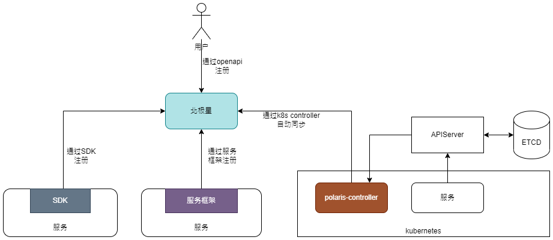

# 服务注册

## 定义

服务注册指定是被调方按照服务模型将自身的服务数据注册到北极星，以供主调方进行服务发现。

服务数据主要包括以下部分：

- 服务名：服务的唯一标识，区分大小写。
- 服务元数据：服务的标签信息，KV格式，可对服务进行分类，可用于过滤。
- 服务实例：提供服务的节点列表，以IP:PORT的方式提供。
- 服务实例元数据：服务实例的标签信息，KV格式，通常用于描述节点的集群、版本等，用于后续流量治理等操作。

## 服务注册的方式

北极星支持以下4种服务注册方式：

### 通过SDK注册

北极星提供了多语言SDK，服务可以通过集成SDK，调用registerInstance接口完成服务注册。

使用参考：[SDK注册使用指南](https://polarismesh.cn/zh/doc/%E4%BD%BF%E7%94%A8%E6%8C%87%E5%8D%97/%E6%9C%8D%E5%8A%A1%E6%B3%A8%E5%86%8C/%E4%BD%BF%E7%94%A8SDK.html#%E4%BD%BF%E7%94%A8sdk)

### 通过服务框架注册

服务一般与服务框架集成（比如[Spring Cloud Tencent](https://github.com/Tencent/spring-cloud-tencent)），框架本身会提供服务自动注册功能，服务启动后，框架会将服务信息自动注册到北极星。

使用参考：框架注册使用指南

### 通过k8s同步的方式注册

用户通过k8s部署服务，并注册为k8s的service，北极星通过controller的机制，从k8s中将service和endpoint信息同步到北极星，完成服务注册。

使用参考：[k8s服务同步使用指南](https://polarismesh.cn/zh/doc/%E4%BD%BF%E7%94%A8%E6%8C%87%E5%8D%97/%E6%9C%8D%E5%8A%A1%E6%B3%A8%E5%86%8C/%E4%BD%BF%E7%94%A8k8s%E6%9C%8D%E5%8A%A1%E5%90%8C%E6%AD%A5.html#%E4%BD%BF%E7%94%A8k8s%E6%9C%8D%E5%8A%A1%E5%90%8C%E6%AD%A5)

### 通过OpenAPI注册

北极星控制面提供基于Rest标准的OpenAPI，用户可通过OpenAPI完成服务注册的操作。

使用参考：[OpenAPI注册指南](https://polarismesh.cn/zh/doc/%E4%BD%BF%E7%94%A8%E6%8C%87%E5%8D%97/%E6%9C%8D%E5%8A%A1%E6%B3%A8%E5%86%8C/%E4%BD%BF%E7%94%A8REST%E6%8E%A5%E5%8F%A3.html#%E4%BD%BF%E7%94%A8rest%E6%8E%A5%E5%8F%A3)

