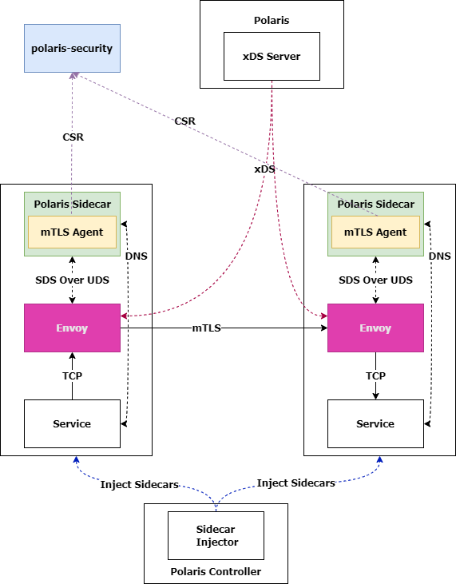
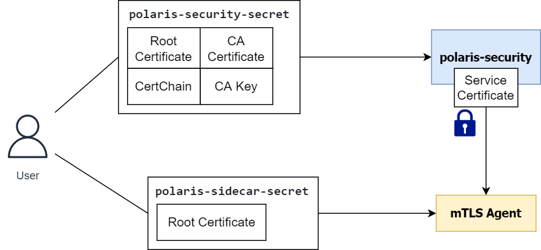

# 认证加密
## 定义
- 认证：即检验服务调用双方的身份真实性。
- 加密：即对服务调用通讯数据进行加密。   

认证加密可以有效地保护服务调用过程，防止中间人攻击，敏感数据泄露等问题。
## 实现原理

### 整体架构
在服务网格模式下，Polaris支持使用mTLS来对服务调用进行认证与加密，整体架构如下所示：

- polaris-security是Polaris的安全组件，在mTLS场景下，它支持作为中间证书签发机构（Intermediate Certificate Authority）使用。
- Polaris Controller监测到用户服务启用mTLS功能后，会向Pod内自动注入所有启用mTLS功能需要的环境。
- Polaris xDS Server会给启用mTLS的服务对应的Envoy sidecar下发相应的额外配置。
- Polaris Sidecar中会额外启动mTLS agent组件，通过Unix Domain Socket通讯向Envoy提供SDS（Secret Discovery Service）能力。
- mTLS agent组件会自动生成服务使用的身份证书及私钥，并自动进行轮转（rotate）。
- 每当身份证书接近过期时，mTLS会向polaris-security发送CSR（证书签名请求）来进行更新。  

### 证书签名及轮转原理

#### 启动阶段

- 用户启用mTLS功能之前，需要先在k8s集群中部署两个secret
- polaris-security会读取polaris-security-secret，并为自身签发service certificate，用于在TLS握手中自证身份。
- mTLS agent会读取polaris-sidecar-secret，用于TLS握手中验证polaris-security的身份。

#### 证书签名

- mTLS agent向polaris-security发起TLS保护的certificate signing request，polaris-security会提供自身的service certiface给mTLS agent验证。
- 成功后，polaris-security从请求的header中提取出mTLS agent的Service Account Token，并使用Token Review请求的方式发送给Kubernetes API Server进行验证。
- 验证成功后，正式进入证书签名流程，polaris-security会按CSR中的参数要求，使用CA私钥加密摘要，并将所有材料整合成已签名的证书，连同证书链一起返回给mTLS Agent。
- mTLS Agent可以使用返回的材料来提供SDS服务，已签名的证书可以用作证明workload的身份；证书链可以用作验证对端workload的身份。

#### 证书轮转
- mTLS agent的Rotater类会负责证书轮转，它其实就是一个定时任务执行器，每隔一定时间间隔就会执行一次CSR发送任务，并根据返回结果更新SDS材料，请求失败则会自动重试。
- 轮转时间间隔默认值为30分钟，证书TTL默认值为1小时，自动重试间隔默认为1秒。
- polaris-security是一个无状态的组件，可以进行适当的水平扩展来保证高可用。

### mTLS实现原理

#### mTLS模式介绍
Polaris提供三种不同的服务粒度模式供用户选择：

| 模式      | 解释 |
| ----------- | ----------- |
| Permissive      |宽容模式，服务接受纯文本/mTLS服务调用；发起服务调用时，根据对端接受状况自动选择发起mTLS或纯文本服务调用      |
| Strict   |严格模式，服务仅接受/发起mTLS服务调用        |
| None     |无加密模式（为默认选项），服务仅接受/发起纯文本服务调用|

#### sidecar注入
- mTLS的开关是用户服务的`metadata`中的`polarismesh.cn/tls-mode`键对应的`label`。
- 服务注册回调时，Polaris Controller的injector发现上述label的值为strict或permissve时，就会渲染出额外的注入配置：挂载secret及uds路径、开启iptables入流量拦截、为polaris-bootstrap-writer设置特殊的环境变量等。
- polaris-bootstrap-writer检测到mTLS相关的环境变量被设置后，会使用一份mTLS专用的Envoy配置模版来进行渲染，这份模版中设置了sds的相关配置与特殊的node metadata，polaris控制面就是使用这个特殊的metadata来区分服务网格中的各个服务是否启用mTLS功能。

#### xDS

- polaris控制面在给各个Envoy sidecar下发配置时，会根据node metadata中的mTLS相关信息来决定下发哪种配置。
- 对于permissve模式，下发的listener会加入一个TLS Inspector filter配置，TLS Inspector能根据请求的头几字节自动判断这是纯文本请求或是mTLS请求，然后进行不同处理；下发的cluster会加入一个额外的Match条件，在对端endpoint拥有`acceptMTLS` metadata时，会使用tls transport socket，否则就使用默认的raw buffer transport socket。
- 对于strict模式，下发的listener仅接受mTLS服务调用；而下发的cluster仅会使用tls transport socket来连接对端endpoint。

