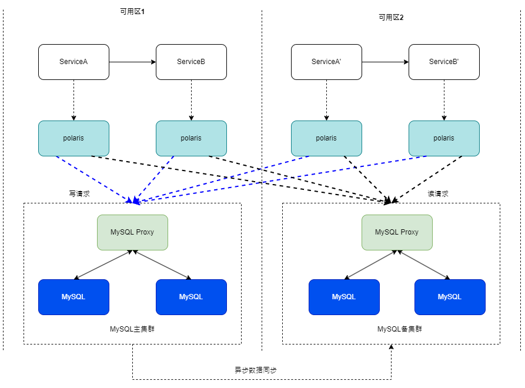
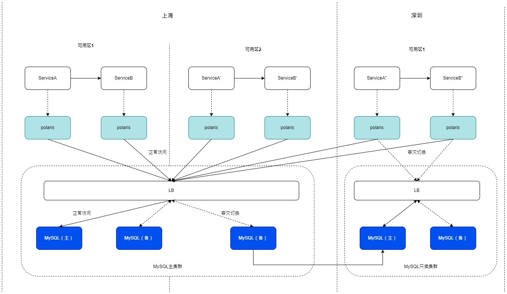

# 高可用架构设计

## 架构模型

北极星支持高可用的部署架构模型，支持多级的容灾部署架构（主备、跨可用区、跨地域）。

### 主备架构

- polaris在单可用区内部署，一般至少部署2节点以保证可用性，客户端随机进行连接。
- 数据库主备都在同一可用区，通过对外暴露访问IP，主实例发生故障时，可以在LB进行主备切换，对外IP不变。
- polaris通过LB暴露的单个接入IP对MySQL进行访问。

### 跨可用区架构

- polaris在多可用区内部署，每个可用区一般至少部署2节点以保证可用性，客户端就近随机挑选polaris进行连接。
- 数据库实例跨可用区部署，主备分别在不同的可用区，通过LB的跨可用区特性进行对外暴露一个接入IP。
- polaris通过LB暴露的单个接入IP对MySQL进行访问。

### 跨地域架构

- polaris在多地域多可用区内部署，每个可用区一般至少部署2节点以保证可用性，客户端就近随机挑选polaris进行连接。
- 数据库分为主集群和只读集群，主集群跨可用区部署，只读集群部署在与主集群不同的地域，主集群通过异步的方式往只读集群同步数据。
- 主集群和只读集群分别对外暴露LB的接入IP，polaris正常情况下只会通过主集群的接入IP访问。
- 在容灾的场景下，主地域集群出现问题，需要将RO集群升级成主集群，同时通过域名切换等方式，将polaris的接入IP切换成RO集群的接入IP。