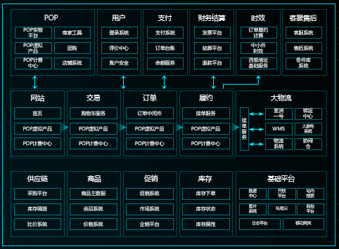

# 什么是微服务架构

## 单体架构与微服务架构

微服务架构是分布式架构的一种，微服务架构是从单体架构演化过来的。

### 单体架构

单体架构的所有代码都在一个应用中，适合小规模或者初创期的业务。

单体架构具备系统复杂度低，部署简单，易运维等优点，常见的单体架构是以下的三层架构：

随着应用模块和开发人员增加，单体应用面临众多问题，例如：

- 变更成本高：任何修改需要重新部署整个系统；
- 扩展性差：无法针对某些热点模块进行水平扩展；
- 故障扩散：某个模块出现故障也会影响其他模块；

### 微服务架构

对单体架构中的每一层进行细粒度的拆分，可以拆分成功整体更松散，模块更内聚的微服务架构。

微服务架构具备职责单一、平台无关的通信、独立性、进程隔离的特点，常见的微服务架构如下：

微服务架构具备以下优点：

- 服务作为组件，可独立部署，独立变更，独立扩缩容。
- 团队管理变简单，可围绕业务来划分团队。
- 技术选择可多样性
- 业务进程及数据独立，故障不会相互影响。

## 微服务架构实施中的核心问题

北极星主要解决的是“服务发现及治理”的问题。