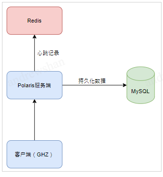

# Polaris服务发现性能测试报告

* [Polaris服务发现性能测试报告](#polaris服务发现性能测试报告)
  * [测试目的](#测试目的)
  * [测试方案](#测试方案)
    * [测试工具](#测试工具)
    * [测试规格](#测试规格)
    * [测试组网](#测试组网)
  * [测试结果](#测试结果)
    * [实例注册](#实例注册)
      * [测试数据](#测试数据)
      * [测试命令](#测试命令)
    * [心跳上报](#心跳上报)
      * [测试数据](#测试数据-1)
      * [测试命令](#测试命令-1)
    * [实例反注册](#实例反注册)
      * [测试数据](#测试数据-2)
      * [测试命令](#测试命令-2)
    * [服务发现](#服务发现)
      * [测试数据](#测试数据-3)
      * [测试命令](#测试命令-3)

## 测试目的

了解PolarisMesh的服务发现性能负载和容量，帮助用户更快的运用评估PolarisMesh系统负荷，协助用户进行资源选型。

## 测试方案

### 测试工具

使用开源的ghz工具进行压测。测试工具地址https://github.com/bojand/ghz/releases/tag/v0.105.0

### 测试规格

| 组件        | 参数                                   |
| ----------- | -------------------------------------- |
| Polaris版本 | v1.4.0                                 |
| 服务端规格  | CPU16核，内存32G，单节点（可水平扩展） |
| MySQL       | CPU 8核，内存16G，存储100G，双节点     |
| Redis       | 内存4G，1主1副本                       |

### 测试组网

客户端直接发送请求到北极星服务端:
- 服务注册/反注册请求会对MySQL进行增删操作
- 心跳上报请求会对Redis进行KV修改操作
- 服务发现请求会对服务端缓存进行操作




## 测试结果

### 实例注册

####  测试数据

| 并发数 | 实例数  | TPS     | 平均RT(ms) | 最大RT(ms) | 服务端负载 | MySQL负载 | Redis负载 |
| ------ | ------- | ------- | ---------- | ---------- | ---------- | --------- | --------- |
| 100    | 100,000 | 1774.43 | 54.83      | 83.61      | 11.80      | 6.54      | 1.40      |
| 200    | 200,000 | 3509.63 | 55.55      | 83.46      | 21.10      | 12.33     | 1.60      |
| 300    | 300,000 | 5079.84 | 57.59      | 86.20      | 32.10      | 16.14     | 2.39      |
| 400    | 400,000 | 6324.14 | 61.70      | 99.44      | 37.00      | 19.39     | 2.43      |

#### 测试命令

- 下载polaris代码
```
git clone https://github.com/polarismesh/polaris.git
```
- 打包proto
```
chmod 777 polaris/common/api/protoc/bin/* && cd polaris/common/api/v1/ && sh build.sh
```
- 执行（ghz命令与配置文件至于polaris/common/api/v1 目录下）：
```
./ghz --config=./register_instance.json
```
- 配置文件 register_instance.json 如下：
```json
{
// 实际执行时请把所有注释行删除
// 请求总数
  "total": 1,
// 并发数
  "concurrency": 1,
  "proto": "./grpcapi.proto",
  "call": "v1.PolarisGRPC.RegisterInstance",
  "data": {
    "id": "polaris-perf-test-1-ins-{{.RequestNumber}}",
// 服务名称
    "service": "POLARIS-PERF-TEST-1",
// 命名空间名称
    "namespace": "default",
// 随机域名
    "host": "fakehost-{{randomString 8 }}.com",
// 随机端口
    "port": "{{randomInt 1000 50000}}",
    "enable_health_check": true,
    "health_check": {
      "type": 1,
      "heartbeat": {
        "ttl": 3
      }
    },
    "healthy": true,
    "isolate": false,
    "ctime": "{{.TimestampUnix}}",
    "mtime": "{{.TimestampUnix}}"
  },
// 您的北极星地址
  "host": "127.0.0.1:8091",
  "insecure": true
}
```

### 心跳上报

####  测试数据

| 并发数 | 实例数  | TPS     | 平均RT(ms) | 最大RT(ms) | 服务端负载 | MySQL负载 | Redis负载 |
| ------ | ------- | ------- | ---------- | ---------- | ---------- | --------- | --------- |
| 100    | 100,000 | 2444.30 | 39.39      | 127.88     | 15.50      | 7.19      | 6.10      |
| 200    | 200,000 | 4593.85 | 41.70      | 146.81     | 25.80      | 8.96      | 7.90      |
| 300    | 300,000 | 5935.82 | 48.02      | 246.16     | 31.89      | 12.40     | 9.59      |
| 400    | 400,000 | 7469.29 | 50.62      | 272.89     | 38.89      | 11.91     | 9.99      |

#### 测试命令

- 执行：
```
./ghz --config=./heartbeat_instance.json
```
-  配置文件 heartbeat_instance.json 如下：
```json
{
// 实际执行时请把所有注释行删除
// 请求总数
  "total": 1,
// 并发数
  "concurrency": 1,
  "proto": "./grpcapi.proto",
  "call": "v1.PolarisGRPC.Heartbeat",
  "data": {
    "id": "polaris-perf-test-1-ins-{{.RequestNumber}}",
// 服务名称
    "service": "POLARIS-PERF-TEST-1",
// 命名空间名称
    "namespace": "default",
    "healthy": true,
    "isolate": false,
    "mtime": "{{.TimestampUnix}}"
  },
// 您的北极星地址
  "host": "127.0.0.1:8091",
  "insecure": true
}
```

### 实例反注册

####  测试数据

| 并发数 | 实例数  | TPS      | 平均RT(ms) | 最大RT(ms) | 服务端负载 | MySQL负载 | Redis负载 |
| ------ | ------- | -------- | ---------- | ---------- | ---------- | --------- | --------- |
| 100    | 100,000 | 5610.45  | 16.71      | 76.90      | 13.50      | 11.15     | 1.80      |
| 200    | 200,000 | 9852.19  | 19.15      | 103.91     | 25.39      | 18.94     | 2.79      |
| 300    | 300,000 | 13335.51 | 21.14      | 130.95     | 34.89      | 22.67     | 3.20      |
| 400    | 400,000 | 16057.31 | 23.34      | 162.36     | 37.29      | 26.94     | 3.25      |

#### 测试命令

- 执行：
```
./ghz --config=./deregister_instance.json
```
-  配置文件 deregister_instance.json 如下：
```json
{
// 实际执行时请把所有注释行删除
// 请求总数
  "total": 1,
// 并发数
  "concurrency": 1,
  "proto": "./grpcapi.proto",
  "call": "v1.PolarisGRPC.DeregisterInstance",
  "data": {
    "id": "polaris-perf-test-1-ins-{{.RequestNumber}}",
// 服务名称
    "service": "POLARIS-PERF-TEST-1",
// 命名空间名称
    "namespace": "default"
  },
// 您的北极星地址
  "host": "127.0.0.1:8091",
  "insecure": true
}
```

### 服务发现

####  测试数据

| 并发数 | 实例数  | TPS      | 平均RT(ms) | 最大RT(ms) | 服务端负载 | MySQL负载 | Redis负载 |
| ------ | ------- | -------- | ---------- | ---------- | ---------- | --------- | --------- |
| 100    | 100,000 | 40535.32 | 1.87       | 6.18       | 58.29      | 0.40      | 2.00      |
| 200    | 200,000 | 44314.53 | 3.76       | 13.05      | 62.5       | 0.40      | 2.00      |
| 300    | 300,000 | 45747.31 | 5.75       | 17.80      | 63.6       | 0.40      | 2.00      |
| 400    | 400,000 | 46805.10 | 7.73       | 24.65      | 64.79      | 0.40      | 2.00      |

#### 测试命令

- 执行：
```
./ghz --config=./discover_instance.json
```
-  配置文件 discover_instance.json 如下：
```json
{
  "total": 1,
  "concurrency": 1,
  "proto": "./grpcapi.proto",
  "call": "v1.PolarisGRPC.DeregisterInstance",
  "data": {
    "service": "POLARIS-PERF-TEST-g{{randomInt 0 100}}c0",
    "namespace": "default"
  },
  "host": "10.0.7.3:8091",
  "insecure": true
}
```
-  拉取方式：按并发数拉取，每个并发单次拉取1000，拉取实例数=并发数*单次拉取数

