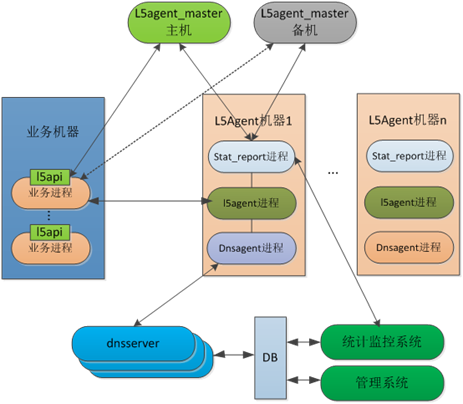
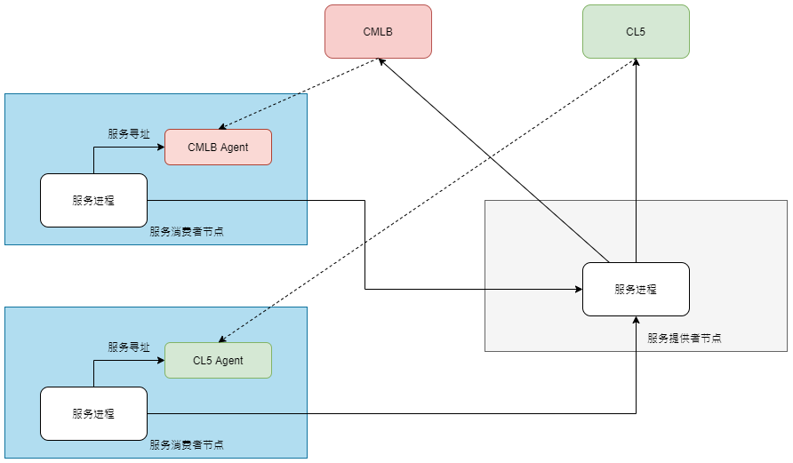
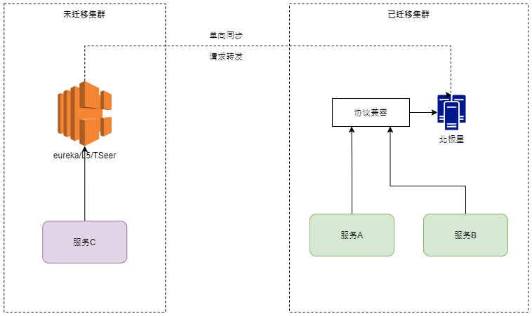

## 导语

注册中心作为微服务架构的核心，承担服务调用过程中的服务注册与寻址的职责。注册中心的演进是随着业务架构和需求的发展而进行演进的。腾讯当前内部服务数超百万级，日调用量超过万亿次，使用着统一的注册中心——北极星。腾讯注册中心也经历3个阶段演进历程，下文主要分享腾讯内部注册中心的演进历程，以及根据运营过程中的优化实践。

## 服务注册中心概述

2008年，zookeeper诞生，作为最早被广泛使用的注册中心，提供了可自定义的基于树形架构的数据存储模型。业界常见的微服务使用场景是dubbo框架，使用zookeeper进行服务数据的管理；同时在大数据场景下，kafka/hadoop使用zookeeper进行集群和分区的管理，属于泛服务注册发现的用法。

由于zookeeper没有服务模型的概念，各框架使用约定的树形路径进行服务数据的存取，在使用和维护上比较复杂。2014年开始，随着微服务架构的大规模应用，具备统一的服务模型和控制台的注册中心得到广泛的使用，最常用的包括eureka、consul、nacos等。

2015年起，k8s开始大规模使用，k8s基于etcd+coredns提供了基于域名的服务发现能力，应用直接基于DNS即可进行服务发现。

总体来说，服务注册发现有两种实现方案。

**zookeeper/eureka/nacos/consul**：优势在于作为独立注册中心，与具体应用部署环境无关，管理和使用都比较方便。局限在于这些注册中心架构都是存储计算合一的，单集群性能有限，无法单独针对读或者写进行水平扩展。

**k8s service**：服务数据基于etcd进行存储，通过coredns进行服务发现。优势在于服务注册中心内置在k8s平台中，无需额外维护注册中心。局限点在于：

1. 无法实现针对pod/workload粒度基于权重的流量灰度。
2. 应用服务调用时，只能获取到单个cluster ip，无法实现基于pod ip列表进行负载均衡，长链接使用场景下容易出现负载不均的问题。
3. 应用基于TCP连接无法拿到对端的POD IP，出问题定位不方便。
4. k8s服务默认只支持当前集群发现，跨集群调用的域名需要带入集群信息，应用进行服务调用时需区分并使用不同的域名。
5. 只能基于k8s环境使用，非k8s环境部署的服务无法使用。

## 腾讯自研注册中心演进历程

### 第一阶段：分布式服务萌芽期

在2012年以前，腾讯内部主流开发语言是C++，业务技术栈主要是LAMP（Linux+Apache+MySQL+PHP）模式和CGI+独立后端模式，前者常见于逻辑简单的单体Web应用，后者常见于大型偏计算类的应用，比如社交应用的后端等。

在这2种模式下，业务的远程调用（PHP寻址MySQL，CGI寻址后端节点），需要依赖寻址。在没有注册中心之前，业务往往通过VIP（四层负载均衡）的方式进行寻址，存在以下问题：

- **变更难度大**：VIP本身基于四层负载均衡设备实现，设备本身存在一个裁撤变更的风险，一旦出现VIP变更，业务的代码需要进行变更，影响面比较广。

- **单点问题**：VIP本身成为了一个单点，一旦四层负载均衡设备出现问题，会导致服务不可用。
在2007年，为了解决VIP寻址所带来的问题，腾讯自研了一款注册中心产品L5，提供了基于控制台和SDK的服务注册发现、负载均衡功能，服务调用可以通过L5寻址后直连访问，无需再依赖VIP。

L5是一套使用C++开发的一体化注册中心，基于数据库进行服务数据的存储，客户端通过Agent与服务端进行访问。L5的架构存在以下问题：

- **架构封闭**：注册所有的功能和负载均策略都写死在代码中，不具备任何扩展性，业务的新功能需求只能通过L5的维护团队来支撑。

### 第二阶段：多注册中心

在2013年后，随着移动互联网的高速发展，社交、娱乐等业务的用户量也在增长，分布式服务架构进入快速发展期，对注册中心也提出了一些需求，比如支持健康检查、支持轻量化、支持与基础设施或发布平台打通等。但是由于原有L5缺乏定制性，而且L5的运维团队缩减，导致业务提的需求无法满足，因此部分业务都开始自研注册中心，其中使用比较广泛的是以下几个注册中心：

- **CMLB**：全称common load balance system，提供同IDC、同城、同国、同洲等多级容灾部署及就近寻址功能，满足业务海外国内多地部署就近容灾的诉求。
- **TSeer**：一个轻量级的注册中心，支持Agent与SDK2种接入方式，满足轻量化的诉求。
- **Routersrv**：是微信服务框架SvrKit的一部分，打通并关联平台相关的基础设施及发布系统。多注册中心共存，不同注册中心上的数据是隔离的，无法互通。

使用不同注册中心的业务团队要进行互通，服务提供者需要把服务同时注册到多个注册中心，才能支持各个业务团队之间服务相互发现。

这种使用方式会带来以下问题：

- **服务发布的复杂度提升**：服务的部署和发布一般和发布系统绑定，对接多个注册中心，对发布系统的实现会比较复杂，容易出现数据不一致的问题。

- **业务开发复杂度提升**：不同注册中心有不同的服务发现API，业务开发者在调用服务之前，需要先确认服务注册在哪个注册中心，选用不同的API接口来进行服务发现。

### 第三阶段：大规模分布式服务互联互通

到了2018年，公司内部业务经过进一步的发展，节点数已经达到了百万级，日调用量也超过了万亿，内部服务跨业务团队之间互相访问成为了常态。使用多注册中心所引发的问题，愈发成为了影响业务开发和部署效率的瓶颈。

#### 统一注册中心：北极星

2018年到2019年初，在公司开源协同的背景下，为解决多注册中心带来的复杂性问题，多个业务团队的同学们聚在一起，基于原有注册中心的运营和设计经验，通过内部开源的方式，协同共建了可以支撑百万级服务体量的注册中心——北极星。

#### 注册中心如何无缝迁移

新的注册中心上线，但是大量的存量服务节点在老注册中心上，业务团队需要进行渐进式迁移，但是对于业务团队来说，不希望有任何的代码改造，否则这个迁移过程成本太高。因此北极星支持以下零代码改造的的渐进式迁移方式：

##### 1、双注册双发现

对于Java类应用，北极星通过提供JavaAgent的方式，支持已迁移的服务通过零改造的方式，进行双注册和双发现，同时存量注册中心也有全量的服务，未迁移服务也可发现已迁移服务。

##### 2、单向同步+协议兼容

对于非Java类应用，北极星通过插件化提供协议兼容能力，兼容已有注册中心的接口，新服务变更一下注册中心地址即可实现迁移。同时，为了解决未迁移服务访问已迁移服务的问题，通过扩展存量注册中心的方式，实现存量服务数据的单向同步以及对已迁移服务的增量拉取。

## 北极星VS其他注册中心

北极星在2018年底开始进行设计和开发，在2019年初上线，到现在已运营了超过3年时间，支撑了腾讯内部不同形态的业务接入，也经历过大大小小的运营活动的洗礼，架构和稳定性也得到了打磨。从技术设计上，北极星解决了业界注册中心存在的单集群性能，水平扩展的问题，同时产品形态上也有自己的一些思考，下文会对这部分内容进行分享：

### 优势1：可扩展性

注册中心关键的点是服务数据的一致性，根据一致性模型，注册中心会分为2类：

#### 强一致性（CP）模式

注册中心集群中所有节点的数据都保证强一致，客户端从集群中同一时刻任意一个节点获取到的数据都是相同的。强一致性集群中，各个节点有自己的角色，一般分为leader和follower。leader统一协调数据的写入与同步，follower负责处理客户端的读请求，常见的数据一致性协议有Zab，Raft等。

zookeeper和consul都属于强一致性注册中心，其局限点在于单集群的写性能受制于一致性协议，必须等待leader写入成功且集群中大多数的follower都同步成功，才完成一次写操作。当leader节点网络故障，需要重新选主，通常耗时30~120秒，选举期间集群不提供服务，这不符合可用性原则。

#### 最终一致性（AP）模式

注册中心集群所有节点都是无状态对等的，服务数据可以在任意节点写入，写入后通过远程请求同步到集群其他节点。客户端从集群中同一时刻不同节点获取到的数据可能会存在差异，但是最终会保持一致。

eureka和nacos都属于最终一致性注册中心，其局限点在于集群每个节点都参与服务数据写入、同步、以及读取，计算存储合一。单集群的读性能会受到写操作的影响，写操作过于频繁引起高负载问题，对读操作性能存在影响。

考虑到作为注册中心，可用性、性能和吞吐量是比较关键的指标，短期的数据不一致是可以忍受的，因此在架构模型上，北极星采用的是最终一致性的架构模型。

#### 计算存储分离

腾讯内部服务调用链路是一个网状结构，各个BG、各个业务之间都存在相互调用，比如游戏业务需要对接支付系统，视频业务需要对接存储系统等。为了简化用户的使用方式，北极星集群需要支撑内部所有的服务接入，以及随着业务的发展，集群的性能也要可以支持水平扩展。

因此，北极星采用计算存储分离的架构，控制面代码拆分成cache（缓存）层和store（存储）层，cache层提供高性能缓存的能力，store层负责对接后端存储，支持关系数据库和本地磁盘；客户端及控制台把服务数据注册到store层，store层通过异步的方式将数据写入数据库或者磁盘；cache层订阅到变更后，从store层增量拉取服务数据，并更新本地缓存；客户端直接从cache层获取到所需的服务数据。控制面cache本身无状态，这意味着对于读写来说都能很好的水平扩展，在腾讯内部，从小规模集群（万级以下服务）到大规模公共集群（百万级服务）都有着生产案例。

### 优势2：单集群性能

为了提升控制面性能，观察到大部分注册中心在服务发现过程中，都有着模型转换和编解码的过程，这一过程CPU基本都是消耗在了protobuf的编解码动作中（占70%）。因此，基于空间换时间的思想，我们在公共服务缓存基础上，增加了协议层热点缓存，对返回的编码后的数据进行复用，省去编解码过程的损耗；经现网实际数据验证，协议层缓存命中率高达98%，性能相比之前提升了一倍，同时也优于同类注册中心。

#### 性能对比

我们针对北极星控制面进行了压测，对于不同规格下的北极星三节点集群、eureka集群、consul集群，压测数据如下：

##### 服务注册

##### 服务发现

#### 测试结论

通过对北极星的注册以及发现功能，从接口层到存储层全调用链路的优化，从最终的压测结果可以看出：

- 在服务注册的TPS上，北极星注册性能，对于同等规格的eureka，最高有将近三倍的注册性能提升；对于同等规格的consul，最高有将近四倍的注册性能提升。
- 从服务发现的TPS上，北极星的发现性能，对于同等规格的eureka，最高有将近十七倍的服务发现性能提升；对于同等规格的consul，最高有将近两倍的服务发现性能提升。

### 优势3：针对不同企业规模有不同的部署模式

针对企业不同的微服务规模，北极星提供3种形态的集群组网：

-大规模集群组网，按功能拆分集群部署，可支持百万级的服务接入；
-小规模集群组网，全功能对等集群，可支持十万级以下服务接入；
-单机版本，提供轻量化的单机版本，供开发人员本地测试联调使用。

#### 大规模集群（百万级服务）

北极星控制面是支持模块化组装的，各部分功能和接口，比如注册、发现、配置等，可以通过单独开关控制开启和关闭。为了提升功能的可用性，实现故障隔离，腾讯内部实践中，对北极星按照功能模块进行集群拆分，服务注册、服务发现、控制台操作划分为不同集群来进行处理，各集群相互独立，可按照请求量独立扩展。客户端通过埋点集群的二次寻址机制，为接口寻址到目标集群进行功能接口的调用。

#### 小规模集群（万级以下服务）

大规模集群部署流程相对比较复杂，且耗费资源较多，为了简化部署过程，北极星支持全功能集群，可支撑万级以下级别的服务接入。每个北极星节点都是具备了全部的功能，如果当前北极星集群的负载高的话，只需对北极星集群执行水平扩容操作。

#### 单机版（本地开发）

开发人员在程序开发联调过程中，往往需要依赖注册中心，而依赖公共集群注册中心容易产生环境冲突，导致联调结果不准确。北极星也提供单机版能力，开发人员可以在桌面机启动一个个人独占全功能的北极星注册中心进行调测，调测完可随时销毁。

### 优势4：注册中心、服务网格、配置中心一体化

早期的注册中心，如zookeeper, eureka，只提供了服务注册和发现功能，对于简单的服务调用来说是比较适合的。但是在应用的整个生命周期中，服务调用往往涉及复杂的调度场景，比如在腾讯内部，应用测试阶段需要涉及多测试环境的隔离、在发布阶段需要进行灰度发布和金丝雀发布，在生产环境需要进行基于生产流量的A/B测试。这时候就需要基于请求特性进行流量调度的能力，将服务流量进行精细化导入到对应的服务分组中，也就是现在常说的服务网格。

要实现服务网格，除需要依赖注册中心下发服务数据外，还需要进行网格规则（流量的调度策略等）的管理下发。此外，应用自身的运行所需要的业务配置信息，也需要依赖配置中心进行管理及订阅下发。

为了简化用户对服务网格的使用，业界像consul 2.0提供了注册中心、配置中心和服务网格的解决方案。与consul类似，北极星控制面将注册中心、服务网格、配置中心功能进行了整合，提供了一体式的服务网格控制面，同时也提供异构数据面及业界主流框架（Spring Cloud，gRPC，TARS等）扩展，便于应用集成。

## 总结

腾讯内部服务架构的发展经历了从单体到分布式再到微服务的发展历程，而服务架构的核心组件注册中心，也经历了从L5单体注册中心，到多注册中心共存，最终统一到北极星的发展历程。

北极星作为腾讯现阶段的企业级注册中心，支撑了腾讯万级服务，以及百万服务实例的日常业务请求调用。根据业务不同的需要，支持大规模集群、小规模集群、单机版等多种部署形态，在运营过程中经过多次的迭代优化，注册和发现性能均优于同等规格的开源注册中心。

北极星已对外开源（开源后名字为Polaris Mesh），支持Spring Cloud、Spring Boot、gRPC、dubbo等主流框架应用直接接入，